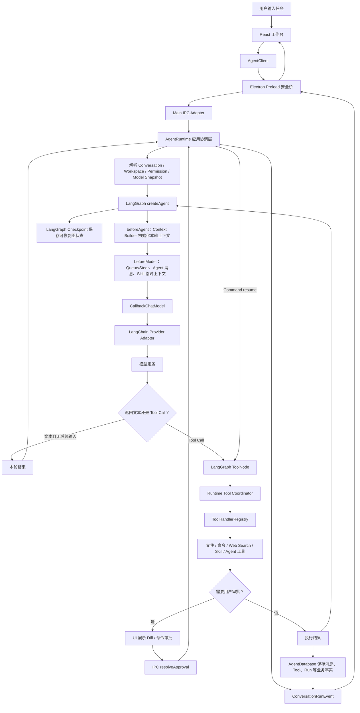

# Agent 如何让 AI 干活：运行时架构总览

> 文档角色：面向开发者和产品设计者的架构总览（HLD）
> 更新时间：2026-08-22
> 适用范围：`apps/web`、Electron Main/Preload、Agent Runtime、LangChain/LangGraph、工具、Skill、上下文和持久化
> 事实口径：本文描述当前代码已经形成的主链；规划中的能力会明确标注，不把目标架构写成已实现功能。

## 1. 先看结论

这个软件不是“模型直接修改文件”，而是一个受控的执行闭环：

```text
用户提出目标
  -> Runtime 解析会话、工作区、权限和模型
  -> Context Builder 组装本轮模型上下文
  -> LangGraph 驱动模型与工具循环
  -> Runtime 校验工具、处理审批并执行副作用
  -> 数据库保存事实，事件流把过程推回界面
  -> 模型根据工具结果继续，直到完成、失败、取消或达到上限
```

最容易混淆的两个概念是：

- **AgentRuntime** 是本项目的应用层总协调器，负责业务规则和副作用边界。
- **Agent Loop** 是“模型 -> 工具 -> 模型”的通用执行循环，目前由 LangChain `createAgent` 和 LangGraph 承担。

因此当前结构是：

> **Loop 语义 + Graph 框架实现 + Runtime 业务协调。**

`AgentRuntime` 不能被一个通用 Loop 完全替代，因为通用 Loop 不知道本项目的会话、工作区、审批、SQLite、Skill、事件和 Subagent 语义。

## 2. 总流程图

下面的图只保留主链，省略了具体 IPC 字段和数据库表名：



图中有两条不同的反馈路径：

1. **执行反馈**：工具结果回到 Graph，模型继续判断下一步。
2. **界面反馈**：Runtime 在业务事实提交后发出事件，Renderer 更新消息、工具卡片、Diff、命令输出和状态。

模型只参与第一条路径；第二条路径由 Runtime 和 IPC 协议控制。

## 3. 分层说明

### 3.1 Renderer：用户看到的工作台

`apps/web` 承载聊天、工具过程、审批、任务、文件栏和设置。它不直接访问 Node、Electron、SQLite、文件系统或 Shell，只依赖 `AgentClient` 合同。

`AgentClient` 提供开始 Run、取消 Run、审批、会话、附件、Skill 和事件订阅等能力。〔FACT｜`apps/web/src/runtime/agent-client.ts:78-156`〕

Electron 环境使用 `DesktopAgentClient`，浏览器开发环境使用 Mock Client；两者对 UI 暴露同一方向的接口。真实的运行能力在 Main 进程，不在 React 组件里。

### 3.2 Preload 与 IPC：安全边界

Preload 只暴露命名且有限的桥接方法，例如发送消息、取消 Run、审批和订阅 `conversation.run_event`。〔FACT｜`apps/desktop/src/preload/api.ts:89-90,296-309,381-384`〕

Main IPC Adapter 的职责是：

1. 校验调用方窗口；
2. 用 Protocol/Zod 解析输入；
3. 调用 `AgentRuntime`；
4. 把结果或错误映射回协议合同。

IPC 层不执行文件和命令，也不实现模型循环。这样 Renderer 即使被误用，也不能绕过 Main 的工作区和权限检查。

### 3.3 AgentRuntime：应用层总协调器

`AgentRuntime` 是 Main 进程看到的 Agent 应用 façade。〔FACT｜`apps/desktop/src/main/agent/agent-runtime.ts:564`〕

它主要做以下工作：

| 责任 | 具体行为 |
| --- | --- |
| 接收任务 | 解析输入、读取会话、绑定 Agent、生成或排队 Run |
| 解析执行快照 | 固定本轮模型、权限模式、推理选项和上下文压缩配置 |
| 准备上下文 | 由 Graph `beforeAgent` 调用 Context Builder，读取历史、附件、项目引用、Skill 目录和任务清单 |
| 组织执行 | 调用 `LangGraphExecutor`，提供模型和工具回调 |
| 权限与审批 | 对文件写入、Patch、命令等操作等待用户决定 |
| 处理生命周期 | Queue、Steer、取消、替换、失败和恢复 |
| 保存业务事实 | 保存用户/Assistant/Tool/Run/Subagent 等可见状态 |
| 推送界面事件 | 发出模型增量、工具开始/结束、审批、命令输出和终态事件 |

入口是 `sendMessage`；一次 Run 的主执行在 `executeRun`；取消和审批分别由 `cancelRun`、`approveToolChange` 处理。〔FACT｜`apps/desktop/src/main/agent/agent-runtime.ts:821,1253,1331,1377`〕

Runtime **不负责维护第二套生产 Agent Loop**。它把 `beforeAgent`、`beforeModel`、`callModel`、`executeTools` 和重试策略交给图执行边界，让框架决定下一步回到模型还是工具；Runtime 仍拥有上下文内容、业务事实和副作用权限。

### 3.4 Context Builder 与 Skill Runtime：决定模型本轮能看到什么

上下文不是简单地把整个聊天记录重新发送给模型。Runtime 会按 Token 预算重建 `ModelMessage[]`，通常包含：

```text
稳定系统规则
  + 当前会话、工作区和权限
  + Agent 协作与工具使用规则
  + Skill 目录或已激活 Skill 正文
  + Context Checkpoint 摘要
  + 未覆盖的最近消息
  + 按当前请求检索的相关历史
  + 本轮新增的 Queue/Steer、Tool Call 和 Tool Result
```

`buildContext` 在 Runtime 中组装系统消息和来源消息；`buildManagedContext` 负责裁剪、工具输出压缩、相关历史和预算；Graph `beforeAgent` 在 Run 线程首次进入时调用 `prepareContext` 并将结果写入图状态。〔FACT｜`apps/desktop/src/main/agent/agent-runtime.ts:1414-1426,2658-2758`；`apps/desktop/src/main/agent/context-manager.ts:338-354`〕

Skill 是渐进加载的：

1. 系统先给模型 Skill 的短目录和 `load_skill` 工具 Schema；
2. 模型需要详细规则时调用 `load_skill`；
3. Skill 正文注入下一轮模型上下文，不写入聊天 Timeline；
4. `read_skill_reference` 按需读取受限的 `references/` 或 `templates/` 文件。

`SkillRuntime` 负责目录、范围、版本、哈希、正文边界和引用文件校验；激活 Skill 的快照 ID、版本和哈希进入 Graph State，以便恢复后重建上下文。〔FACT｜`apps/desktop/src/main/agent/skill-runtime.ts:184-207,281-319`〕

因此要区分：

```text
聊天历史       = 用户和 Agent 可见的长期事实
模型上下文     = 本轮按预算选出的输入
Graph State     = 为恢复执行保存的最小结构化状态
Skill 正文      = 本轮上下文输入，不是聊天消息
```

### 3.5 LangGraph Executor：真正的 Agent Loop

`LangGraphExecutor` 使用 LangChain 当前的 `createAgent`，并通过 Middleware 接入项目回调。〔FACT｜`apps/desktop/src/main/agent/langgraph-executor.ts:491-550,610-690`〕

它负责：

- `beforeAgent` 首次上下文初始化，以及 `model -> tools -> model` 条件循环；
- 将模型返回的 Tool Call 路由到 ToolNode；
- 模型调用次数上限，以及覆盖 Middleware/ToolNode 节点开销的图递归预算；
- `interrupt()` 暂停审批；
- `Command({ resume })` 在同一 `thread_id` 恢复；
- 在节点边界使用 Checkpoint；
- `wrapModelCall` Middleware 执行模型重试，Runtime 提供可重试判定、退避等待、流式保护和事件回调；
- 处理同一 Run 内的后续输入是否需要再进入模型。

图的简化形状是：

```text
  START
  -> beforeAgent（只初始化一次本 Run 的历史上下文）
  -> beforeModel
  -> model
      ├─ 无 Tool Call、无后续输入 -> END
      ├─ 无 Tool Call、有后续输入 -> beforeModel
      └─ 有 Tool Call -> tools -> model
```

审批发生时，图会暂停在工具边界；用户的决定由 Runtime 接收，再以 `Command({ resume })` 恢复，而不是重新发起一个全新的 Run。〔FACT｜`apps/desktop/src/main/agent/langgraph-executor.ts:567-614`〕

文件中的 `while (true)` 是中断恢复和后续输入的外层驱动，不代表项目又保留了一套绕过 LangGraph 的旧循环。核心模型/工具循环属于 `createAgent`。

这里有两个容易混淆的上限：模型轮数由 LangChain `modelCallLimitMiddleware` 按 `thread_id` 计数；LangGraph `recursionLimit` 统计整个图的节点步数。Executor 会按模型轮数换算出更大的图预算，并把任一上限耗尽转换为受控的模型运行限制，避免多工具批次误触发框架默认 25 步后显示为内部错误。

### 3.6 Model Adapter：把项目中立请求接到不同模型

Graph 使用 `CallbackChatModel` 作为桥接模型。它把 LangGraph 的模型节点转回 Runtime 的 `callModel` 回调；Runtime 再调用中立的 `ModelProviderAdapter`。

生产适配器是 `LangChainModelAdapter`，内部使用对应的 LangChain Provider 包处理 OpenAI、Anthropic、Google 等协议和 Tool Calling。〔FACT｜`apps/desktop/src/main/model/langchain-model-adapter.ts:756`〕

这样分层后：

- Graph 不需要知道具体 Provider 的请求格式；
- Runtime 不需要解析 Provider 特有的流式协议；
- UI 只接收项目统一的消息和事件合同；
- 模型配置在 Run 开始时形成快照，中途修改不会改变已运行的 Run。

### 3.7 Tool Registry 与受控工具执行

模型看到的是工具名称、描述和参数 Schema；真正执行由 Runtime 的工具注册表完成。

`ToolHandlerRegistry` 负责：

- 汇总当前会话可用的工具定义；
- 检查工具名唯一性；
- 根据会话工作区决定工具是否可用；
- 路由到具体 Handler；
- 返回工具的并发/顺序执行策略。〔FACT｜`apps/desktop/src/main/tools/tool-handler-registry.ts:31-78`〕

当前工具类别包括：

- 项目文件和目录：列目录、查找、文本搜索、读取、写入、Patch、删除；
- 命令：启动、等待、停止命令，以及实时输出；
- `web_search`：受界限的网页搜索；
- Skill：`load_skill`、`read_skill_reference`；
- Agent 协作：发送消息、读取对话、等待消息；
- Subagent：创建、查询和等待一次性子任务；
- 任务清单和附件。

工具执行还要经过工作区路径安全、参数校验、权限模式、取消信号、结果大小限制、审计和错误映射。框架的 ToolNode 只负责标准调度，不能绕过 Runtime wrapper。

### 3.8 审批、文件变更和命令

对于文件写入、Patch 或受保护命令，工具通常分成两个阶段：

```text
模型提出 Tool Call
  -> Runtime 解析并准备变更/Diff或命令
  -> 依据权限模式判断是否需要审批
  -> 需要审批：interrupt，等待用户
  -> 用户批准：执行副作用
  -> 用户拒绝：返回结构化失败结果
  -> Tool Message 回到模型
```

“模型给出了 Tool Call”不等于“已经获得权限”。审批前不能写文件或启动受保护命令；取消时不会自动重放已经开始的副作用。

同一模型轮可以返回多个 Tool Call，但 Runtime 仍按工具策略调度：只读调用可以限宽并发，非只读模式下独立命令也可限宽并发；询问模式逐条等待审批，但已批准的命令可以重叠执行。文件写入、消息和任务状态保持有序；同一文件的旧版本冲突会让旧变更作废，要求模型重新读取后生成新变更。LangGraph 重放审批节点时，Runtime 复用运行中或已完成的 ToolCall，避免重复启动副作用。

### 3.9 AgentDatabase 与 LangGraph Checkpoint：两种不同的持久化

系统同时使用两类持久化，但职责不同：

| 存储 | 保存什么 | 是否面向 UI/业务 |
| --- | --- | --- |
| `AgentDatabase` | 会话、消息、Tool 行、Run、审批、任务、Subagent、附件和上下文 Checkpoint | 是，属于业务事实 |
| `NodeSqliteCheckpointSaver` | LangGraph 的图状态、节点 writes 和线程恢复信息 | 否，属于执行恢复细节 |

`AgentDatabase` 在 Electron 启动时创建；图 Checkpointer 使用独立 SQLite 文件并注入 Runtime。〔FACT｜`apps/desktop/src/main/bootstrap/index.ts:113-186`〕

不要把完整数据库行复制进 Graph State，也不要把 Graph Checkpoint 当作聊天历史。UI 历史和审计事实由业务数据库保存；Graph Checkpoint 只保证安全节点边界的执行恢复。

### 3.10 Agent、Subagent 与对话通信

Agent 间通信仍然是业务工具和持久化消息，不是把多个模型塞进同一个模型请求：

- `send_agent_message` 把结构化消息写入目标对话；
- 空闲目标会启动新的 Run，忙碌目标进入 Queue/Steer 边界；
- Subagent 有独立 Conversation 和 Run；
- 父 Agent 默认收到完成摘要和对话引用，需要细节时按预算读取子对话。

因此“对话之间的通信”在模型层表现为 Tool Call，在应用层表现为数据库消息、队列和唤醒。

## 4. 一次“修改文件”任务是怎样完成的

以用户说“把 `src/app.tsx` 的按钮文案改掉”为例：

1. UI 通过 `AgentClient` 发送用户消息；Preload 转成 IPC 调用。
2. IPC 解析输入，`AgentRuntime.sendMessage` 创建 Run 和用户消息，并固定模型/权限快照。
3. Runtime 解析工作区，Graph `beforeAgent` 调用 Context Builder，构建系统规则、历史、Skill 目录和工具 Schema。
4. LangGraph `beforeModel` 注入当前 Queue/Steer 后进入模型节点，Provider Adapter 发出模型请求；重试由 `wrapModelCall` Middleware 控制。
5. 模型返回 `read_file` Tool Call；Graph 进入 ToolNode，Runtime wrapper 校验路径和参数。
6. `read_file` 结果写入 Tool 事实，并作为 Tool Message 回到 Graph。
7. 模型根据文件内容返回写入或 Patch Tool Call。
8. Runtime 生成预期内容和 Diff；若权限模式是 `ask_before_changes`，Graph 中断并向 UI 发审批事件。
9. 用户批准后，Runtime 以同一个图线程恢复，执行写入；用户拒绝则返回结构化拒绝结果，不产生写盘副作用。
10. 写入结果和 Diff 持久化，Tool Message 回到模型；模型运行测试命令或继续检查。
11. 模型返回最终文本且没有后续 Tool Call，Graph 结束；Runtime 提交 Run 终态并发出完成事件。

## 5. 模型到底能看到什么

模型每轮主要看到四类输入：

```text
1. System Message：安全规则、权限、工作区、任务和 Skill 目录/正文
2. 历史消息：按 Token 预算保留的用户、Assistant 和 Tool 消息
3. 当前新增消息：Queue、Steer、Agent 协作消息和本轮工具结果
4. Tool Schema：名称、描述、参数和可用范围
```

模型看不到或不能直接控制：

- `AgentDatabase` 的 SQL 和内部行；
- Electron 窗口、Preload、IPC 实现；
- 任意绝对工作区根路径的授权权力；
- 用户尚未批准的文件变更或命令；
- LangGraph Checkpoint 的内部结构；
- 其他对话的完整历史（除非通过受限工具读取）。

所以工具 Schema 解决的是“模型如何提出操作”，Runtime 和权限层解决的是“操作是否真的可以发生”。

## 6. 取消、失败和恢复

### 6.1 取消

同一个 `AbortSignal` 贯穿 Runtime、Graph、模型适配器和工具。用户取消后：

- 未开始的模型/工具工作停止；
- 已经开始的文件写入或命令不会被自动重复执行；
- 已经产生的流式内容和工具事实按取消状态保留；
- 等待中的审批自动结束为拒绝/取消路径。

### 6.2 重试

模型重试循环位于 `LangGraphExecutor` 的 `wrapModelCall` Middleware。Runtime 提供错误分类、退避时间、可取消等待和 `model.request_retrying` 事件回调；只有尚未产生可见文本的可重试错误或空响应才会重试。一旦本轮已经产生文本或 Tool Call，Middleware 不自动重放整轮，避免重复副作用。

### 6.3 应用重启

启动时先恢复业务数据库、项目工作区和 Checkpoint 服务，再由 Runtime 恢复安全的 queued Run、未投递的 Subagent 结果和待处理 Agent 消息。已经进入副作用边界的 running Run 不盲目重放。

## 7. 临时对话和项目对话的区别

临时对话只是没有关联项目工作区，不是“能力被关闭的聊天”：

- 仍可调用模型、命令、`web_search`、任务、附件、Agent 和 Subagent；
- 命令在该对话独立的临时目录中运行；
- 文件/目录/项目搜索和项目文件变更需要先附加工作目录；
- 附加目录后，Runtime 重新按会话工作区规则提供项目工具。

这个差异由 Runtime 在生成工具定义和系统上下文时决定，Graph Loop 本身不区分项目对话和临时对话。

## 8. 关键代码地图

| 模块 | 作用 | 当前入口 |
| --- | --- | --- |
| `apps/web/src/runtime/agent-client.ts` | UI 与宿主无关的客户端合同 | `AgentClient` |
| `apps/desktop/src/preload/api.ts` | Renderer 可调用的安全桥 | IPC invoke、事件订阅 |
| `apps/desktop/src/main/ipc/register-main-ipc.ts` | Main IPC 校验和 Runtime 调用 | `registerMainIpcHandlers` |
| `apps/desktop/src/main/agent/agent-runtime.ts` | 应用 façade、上下文、权限、业务事实和事件 | `AgentRuntime` |
| `apps/desktop/src/main/agent/langgraph-executor.ts` | Graph、Loop、ToolNode、中断和恢复 | `LangGraphExecutor` |
| `apps/desktop/src/main/model/langchain-model-adapter.ts` | LangChain Provider 适配 | `LangChainModelAdapter` |
| `apps/desktop/src/main/tools/tool-handler-registry.ts` | 工具定义、可用性和 Handler 路由 | `ToolHandlerRegistry` |
| `apps/desktop/src/main/agent/skill-runtime.ts` | Skill 发现、加载、快照和引用读取 | `SkillRuntime` |
| `apps/desktop/src/main/agent/context-manager.ts` | Token 预算、裁剪、摘要候选和相关历史 | `buildManagedContext` |
| `apps/desktop/src/main/storage/agent-database.ts` | 会话和运行的业务持久化 | `AgentDatabase` |
| `apps/desktop/src/main/storage/node-sqlite-checkpoint-saver.ts` | LangGraph Checkpoint 存储适配 | `NodeSqliteCheckpointSaver` |

## 9. 当前边界与不应误解的地方

1. `AgentRuntime` 仍然保留，而且是必要的应用层 façade；迁移到 LangGraph 不等于删除它。
2. 当前生产主链使用 `createAgent`，不使用已废弃的 `createReactAgent` 或旧 `AgentExecutor`。
3. LangGraph 负责通用执行控制，但不会自动设计本项目的文件路径安全、审批合同、上下文预算或业务数据库。
4. Skill 正文不会因为出现在 Skill 目录中就自动进入模型；模型需要通过 `load_skill` 激活，Runtime 再按预算注入。
5. LangGraph Checkpoint 不是聊天历史，也不是数据库事务；业务事实和图恢复状态必须分别管理。
6. 多 Agent 的完整团队 Supervisor、自动招聘和跨机器调度仍不是当前主链的已实现能力；当前已实现的是统一 Run 核心上的 Agent 消息和 Subagent 协作。

## 10. 与其他设计文档的关系

- 工具定义、权限、审批、冲突和结果合同：见[AI 工具体系与生命周期设计](./11-AI工具体系与生命周期设计.md)。
- LangChain/LangGraph 选型、图形状、Checkpoint 和迁移决策：见[LangChain 与 LangGraph 改造方案](./15-LangChain与LangGraph改造方案.md)。
- 原始消息、上下文预算、压缩和 Skill 注入：见[对话存储、上下文与压缩设计](./16-对话存储、上下文与压缩设计.md)。
- IPC、事件和持久化合同：见[前后端接口与数据约定](./02-前后端接口与数据约定.md)。
- Agent、Subagent、团队和消息语义：见[业务上下文](./14-业务上下文.md)与[多 Agent 团队与任务调度设计](./05-多Agent团队与任务调度设计.md)。
