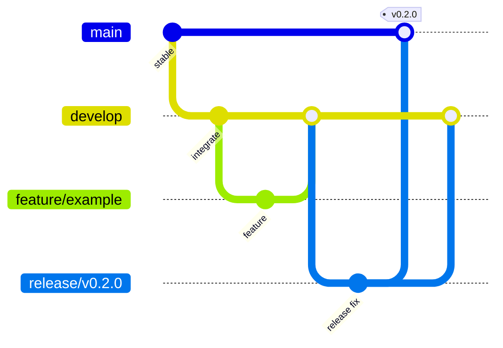

# Git 与 GitHub 协作规范

> 文档角色：本仓库的 Git Flow、GitHub Pull Request、发布标签与回滚约定。
>
> 状态：首个 GitHub 仓库创建前的执行规范；GitHub 分支保护和发布工作流配置后，应以平台实际配置为准。
>
> 参考：`E:\个人\学习\AI\ai\60-Git与工程协作` 的 Git Flow、公共历史、Tag 发布和回滚原则。

## 1. 目标与边界

本规范让每一项变更能回答四个问题：它为何发生、谁审阅过、是否通过验证、哪个发布制品包含它。它适用于所有源码、文档、CI 配置和发布配置。

以下规则优先级由高到低：GitHub 分支保护与必需检查、已发布版本的回滚安全、项目编码规范、本文件的默认流程、个人偏好。

当前事实：仓库已有本地 `main`，尚未配置远程仓库、GitHub 环境、分支保护或发布工作流；产品名为 Aster。〔FACT｜`.git`、`git remote -v`、`package.json`，2026-08-27〕

## 2. 分支模型

本项目采用 Git Flow；长期分支只有 `main` 与 `develop`。

| 分支 | 创建来源 | 合入目标 | 作用与限制 |
| --- | --- | --- | --- |
| `main` | 长期存在 | - | 已发布的稳定基线；只接受 `release/*`、`hotfix/*` 的 PR。 |
| `develop` | 长期存在 | - | 下一版本集成线；只接受日常功能和修复的 PR。 |
| `feature/<topic>` | `develop` | `develop` | 单个用户可见功能或明确开发任务。 |
| `fix/<topic>` | `develop` | `develop` | 尚未发布版本的缺陷修复。 |
| `release/vX.Y.Z` | `develop` | `main` 与 `develop` | 发版冻结；只允许版本、发布配置、文档和阻断发布的修复。 |
| `hotfix/<topic>` | `main` | `main` 与 `develop` | 已发布版本的紧急修复。 |
| `docs/<topic>`、`ci/<topic>`、`chore/<topic>` | `develop` | `develop` | 仅在改动性质需要单独表达时使用。 |



命名只使用小写 ASCII、数字和连字符；不要使用人名、日期或模糊名称，如 `feature/new`。

## 3. 日常开发与 Pull Request

### 3.1 从最新集成线创建分支

```powershell
git fetch --prune origin
git worktree add ..\Aster-feature-task-list-export -b feature/task-list-export origin/develop
Set-Location ..\Aster-feature-task-list-export
```

每个分支只完成一个可验收目标。开始前在 PR 或 Issue 中写明目标、非目标和验证方法；执行中不顺手重构无关模块。

所有需要修改仓库的用户需求必须在独立 Git worktree 中完成：一个活跃任务对应一个 worktree 和一个分支。不得通过切换共享工作目录的分支来并行处理不同任务；worktree 内可直接提交、推送并创建 PR/MR，无需先合并到其他本地分支。

PR/MR 已合并或已关闭后，对应的 `feature/*`、`fix/*`、`docs/*`、`ci/*`、`chore/*` 分支即视为结束：不得继续提交或修改，也不得作为下一项工作的创建来源。即使该分支仍保留在本地或远程，新目标也必须从最新 `develop` 新建一个 worktree 和与目标对应的分支。

### 3.2 提交前检查

```powershell
git status --short
git diff
pnpm lint
pnpm typecheck
pnpm test
pnpm build
git diff --check
git add <exact-files>
git diff --cached
```

不得将 `.env*`、密钥、访问令牌、用户数据、构建产物、缓存、临时目录或机器专属配置加入暂存区。若发现某类稳定生成文件遗漏在 `.gitignore`，先在 PR 中说明来源和影响，再补充精确忽略规则；不要用宽泛规则隐藏可能需要提交的源码。

### 3.3 提交格式

提交信息使用 Conventional Commits：

```text
<type>(optional scope): short imperative summary
```

| 类型 | 使用场景 |
| --- | --- |
| `feat` | 新的用户可见能力 |
| `fix` | 缺陷修复 |
| `docs` | 仅文档变更 |
| `test` | 测试新增或调整 |
| `refactor` | 不改变行为的结构调整 |
| `build` / `ci` | 构建、依赖、发布或 GitHub 自动化 |
| `chore` | 其他维护项 |
| `revert` | 对已共享变更的反向提交 |

主题不使用句号；提交正文需要解释兼容性、迁移或安全影响时再添加。

### 3.4 同步分支与合并

功能分支仅由自己使用时，可以在提 PR 前整理到最新 `develop`：

```powershell
git fetch origin
git rebase origin/develop
git push --force-with-lease
```

多人共享分支、`main`、`develop`、`release/*`、`hotfix/*` 均为公共历史：禁止 rebase 后强推，使用普通 merge 或通过 PR 合并。任何情况下不用裸 `git push --force`。

PR 默认目标为 `develop`，并应包含：

1. 目标与非目标。
2. 关键设计或用户可见变化。
3. 已运行的验证命令与结果。
4. 风险、迁移、后续工作或手工验证步骤。

默认采用 **squash merge**，让每项工作在 `develop` 保留一个可追溯提交。`release/*` 与 `hotfix/*` 合并可保留 merge commit，以便明确发布边界；以 GitHub 仓库实际配置为准。

## 4. GitHub 必配项

仓库创建后，维护者必须在 GitHub 设置中完成以下配置。它们不是提交到 Git 的文件，不能由本规范自动生效。

| 对象 | 必须配置 |
| --- | --- |
| `main` | Require pull request、至少 1 个审批、Require status checks、Require branches to be up to date、禁止 force push 与删除。 |
| `develop` | Require pull request、Require status checks、禁止 force push 与删除。 |
| `release/*`、`hotfix/*` | 保护匹配规则、禁止 force push；合并前通过完整 CI。 |
| Actions | Workflow permissions 设为最小权限；普通 CI 只需 `contents: read`。 |
| 合并方式 | 启用 squash merge；保留 merge commit 仅用于发布/热修复分支。 |
| 安全 | 启用 Dependabot alerts、Secret scanning、Push protection（可用时）。 |

本仓库的 [CI 工作流](../.github/workflows/ci.yml) 对 PR 与 `main`/`develop` 推送运行 `lint`、`typecheck`、`test`、`build`。在仓库状态已经通过这些门禁前，不要把它们设为强制检查以外的“绿色装饰”。

## 5. 发布流程

### 5.1 版本与标签

版本采用 SemVer：`vMAJOR.MINOR.PATCH`。桌面应用版本的当前运行时来源是 `apps/desktop/package.json`；发布前必须确认各工作区的版本策略、更新元数据与 tag 一致。〔FACT｜`apps/desktop/package.json`、`register-main-ipc.ts` 使用 `app.getVersion()`〕

- `MAJOR`：存在不兼容的用户、配置、数据或插件变化。
- `MINOR`：向后兼容的新能力。
- `PATCH`：向后兼容的缺陷修复。
- `-beta.N`：预发布测试版本，不面向默认 Stable 用户。

已发布的 tag 不移动、不覆盖。tag 是源码发布点，不等同于安装包已经构建、上传或推送给用户。

### 5.2 正式发布

```powershell
git switch develop
git pull --ff-only origin develop
git switch -c release/v0.2.0
git push -u origin release/v0.2.0

# 只处理发布阻断项并完成完整验证
# 通过 PR 合入 main，再创建不可变 tag
git switch main
git pull --ff-only origin main
git tag -a v0.2.0 -m "release: v0.2.0"
git push origin v0.2.0
```

随后：

1. CI 基于 tag 构建与发布制品；只有可追溯到该 tag 的制品才能进入 GitHub Release。
2. 验证安装、首次启动、基础功能与更新检查。
3. 将 `release/v0.2.0` 的发布修复合回 `develop`。
4. 在 GitHub Release 记录用户可读变更、已知限制和回滚说明，再删除 release 分支。

自动更新功能尚未实现；在其上线前，GitHub Release 只是安装包分发与版本记录，不代表客户端可自动获得更新。〔FACT｜`apps/desktop/package.json` 当前未声明打包/更新依赖，2026-08-27〕

### 5.3 Hotfix 与回滚

紧急修复从 `main` 创建：

```powershell
git switch main
git pull --ff-only origin main
git switch -c hotfix/crash-on-startup
```

修复经验证后合入 `main`，发布新的补丁 tag，并同步合入 `develop`。如果当前有存续的 release 分支，也要评估是否需要同步。

生产问题优先恢复上一个已验证制品，再用 PR 和 `git revert` 修正共享历史。不要对 `main` 执行 `reset --hard` 或强推，也不要把生产恢复简化为在用户机器上切换源码 tag。SQLite Migration、用户配置和协议变化不一定能随应用二进制回退；遇到不兼容变化时优先向前修复或提供明确的数据恢复方案。

## 6. 评审重点

评审不是只看代码风格。必须检查：

- 变更是否只覆盖声明的目标，是否混入无关改动。
- 边界输入是否经过 Schema 校验，Renderer 是否保持在安全沙箱内。
- 文件、命令、网络和数据删除是否遵守权限、审批、取消与幂等规则。
- 迁移是否前向、可重复、失败可恢复；更新是否兼容现有用户数据。
- 是否补足有意义的测试、文档和可重复验证证据。

详见 [后端编码规范](./13-后端编码规范.md) 与 [前后端模块与编码规范](./06-前后端模块与编码规范.md)。

## 7. 首次初始化清单

仓库创建后按以下顺序执行：

- [ ] 推送本地 `main` 到正确的 GitHub 组织/仓库，并创建 `develop`。
- [ ] 配置本文件第 4 节的分支保护、安全扫描、Actions 权限与合并方式。
- [ ] 在 Actions 页面确认 `CI` 能在一个文档 PR 上完整运行。
- [ ] 选择并提交许可证；在 README 中写明。
- [ ] 明确 Issue 模板、维护者/Code Owners 和安全披露渠道。
- [ ] 在首次发布前实现打包、签名、GitHub Release 与更新链路，并在测试设备完成升级和失败恢复验证。

## 8. 常用命令速查

```powershell
# 先同步并观察，不直接改变工作区
git fetch --prune origin
git log --oneline --graph --decorate --all -20

# 取消暂存，保留文件修改
git restore --staged <file>

# 撤销共享提交，生成可评审的反向提交
git revert <commit>

# 找回本地误操作前的引用，先建立保护分支
git reflog --date=local
git switch -c recovery/<topic> <commit>
```

`git reset --hard`、删除远程分支、覆盖 tag、对公共分支强推均属于高风险操作；除非已有明确批准和恢复方案，否则不得执行。
