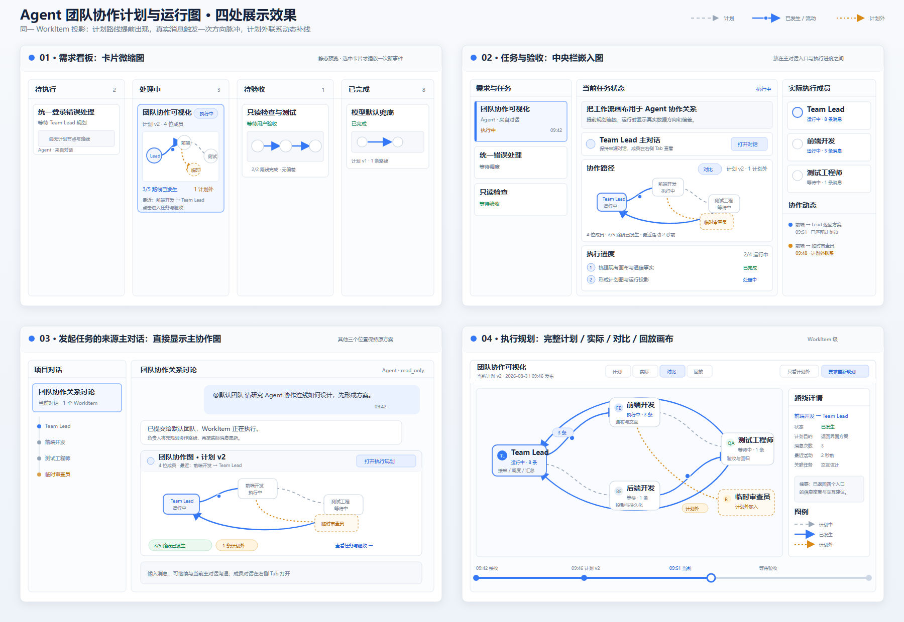
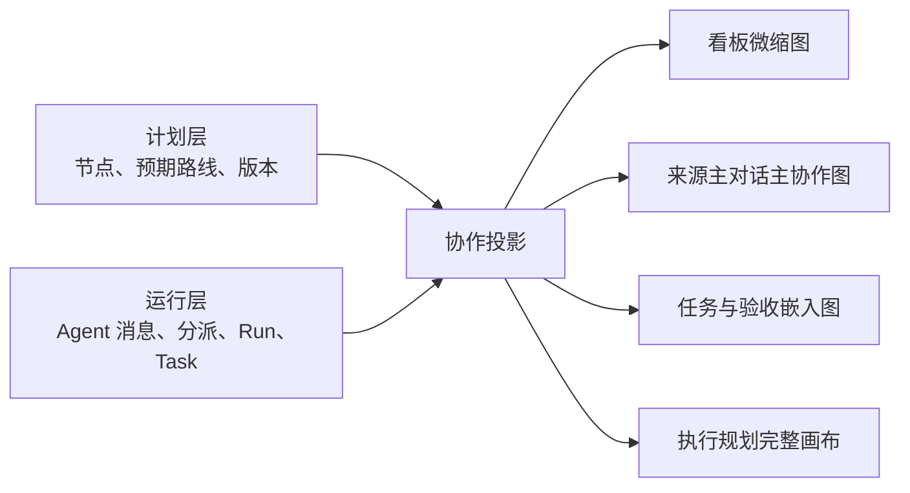
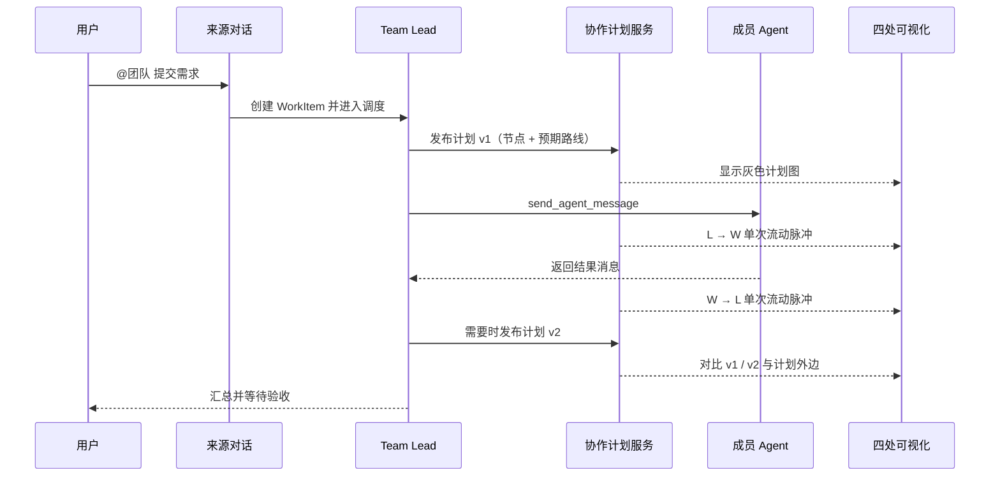
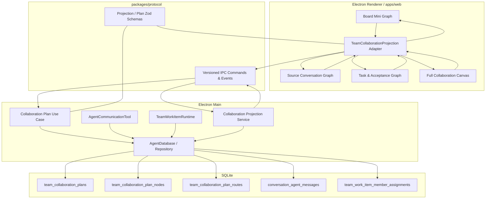

# Agent 团队协作计划与运行图产品需求及概要设计（PRD + HLD）

> 文档状态：核心功能已实施；历史回放、布局持久化与专用活动事件待后续
>
> 版本：v1.3
>
> 更新时间：2026-08-31
>
> 适用范围：Team WorkItem 的计划、执行观察、偏差识别与历史回放
>
> 关联文档：[多 Agent 团队与任务调度设计](./05-多Agent团队与任务调度设计.md)、[前后端接口与数据约定](./02-前后端接口与数据约定.md)、[界面迁移与设计系统规范](./07-界面迁移与设计系统规范.md)、[业务上下文](./14-业务上下文.md)

## 0. 方案结论

本方案不建设新的工作流引擎，也不把 Agent 之间的每次消息升级为永久通信信道。推荐建立一份**按 WorkItem 隔离、可版本化的协作计划图**：Team Lead 在执行前声明预期参与者和预期通信路径；真实的 Agent 消息、分派和结果回传再叠加到这张图上，形成“计划拓扑 + 运行事件”的统一视图。计划外消息允许发生，并以临时偏差边展示。〔INFER〕

一份协作事实生成四种 UI 投影：〔INFER〕

1. 需求看板：卡片内的静态微缩图，选中后可展开。
2. 发起团队任务的来源主对话：在团队任务提交结果之后直接显示主协作图。
3. “任务与验收”页：中央栏内的只读嵌入图，位于 Team Lead 对话入口和执行进度之间。
4. “执行规划”页：完整画布，用于查看计划、实时运行、计划/实际对比和历史回放。

连线的生命周期采用以下规则：**计划发布时出现；消息发生时短暂高亮并显示方向流动；消息结束后连线不消失，而是沉淀为带次数和最近活动时间的已发生关系；计划外联系生成红色临时边；计划修订后旧边进入历史版本，不覆盖既有执行事实。画布连线不叠加用途或消息文字；同一对 Agent 双向通信时使用上下两条平行直线和相反箭头，不使用绕行回弧。**〔INFER〕



可编辑矢量源稿：[agent-team-collaboration-visualization-overview.svg](./assets/agent-team-collaboration-visualization-overview.svg)。

### 0.1 2026-08-31 实施快照

当前代码已经完成计划/实际关系图的生产竖切：Protocol 提供统一投影 Schema；SQLite Migration 17 新增计划、节点和路线表，并给真实 Agent 消息补充 WorkItem 归属；Team Lead 可用 `set_team_collaboration_plan` 发布完整计划修订；Main 生成计划内、计划外、跳过和已发生路线；Renderer 用一套 SVG 图元分别渲染看板微缩图、来源主对话主图、“任务与验收”嵌入图和“执行规划”完整画布。节点复用 Conversation 上受控的 Agent 图标；非微缩卡片底部保留两行最新输出区域，持久快照只带最近 Assistant 输出的 280 字符以内尾部摘录，运行中按 Run ID 合并 `assistant.delta`。图的布局、颜色、间距和响应式使用 Tailwind 与语义 Token，Feature CSS 只保留 SVG 数据流关键帧。〔FACT｜`packages/protocol/src/team-collaboration.ts`；`apps/desktop/src/main/storage/agent-database.ts`；`apps/web/src/features/team/collaboration/collaboration-graph.tsx`〕

本批次没有实现历史时间轴、旧计划版本切换、用户拖动后的布局持久化、专用 `team.collaboration.activity` 事件和聚合投影表。当前可见图通过既有 Conversation Run 事件刷新持久投影，并直接消费 Assistant 文本增量更新卡片；已发生和计划外路线使用方向虚线表达流向，仅在发送方 Conversation 处于 `running` 时播放流动动画，发送方停止后保留虚线但立即静止，`prefers-reduced-motion` 时也停止动画。〔FACT〕

## 1. 背景与实施前基线

### 1.1 实施前已有产品事实

> 本节保留立项时的事实快照，用于说明改造起点；当前实现以 0.1 节和代码为准。

- 团队页面已经有“需求看板 / 任务与验收 / 执行规划”三个页签；需求看板点击 WorkItem 后会进入任务与验收，执行规划当前加载独立的 `WorkflowDesigner`。〔FACT｜`apps/web/src/features/team/team-workspace.tsx:319`〕
- “任务与验收”中央栏已经依次展示 WorkItem 摘要、Team Lead 主对话入口和执行进度；这为在两者之间插入“协作路径”区块提供了稳定位置。〔FACT｜`apps/web/src/features/team/team-workspace.tsx:499`〕
- 需求看板当前以四列 WorkItem 卡片展示标题、状态、来源、下一动作和时间，尚未展示参与者或协作关系。〔FACT｜`apps/web/src/features/team/team-work-item-board.tsx:18`〕
- 当前执行规划画布是 1800 × 760 的自定义 SVG 画布，具备节点拖动、键盘移动、端点连线、贝塞尔曲线和自动初始布局。〔FACT｜`apps/web/src/features/team/team-workflow-canvas.tsx:11`〕
- 当前 `WorkflowDesigner` 只把模板、节点、边和坐标保存在 React 本地状态，并按工作流语义拒绝环路；它不是 Team Runtime 的持久化事实。〔FACT｜`apps/web/src/features/team/team-workflow-designer.tsx:50`；`apps/web/src/features/team/team-workflow-graph.ts:19`〕
- Team WorkItem 已持久化 `sourceConversationId`、执行 Conversation、任务和事件；这使来源对话、团队页面和执行图能够按同一个 WorkItem 关联。〔FACT｜`packages/protocol/src/team-work-item.ts:56`；`packages/protocol/src/team-work-item.ts:73`〕
- WorkItem 的执行谱系已经返回 Team Lead 与真实参与 Agent 的 Conversation、Agent 身份、最近分派和深度。〔FACT｜`packages/protocol/src/team-work-item.ts:86`；`apps/desktop/src/main/storage/agent-database.ts:1700`〕
- Agent 消息已包含发送 Conversation、目标 Conversation、消息类型、Run、Task、已读状态和发生时间，并写入 `conversation_agent_messages`。〔FACT｜`packages/protocol/src/conversation.ts:390`；`apps/desktop/src/main/storage/agent-database.ts:3777`〕
- 持久团队成员关系和 WorkItem 成员分派分别由 `team_member_conversations` 与 `team_work_item_member_assignments` 保存，普通侧边对话不会仅因父子关系而被误认为执行成员。〔FACT｜`apps/desktop/src/main/storage/agent-database.ts:7116`；`apps/desktop/src/main/storage/agent-database.ts:1700`〕
- 当前 Agent 间消息与自动唤醒主链已存在，但业务上下文仍将完整端到端验证标为待补齐；长期团队的候选评分、租约、失败替补等也尚未完成。〔FACT｜`doc/14-业务上下文.md:522`〕

### 1.2 当前问题

现有页面能够回答“任务是什么、谁在运行、执行到哪一步”，但不能连续回答以下问题：〔INFER〕

- Team Lead 原本准备让谁和谁协作？
- 刚才是哪一个 Agent 向哪一个 Agent 发送了什么类型的消息？
- 当前真实执行是否偏离了最初计划？
- 一次性 Subagent、持久成员和 Team Lead 的关系有什么区别？
- 用户在来源对话、看板和验收页看到的是不是同一份实时事实？

### 1.3 设计目标

| 目标 | 可验证结果 |
| --- | --- |
| 提前可见 | WorkItem 首次正式委派前，能够看到 Team Lead 发布的计划节点与计划边。 |
| 运行透明 | 每次 Agent 消息在正确方向上产生一次可感知脉冲，并更新次数与最近活动。 |
| 偏差可解释 | 计划外通信显示为临时边，用户可查看产生时间和原因摘要。 |
| 四处一致 | 同一 WorkItem 在四个入口显示相同节点、边状态、计数和版本。 |
| 不增加执行约束 | 即使没有计划边，合法 Agent 消息仍可投递；图用于计划、观察和复盘。 |
| 历史可追溯 | 计划修订不改写旧消息，用户可回看每一版本对应的实际执行。 |

以上目标为本次产品设计建议。〔INFER〕

## 2. 外部产品参考与借鉴结论

| 产品或能力 | 可借鉴点 | 不直接照搬的部分 |
| --- | --- | --- |
| [AutoGen Studio](https://microsoft.github.io/autogen/0.5.7/user-guide/autogenstudio-user-guide/index.html) | Team Builder 与 Playground 将团队结构配置和运行消息流分开呈现。〔FACT｜官方文档〕 | 不把图做成必须由用户手工搭建后才能运行的流程编辑器。 |
| [AutoGen GraphFlow](https://microsoft.github.io/autogen/dev/user-guide/agentchat-user-guide/graph-flow.html) | 明确区分执行图和消息图，说明“谁可执行下一步”与“谁真的发了消息”不是同一事实。〔FACT｜官方文档〕 | 不采用严格有向图来禁止反馈、回环或临时协作。 |
| [OpenAI Agents SDK Visualization](https://openai.github.io/openai-agents-python/visualization/) | 用不同节点和线型表达 Agent、Tool、MCP 与 handoff 等静态关系。〔FACT｜官方文档〕 | 静态结构图不足以表达本产品的消息次数、方向脉冲和计划偏差。 |
| [LangSmith Studio](https://docs.langchain.com/langsmith/studio) | 图遍历、中间状态与时间旅行适合复盘一次 Agent Run。〔FACT｜官方文档〕 | 本产品首先按 WorkItem 汇总跨 Conversation 协作，不展示 LangGraph 内部每一个模型/工具节点。 |
| [Datadog Service Map](https://docs.datadoghq.com/tracing/services/services_map/) / [Grafana Tempo Service Graph](https://grafana.com/docs/tempo/latest/metrics-from-traces/service_graphs/service-graph-view/) | 从真实 Trace 推导服务关系，并在边上汇总流量、延迟或错误，适合借鉴“运行事件投影”。〔FACT｜官方文档〕 | Agent 团队还需要执行前的计划边，不能只从历史消息反推。 |

综合借鉴结论：本产品应采用“**计划图类似团队编排图，实际层类似服务拓扑/Trace 投影，回放类似 Run 时间旅行**”的组合方式。计划和实际必须可比较，但不能混成一套状态。〔INFER〕

## 3. 范围

### 3.1 本期范围

- 每个 WorkItem 一张协作计划图，支持计划版本。
- Team Lead、持久团队成员和一次性 Subagent 三类节点。
- 计划边、已发生边、活动脉冲、临时偏差边和历史边。
- 四个 UI 入口及其信息密度差异。
- 节点/边详情、过滤、计划/实际对比和按时间回放。
- Main 侧持久化计划，基于既有 Agent 消息生成运行投影。
- 轻量性能、无障碍、隐私和错误降级合同。

以上均为待实施能力。〔INFER〕

### 3.2 明确不做

- 不新建常驻的 Agent 通信信道或 Socket 概念。
- 不要求所有消息必须沿计划边发送。
- 不把 Task DAG、LangGraph 内部执行图和 Agent 通信图合并为一张图。
- 不在第一版开放用户直接改变业务连线；用户通过“要求负责人重新规划”修订计划。
- 不在看板的所有卡片上持续播放动画。
- 不在图上默认展示完整消息正文、工具参数或审批凭据。
- 不以图状态替代 `conversation_agent_messages`、任务状态或 WorkItem 事件。

以上非目标用于控制第一版边界。〔INFER〕

## 4. 核心概念与语义

### 4.1 三层事实



- **计划层**：Team Lead 对本 WorkItem 的预期参与者、方向和协作目的；允许修订。〔INFER〕
- **运行层**：现有 Agent 消息、WorkItem 分派、Conversation Run 和 Task 状态，是不可由前端伪造的业务事实。〔FACT｜`apps/desktop/src/main/storage/agent-database.ts:3777`；`apps/desktop/src/main/storage/agent-database.ts:1700`〕
- **投影层**：Main 组合计划和运行事实，输出给 Renderer；Renderer 只负责四种密度的渲染与短暂动画。〔INFER〕

### 4.2 图的作用域

协作图以 `workItemId` 为唯一业务作用域，不建立团队级永久全连接图。相同两个 Agent 在不同 WorkItem 中可以有不同计划关系；WorkItem 完成后图转为只读历史。〔INFER〕

团队级页面可以在未来聚合多个 WorkItem 的长期协作统计，但不能替代本期的 WorkItem 图。〔INFER〕

### 4.3 节点语义

| 节点类型 | 生命周期 | 默认视觉 | 完成后的处理 |
| --- | --- | --- | --- |
| Team Lead | WorkItem 根执行 Conversation | 左侧起点、负责人徽标 | 保留并显示汇总状态 |
| 持久成员 | 团队配置中的长期成员 Conversation | 实线边框、岗位名、运行状态 | 保留在图中，可在后续 WorkItem 复用 |
| 一次性 Subagent | 单次分支任务 Conversation | 虚线边框、“临时”标记 | 置灰但保留父子谱系，可折叠 |
| 计划占位节点 | 已规划岗位但尚未绑定实际 Conversation | 空心边框、“待分配”标记 | 绑定后在原位置替换，不新建重复节点 |

节点点击统一打开右侧详情；若已绑定 Conversation，则复用现有成员侧边 Tab。节点头像优先使用该 Conversation 持久化的受控 Agent 图标，缺失时回退到名称首字；非微缩卡片只显示两行最新 Assistant 输出摘录，不在图中复制完整 Timeline。〔FACT〕

### 4.4 连线不是永久信道

一条线表示“本 WorkItem 中，从 A 到 B 的预期或已发生协作关系”，不是一个需要手动关闭的网络连接。它的业务寿命跟随计划版本和 WorkItem，而不是跟随一条消息的发送时长。〔INFER〕

| 投影状态 | 触发条件 | 视觉表达 | 是否保留 |
| --- | --- | --- | --- |
| `planned` 计划中 | 当前激活计划声明 A → B，尚无真实消息 | 细灰虚线 + 空心箭头 | 计划版本有效期间保留 |
| `active` 活动脉冲 | 新消息已提交并在 UI 收到事件 | 蓝色高亮 + 单次方向粒子 | 只保留 1.2–2 秒的动效 |
| `observed` 已发生 | 路线上已有至少一条真实消息 | 中性实线 + 消息次数 + 最近时间 | WorkItem 历史中保留 |
| `ad_hoc` 计划外 | 真实 A → B 消息没有匹配当前计划路线 | 红色点划线 + “计划外” | 当前版本及历史中保留 |
| `skipped` 未使用 | WorkItem 结束时计划路线从未发生消息 | 淡灰虚线 + “未使用” | 历史回放中保留 |
| `superseded` 已修订 | 新计划版本替代旧版本 | 仅在历史/对比模式显示 | 永久保留旧版本事实 |

同一条线的“计划定义状态”和“运行投影状态”分开保存或计算，避免把一次动画写成数据库业务状态。〔INFER〕

### 4.5 偏差与计划修订

1. 合法消息永远先投递，不能因为缺少计划边而失败。
2. 投影服务按发送者、接收者和消息发生时有效的计划版本匹配路线。
3. 未匹配时生成 `ad_hoc` 投影边，不复制消息正文。
4. Team Lead 可以在后续重新规划时把常见临时边纳入新版本。
5. 新版本只影响激活时间之后的消息；历史消息继续归属原版本或原偏差边。

以上为软约束设计。〔INFER〕

## 5. 用户流程

### 5.1 正常流程



上述时序中的计划发布、委派、真实消息关联和当前投影已经实现；逐事件瞬时脉冲和历史回放仍待后续。〔FACT/INFER〕

### 5.2 无法提前完整规划

当 Team Lead 只能确定部分路径时，允许发布包含占位成员或可选边的最小计划；执行中新增成员会先以临时节点/临时边出现，再由下一版计划正式吸收。系统不为了凑齐整图阻塞真实任务。〔INFER〕

### 5.3 没有计划仍开始执行

如果首条真实分派早于计划发布，系统显示“尚未发布计划”的运行图，并把关系标记为临时；Team Lead 后续发布计划后，不回写改变早先消息的归属。〔INFER〕

## 6. 四个展示位置的产品设计

### 6.1 信息密度总表

| 展示位置 | 默认尺寸/位置 | 默认内容 | 交互 | 动画策略 |
| --- | --- | --- | --- | --- |
| 需求看板 | WorkItem 卡片底部约 96–120 px | 最多 6 个关键节点、路线状态、计划外数量 | 点击卡片进入任务与验收；选中卡可展开到约 220 px | 全部静态；仅选中展开卡播放新事件一次 |
| 来源主对话 | `submit_team_work_item` 结果之后，约 280–360 px | 主协作图、当前计划、实际流向、Agent 图标和两行最新输出 | 打开完整规划、打开成员侧边 Tab | 当前对话可见时播放一次 |
| 任务与验收 | 中央栏，Team Lead 对话入口和执行进度之间，约 240–320 px | 完整参与者、当前计划边、实际边、Agent 图标、两行最新输出和图例 | 选择节点/边、筛选、打开完整画布 | 当前 WorkItem 可见时播放一次 |
| 执行规划 | 现有完整页签，占满中央工作区 | 计划/实际/对比、版本、Agent 图标、两行最新输出和详情 | 缩放、平移、选中、布局调整、版本切换、回放 | 允许完整事件动画，支持 reduced motion |

四处必须读取相同的 `TeamCollaborationProjection`，不能分别维护节点、边或消息计数。〔INFER〕

### 6.2 需求看板

卡片继续以 WorkItem 状态为主，微缩图只承担“协作是否已规划、当前谁在工作、有没有计划外联系”的扫视任务。卡片展示以下压缩信息：〔INFER〕

- 关键节点：Team Lead、当前运行成员、最近活动成员；超过 6 个合并为 `+N`。
- 线型：计划中、已发生、计划外三种，不显示消息正文。
- 图下注释：`计划 v2 · 3/5 条路线已发生 · 1 条计划外`。
- 队列中的 WorkItem 若尚未计划，显示“等待 Team Lead 规划”，不绘制伪图。
- 所有卡片不循环播放流动虚线，避免整页持续闪烁与高 CPU 占用。

### 6.3 来源主对话

来源主对话只做一项调整：团队任务提交成功后，在对应结果消息下方直接显示主协作图，不再额外设计另一套摘要卡或折叠态。需求看板、“任务与验收”和“执行规划”的既有方案保持不变。〔INFER〕

- 图与 `sourceConversationId + workItemId` 精确绑定。
- 图标题栏只保留 WorkItem 名称、状态、计划版本和“打开执行规划”入口。
- 点击节点时保持来源主对话不变，并在右侧打开对应成员 Tab。
- WorkItem 完成后图保留在原消息位置，转为只读历史。
- 空间不足时在图内部缩放或平移，不改成另一种图形语义。

### 6.4 “任务与验收”页

在中央栏 WorkItem 摘要和 Team Lead 主对话入口之后、执行进度之前增加 `协作路径` Section。右侧栏继续负责真实成员与协作动态，避免重复塞入完整聊天。〔INFER〕

嵌入图提供：〔INFER〕

- `计划 / 实际 / 对比` 三态切换，默认“对比”。
- 当前计划版本、参与者数量、路线使用率和计划外数量。
- 节点状态与右侧成员列表联动选中。
- 边点击后右侧显示目的、次数、最近消息时间和关联 Task，不显示完整正文。
- 高度稳定在 240–320 px；成员增多时缩放或聚合，不推动执行进度无限下移。

### 6.5 “执行规划”完整画布

现有“执行规划”页签保留，但语义从“工作流模板编辑器”调整为“WorkItem 协作计划与运行图”。第一版完整画布具备：〔INFER〕

- 模式：`计划`、`实际`、`对比`、`回放`。
- 版本：查看 v1、v2…，对比当前版本与上一版。
- 时间轴：从 WorkItem 接收、计划发布、消息、分派、任务状态直到验收。
- 图例：计划、已发生、当前活动、计划外、未使用、临时成员。
- 过滤：只看活动、只看计划外、按 Task、按消息类型。
- 布局调整：用户可拖动节点位置并保存视图坐标，但不直接改变业务路线。
- 重新规划：通过结构化指令让 Team Lead 生成新版本，发布前显示差异摘要。

## 7. 功能需求

> 本节均为目标能力。〔INFER〕

### FR-01 Team Lead 发布计划

- Team Lead 在首次正式委派前优先调用团队专用计划工具，提交节点、路线、目的和修订理由。
- Main 校验节点属于当前 Team/WorkItem 或是合法占位岗位，且每一条边的两端存在。
- 当前版本中同一有向 Agent 对只允许一条业务路线；多个目的合并到同一条边的 `purpose` 列表，保证没有显式 `routeId` 的既有消息仍可确定性匹配。
- 计划工具失败不自动伪造成功；WorkItem 可以继续执行，但图显示“计划未发布”。

### FR-02 计划版本

- 首次发布为 `revision=1`；每次修订新增版本，禁止原地覆盖。
- 一个 WorkItem 同时最多一个 `active` 计划。
- 激活新版本与旧版本进入 `superseded` 在同一数据库事务完成。
- 每版保存创建者、原因、创建时间、激活时间和节点布局。

### FR-03 真实消息投影

- Main 在 Agent 消息提交成功后发送轻量投影更新事件。
- 投影按 `senderConversationId + targetConversationId + occurredAt` 匹配当时激活的计划。
- 消息次数、首末时间、类型分布和未读数从既有消息事实聚合，不复制正文。
- Renderer 的粒子动画只是新事件的瞬时表现，不写回数据库。

### FR-04 计划外联系

- 当前版本不存在匹配边时，生成有向 `ad_hoc` 投影边。
- 相同方向的后续计划外消息聚合到同一条边。
- 反方向消息是独立边；A → B 不隐含 B → A。
- 修订计划后，旧临时边保留在旧版本/历史中；新消息才匹配新计划。

### FR-05 节点绑定

- 计划可以先绑定稳定 `agentId`，实际 Conversation 创建后再补充 `conversationId`。
- 绑定必须保留原节点 ID 和坐标，避免 UI 跳动。
- 一次性 Subagent 通过父任务谱系创建，只能附着在其真实父节点下。

### FR-06 四处同步

- 四个入口按 `workItemId` 请求同一个投影接口。
- 投影更新事件只携带 `workItemId`、`revision` 和变更提示；Renderer 收到后增量更新或重新取快照。
- 不可见入口不维持独立动画计时器；重新可见时直接显示当前快照。

### FR-07 详情与跳转

- 节点点击复用现有成员侧边 Tab 行为。
- 边详情显示两端、方向、目的、消息计数、最近活动、关联 Task 和计划/偏差状态。
- 完整消息内容只在原生 Conversation Timeline 中查看。

### FR-08 回放

- 回放按持久时间排序重建某一时刻的节点/边投影。
- 拖动时间轴只改变显示，不改变 WorkItem、消息已读状态或任务状态。
- 回放到计划修订点时明确显示版本切换。

### FR-09 空、错与降级

- 无计划、无参与者、加载失败、旧数据缺计划表都使用稳定容器展示真实状态。
- 计划加载失败不影响 WorkItem 和 Conversation 的正常使用。
- 某条消息无法解析时记录安全诊断并跳过该事件，不让整张图不可用。

### FR-10 动画与通知

- 每条新消息最多触发一次方向脉冲；同一事件 ID 在同一 Renderer 生命周期内去重。
- 默认 1.5 秒完成，连续消息可合并为带数量的脉冲。
- `prefers-reduced-motion` 下取消位移动画，改用边高亮和计数更新。

## 8. 验收标准

> 以下场景全部满足，才可认为第一版完成。〔INFER〕

1. Team Lead 发布含 4 个节点、5 条路线的 v1 后，四个入口在刷新后显示相同版本、节点数和路线数。
2. Team Lead 沿计划边向成员发送消息后，可见画布只播放一次正确方向的脉冲；刷新后边显示消息次数，动画不重播。
3. 成员向 Team Lead 回复时显示独立反向边或匹配已计划的反向边；同一对 Agent 的双向边使用平行直线和相反箭头，不能合成无方向线，也不使用绕行回弧。
4. 未规划的成员之间发送合法消息时，消息成功投递且出现红色计划外边。
5. 发布 v2 后，v1 仍可回放；v1 时间段的消息计数不迁移到 v2。
6. 一次性 Subagent 完成后节点变灰并可折叠，父子关系和历史消息计数仍可查看。
7. 点击任务与验收图中的持久成员，来源主对话保持不变，右侧打开该成员原生 Conversation Tab。
8. 看板存在 30 个 WorkItem 时，未选中卡片没有持续动画；滚动和点击无明显卡顿。
9. 1024 × 680 与 1440 × 900、light/dark 均无重叠、不可解释空白或状态只靠颜色表达。
10. 开启 reduced motion 后无粒子位移，边高亮、计数和屏幕阅读器摘要仍能表达新消息。
11. 旧数据库没有计划记录时，现有 WorkItem、消息和验收流程正常，实际关系可按消息投影为“未规划执行”。
12. 计划存储或投影接口失败时，Agent 消息、Run 和 WorkItem 状态不受影响，UI 显示可重试错误。

## 9. 非功能需求

> 本节为目标约束。〔INFER〕

### 9.1 性能

- 微缩图建议上限 6 个可见节点、8 条可见边；完整图默认支持 30 个节点、80 条边。
- 超过上限按角色或临时分支聚合，用户展开后再渲染明细。
- 看板微缩图使用静态 SVG；完整画布仅在可见时运行动画。
- 投影快照建议控制在 256 KB 内，边详情和消息列表按需读取。
- 连续 200 ms 内的同一路线事件可合并渲染，但数据库计数保持逐条准确。

### 9.2 可访问性

- 图必须有等价的“参与者与路线列表”视图，键盘可切换节点和边。
- 状态同时使用颜色、线型、图标或文字标签。
- 新消息只播报聚合摘要，例如“测试工程师向 Team Lead 返回 1 条结果”，不逐字符播报。
- 遵守 `prefers-reduced-motion`。现有 UI 规范已要求动画尊重该设置。〔FACT｜`doc/07-界面迁移与设计系统规范.md:349`〕

### 9.3 隐私与安全

- 投影 DTO 默认不含完整消息正文、系统 Prompt、工具参数、审批凭据或绝对路径。
- 边详情可展示经过长度限制的安全摘要；查看正文必须跳到原 Conversation。
- Renderer 不能提交“消息已发生”或“成员运行中”等运行事实。
- 所有计划写入经过 Protocol Schema、可信 IPC Sender 和 Main 侧 WorkItem/Team 校验。

### 9.4 一致性与恢复

- 计划激活、旧计划失效和审计事件同事务提交。
- Renderer 事件必须在数据库提交后发送；数据库事实优先于动画事件。该顺序符合现有后端规范。〔FACT｜`doc/13-后端编码规范.md:235`〕
- 应用重启后从计划表与消息表重建投影，不恢复未完成动画。

## 10. 概要架构

> 计划表、统一投影、Team Lead 工具、查询 IPC 和四个 Renderer 容器已经落地；图中的专用事件与历史能力仍是目标部分。〔FACT/INFER〕



### 10.1 边界职责

| 模块 | 职责 | 禁止事项 |
| --- | --- | --- |
| Collaboration Plan Use Case | 校验、发布、修订、激活计划 | 不执行模型循环，不直接拼 UI DTO |
| Collaboration Projection Service | 合并计划、成员谱系、消息聚合和时间点 | 不修改 WorkItem 或消息事实 |
| AgentCommunicationTool | 继续负责消息发送、等待和唤醒 | 不因图上缺边拒绝合法消息 |
| AgentDatabase/Repository | 事务持久化计划并查询既有消息 | 不依赖 React 或 Electron Window |
| Projection Adapter | 缓存当前快照、按事件去重并分发给四种组件 | 不创建第二份可写业务状态 |
| 四种图组件 | 按密度渲染、选择、跳转、瞬时动画 | 不直接调用 IPC，不伪造运行状态 |

这些边界延续现有“IPC 只适配、Use Case 负责业务、Storage 不依赖 UI”的依赖方向。〔FACT｜`doc/13-后端编码规范.md:82`〕

## 11. 数据设计

> 采用“新计划表 + 复用既有消息事实”的最小数据方案。〔INFER〕

### 11.1 新增表

```text
team_collaboration_plans
  id PK
  work_item_id FK
  revision UNIQUE(work_item_id, revision)
  status active | superseded
  created_by_conversation_id FK
  reason
  created_at
  activated_at NULL
  superseded_at NULL

team_collaboration_plan_nodes
  id PK
  plan_id FK
  stable_agent_id NULL
  conversation_id NULL
  kind team_lead | standing | ephemeral | placeholder
  name_snapshot
  role_snapshot
  position_x
  position_y
  created_at

team_collaboration_plan_routes
  id PK
  plan_id FK
  from_node_id FK
  to_node_id FK
  purposes_json
  optional INTEGER
  created_at
  UNIQUE(plan_id, from_node_id, to_node_id)
```

第一版不新增 `team_collaboration_events`：真实消息继续由 `conversation_agent_messages` 提供，分派继续由 `team_work_item_member_assignments` 提供；Migration 17 为消息增加可空 `work_item_id`，消息提交后再由 Runtime 关联，保证投影不会混入同一持久 Conversation 的其他 WorkItem。当前计划不保存未发布草稿，发布事务直接生成 `active` 修订并把旧版改为 `superseded`。只有明确出现查询性能瓶颈后，才增加可重建的聚合投影表。〔FACT〕

### 11.2 投影 DTO

```ts
type TeamCollaborationProjection = {
  workItemId: string;
  plan: {
    id: string;
    revision: number;
    status: "active" | "superseded";
    createdAt: string;
    activatedAt: string;
    reason: string;
  } | null;
  nodes: TeamCollaborationNodeView[];
  edges: TeamCollaborationEdgeView[];
  summary: {
    participantCount: number;
    plannedRouteCount: number;
    observedRouteCount: number;
    adHocRouteCount: number;
    messageCount: number;
    lastActivityAt: string | null;
  };
};

type TeamCollaborationNodeView = {
  id: string;
  agentId: string | null;
  conversationId: string | null;
  kind: "team_lead" | "standing" | "ephemeral" | "placeholder";
  name: string;
  role: string;
  runStatus: "idle" | "queued" | "running" | "completed" | "failed" | "blocked";
  taskIds: string[];
  position: { x: number; y: number };
};

type TeamCollaborationEdgeView = {
  id: string;
  fromNodeId: string;
  toNodeId: string;
  state: "planned" | "observed" | "ad_hoc" | "skipped";
  purposes: string[];
  messageCount: number;
  unreadCount: number;
  firstActivityAt: string | null;
  lastActivityAt: string | null;
  messageTypes: Record<"message" | "notification" | "agent_result" | "task_result", number>;
};
```

DTO 不携带瞬时 `active` 状态；Renderer 收到 `team.collaboration.activity` 后将对应边短暂高亮。这样刷新不会重播旧动画。〔INFER〕

### 11.3 计划写入命令

建议由 Team Lead 使用受限的团队工具 `set_team_collaboration_plan`，其模型可见参数保持最小：参与者稳定标识、方向、目的和修订理由。Main 根据当前受管 WorkItem 补齐 `workItemId`、创建者 Conversation、Team 和项目，模型不能指定其他 WorkItem。〔INFER〕

用户侧不直接调用该工具。Renderer 的“要求重新规划”仍是用户消息/WorkItem 操作，由 Team Lead 生成下一版。〔INFER〕

## 12. IPC 与事件合同

> 名称为建议合同，实施时应与 `AgentClient` 现有命名保持一致。〔INFER〕

### 12.1 查询与命令

```text
team.collaboration.get_projection({ workItemId, revision?, at? })
team.collaboration.list_plan_versions({ workItemId })
team.collaboration.update_layout({ workItemId, planId, positions })
team.collaboration.request_replan({ workItemId, instruction })
```

- `get_projection({ workItemId })` 已实现，是四处 UI 的唯一读取入口；`revision` 和 `at` 尚未开放。〔FACT〕
- `list_plan_versions`、`update_layout`、`request_replan` 尚未实现，保留为后续合同。〔INFER〕
- 后续的 `update_layout` 只写坐标，不改变节点身份或路线。
- 后续的 `request_replan` 不直接写计划，由 Team Lead 生成并发布。

### 12.2 Renderer 事件

```ts
type TeamCollaborationChangedEvent = {
  type: "team.collaboration.changed";
  workItemId: string;
  revision: number | null;
  reason: "plan_published" | "plan_revised" | "participant_changed" | "message_projected";
};

type TeamCollaborationActivityEvent = {
  type: "team.collaboration.activity";
  eventId: string;
  workItemId: string;
  edgeKey: string;
  fromConversationId: string;
  toConversationId: string;
  messageType: "message" | "notification" | "agent_result" | "task_result";
  occurredAt: string;
};
```

`changed` 用于刷新持久投影，`activity` 仅用于一次性方向脉冲。两者都必须在消息/计划事务提交后发送。〔INFER〕

当前尚未新增这两个专用事件。Renderer 订阅既有 Conversation Run 事件并重新读取持久投影；已发生和计划外路线在发送方 `running` 期间使用方向虚线表达流动，发送方停止后虚线静止。专用事件留在 Phase 3 剩余项中，不能把当前按 Run 状态驱动的动画描述成已经具备逐消息去重脉冲。〔FACT〕

## 13. 前端复用与改造边界

### 13.1 可复用

- SVG 边层、箭头 Marker 和贝塞尔路径算法。〔FACT｜`apps/web/src/features/team/team-workflow-canvas.tsx:86`；`apps/web/src/features/team/team-workflow-canvas.tsx:285`〕
- 节点拖动、坐标限制和 Alt + 方向键移动。〔FACT｜`apps/web/src/features/team/team-workflow-canvas.tsx:135`〕
- 初始分层布局的思路，但需替换为允许反馈边的布局算法。〔FACT｜`apps/web/src/features/team/team-workflow-canvas.tsx:239`〕
- 现有 Team 页签、WorkItem 选中状态和成员 Conversation 跳转。

### 13.2 不复用

- `WorkflowNodeDefinition` 的阶段、模型动作、脚本动作和输入输出合同；它表达工作流节点，不表达 Agent 身份。〔FACT｜`apps/web/src/features/team/team-workflow-simulator.ts:1`〕
- `wouldCreateWorkflowCycle`：Agent 沟通天然可能形成 A → B → A 的反馈回路。〔FACT｜`apps/web/src/features/team/team-workflow-graph.ts:19`〕
- 手工输入/输出端口作为主要建图方式。
- 模拟运行状态作为真实 Team Runtime 状态。
- 把完整画布组件直接缩放塞入看板；四种视图应共享图元和投影模型，而不是复用一个巨型 DOM。

以上“可复用/不复用”是目标重构边界。未标注事实的条目为设计推论。〔INFER〕

### 13.3 建议组件拆分

```text
features/team/collaboration/
  collaboration-graph-model.ts
  collaboration-graph-layout.ts
  collaboration-graph-edge.tsx
  collaboration-graph-node.tsx
  collaboration-graph-legend.tsx
  collaboration-mini-graph.tsx
  collaboration-conversation-graph.tsx
  collaboration-embedded-graph.tsx
  collaboration-full-canvas.tsx
  collaboration-edge-details.tsx
  use-collaboration-projection.ts
```

共享图元只负责展示；每种容器自己决定信息密度、工具栏和空状态。来源主对话的容器直接呈现主协作图，不再增加单独摘要卡。样式与 Feature 共置并使用现有语义 Token。〔INFER〕

## 14. 关键架构决策（ADR 摘要）

### ADR-01 不建立永久通信信道

- **采纳**：WorkItem 计划边 + 真实消息投影。
- **拒绝**：Agent 建立连接后一直存在的独立 Channel 实体。
- **原因**：现有消息已经具备 sender/target/状态/时间；新增 Channel 会制造开启、关闭、恢复和权限语义，却不能自然表达一次性 Subagent 和计划修订。〔INFER〕

### ADR-02 计划与实际分层

- **采纳**：计划持久化，实际从现有消息与分派事实计算。
- **拒绝**：把消息一发生就写回计划边状态。
- **原因**：计划可以未使用，实际可以偏离；两者混写会丢失“原本准备怎么做”的复盘价值。〔INFER〕

### ADR-03 软约束优先

- **采纳**：计划外消息允许投递并显式标记。
- **拒绝**：无计划边就阻断消息。
- **原因**：团队执行中出现新信息是正常情况，图不能成为新的单点阻塞。〔INFER〕

### ADR-04 Main 生成投影

- **采纳**：Main/Repository 查询业务事实并输出 Zod DTO。
- **拒绝**：四个 Renderer 组件分别拼 WorkItem、成员和消息。
- **原因**：当前数据库和团队执行谱系都在 Main，Renderer 分别聚合会形成四份不一致逻辑。〔INFER〕

### ADR-05 第一版不开放直接改业务连线

- **采纳**：用户调整布局；业务路线由 Team Lead 计划，用户通过指令要求修订。
- **拒绝**：拖一条线就立即改变 Team Lead 约束。
- **原因**：先稳定计划、实际与偏差语义，再评估人工共同编辑；避免把现有工作流设计器的交互误当成团队调度事实。〔INFER〕

## 15. 实施分期

> 每一期都能独立验收，不以“以后可能使用”为理由提前实现后续层。下列状态按 2026-08-31 代码更新。〔FACT/INFER〕

### Phase 1：只读实际关系图

- [x] 从现有 WorkItem 执行谱系、分派和 Agent 消息生成实际图。
- [x] 落地“任务与验收”嵌入图与完整画布实际模式。
- [x] 自动验证节点跳转、方向、计数和空状态；旧数据在没有计划时仍可生成参与者图。

### Phase 2：计划发布与计划/实际对比

- [x] 新增计划表、Protocol、Main 投影和 Team Lead 计划工具。
- [x] 完成计划边、计划外边、版本修订和当前版本对比。
- [x] 将现有执行规划页由示例 WorkflowDesigner 切换为真实 WorkItem 画布。

### Phase 3：四处投影与实时脉冲

- [x] 增加看板微缩图，并把主协作图直接放入来源主对话的成功提交结果之后。
- [x] 使用既有 Run 事件刷新投影，并支持 reduced motion；微缩图保持静态。
- [x] 节点复用受控 Agent 图标；非微缩卡片显示持久最新输出摘录并实时合并 Assistant 文本增量。
- [ ] 增加专用、可去重的一次性活动事件，并完成 30 卡片与密集消息性能验收。

### Phase 4：历史回放与聚合优化

- [ ] 增加时间轴、版本切换和按 Task/消息类型过滤。
- [ ] 仅当真实查询指标不足时增加可重建的聚合投影表。

## 16. 测试策略

> 实施时至少覆盖以下层级。〔INFER〕

| 层级 | 核心用例 |
| --- | --- |
| Protocol | 计划/投影 Schema 正反例、版本、上限、未知字段拒绝 |
| Repository | 首版发布、并发修订、旧版失效、事务回滚、旧库 Migration |
| Projection | 计划内/计划外、双向、版本时间边界、一次性 Subagent、未读聚合 |
| IPC | Sender 校验、WorkItem 归属、响应 Schema、提交后事件顺序 |
| Agent 工具 | 只能修改当前受管 WorkItem、非法节点/边拒绝、失败不阻塞消息 |
| React 单测 | 四种密度、空/错/加载、节点跳转、脉冲去重、reduced motion |
| 视觉回归 | 1024 × 680、1440 × 900、light/dark、6/12/30 节点 |
| E2E | 提交 → 计划 v1 → 计划内消息 → 计划外消息 → v2 → 验收 → 回放 |

## 17. 风险与控制

| 风险 | 后果 | 控制方式 |
| --- | --- | --- |
| 把图误认为严格工作流 | Team Lead 为了满足图而绕远 | UI 明示“计划可调整”，计划外通信不阻塞 |
| 四处各自聚合 | 计数和状态不一致 | 单一投影 DTO 与统一订阅 Adapter |
| 动画过多 | 看板干扰、CPU 占用 | 微缩图静态、只对可见选中视图播放一次 |
| 节点位置跳动 | 用户无法跟踪 Agent | 稳定节点 ID、计划占位绑定后保留坐标 |
| 计划版本改写历史 | 无法复盘偏差 | 只追加版本，按激活时间匹配消息 |
| 消息正文泄露 | 敏感内容扩散到多个页面 | 投影不含 Agent 间消息、Prompt、工具参数或完整回复，只返回最近 Assistant 输出的 280 字符以内摘录；完整内容仍跳转原 Conversation |
| 图过密 | 线条不可读 | 节点/边上限、角色聚合、只看活动/偏差过滤 |
| 计划工具失败阻塞任务 | 团队可用性下降 | 计划是软能力，失败显示真实状态但不阻断合法执行 |

## 18. 已确认决策与后续文档同步

本方案已按当前讨论固定以下产品决策：〔INFER〕

- 需要同时显示在需求看板、来源主对话、“任务与验收”和“执行规划”。
- 仅来源主对话在团队任务提交结果之后直接显示主协作图；其他三个位置保持各自既定展示方案。
- Team Lead 应在可以判断执行路径时提前建立计划线，后续允许动态变化。
- 一次消息不让整条关系线随发送结束而消失；动画结束后保留已发生关系。
- 不建立团队级永久通信信道；图的业务作用域是 WorkItem。
- 核心计划/实际投影和四处展示已进入生产代码；历史回放、布局持久化和专用活动事件继续按分期实现。

本轮已经同步更新 `02-前后端接口与数据约定.md`、`05-多Agent团队与任务调度设计.md`、`11-AI工具体系与生命周期设计.md` 和 `14-业务上下文.md`；后续完成 Phase 3 剩余项或 Phase 4 时继续同步事件、性能和历史语义。〔FACT〕
