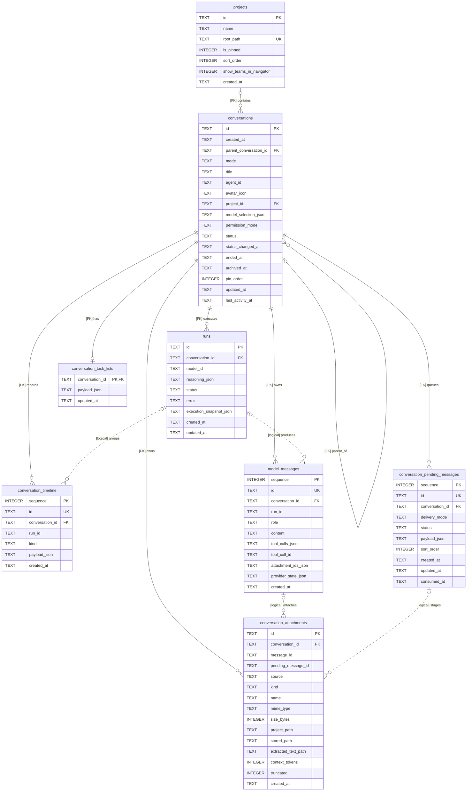
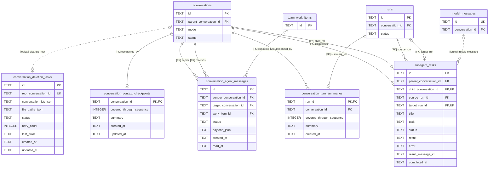
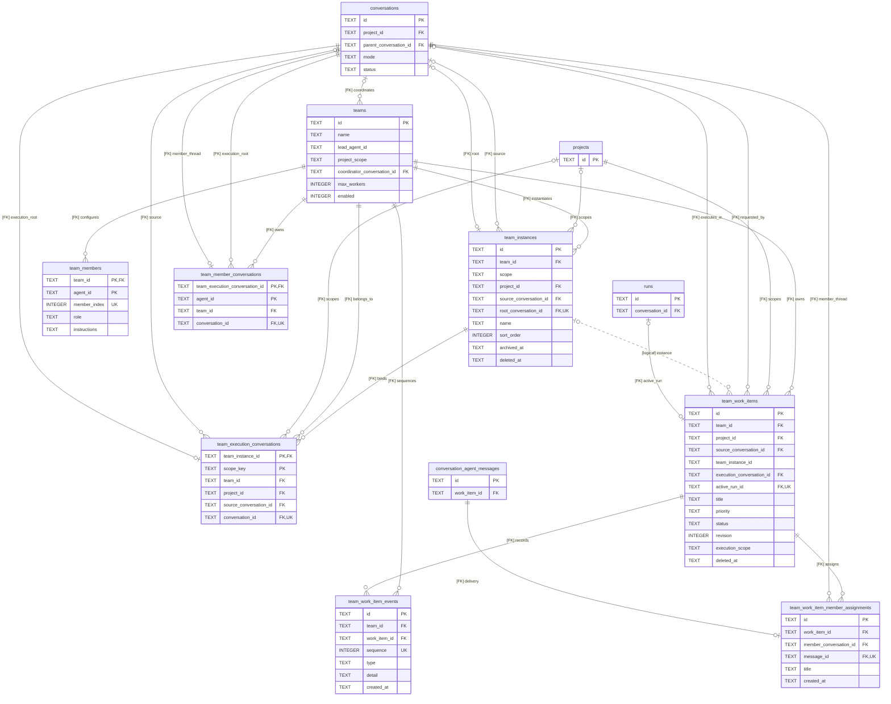
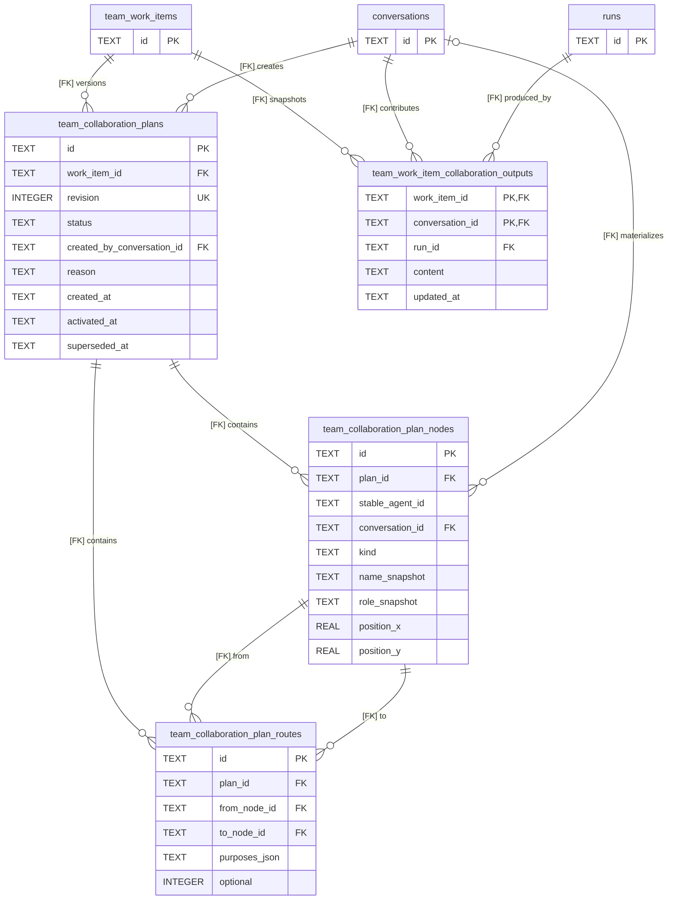
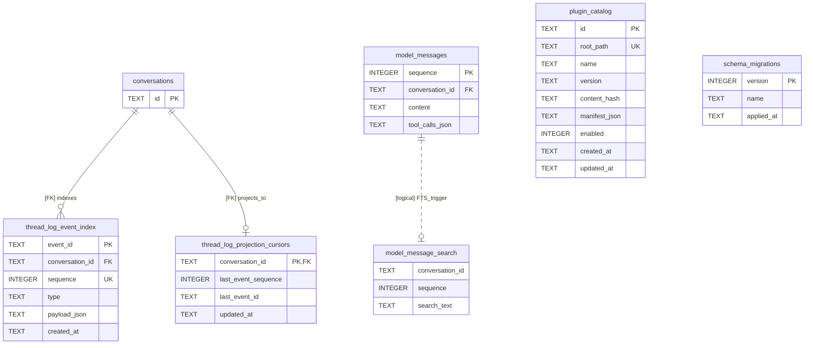
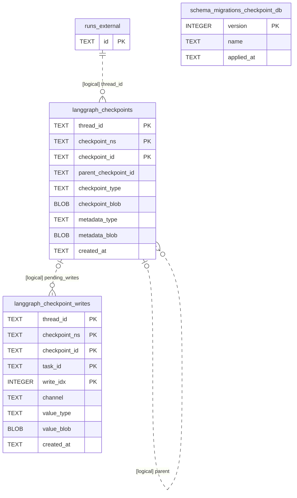

# Aster 数据库实体关系图

> 状态：数据库设计说明 v0.1
>
> 更新时间：2026-09-05
>
> 范围：当前桌面端 SQLite 表及其关系；`conversations` 及 `runs` 的模型相关字段例外使用已确认的最新目标结构。

## 1. 范围与阅读规则

Aster 当前在应用数据目录中使用两个相互独立的 SQLite 文件：

| 数据库 | 默认文件 | 表实例数 | 职责 |
| --- | --- | ---: | --- |
| 业务与运行投影库 | `agent.sqlite` | 30 | 项目、对话、Run、消息、附件、团队、事件投影、插件目录和迁移记录 |
| LangGraph 检查点库 | `langgraph-checkpoints.sqlite` | 3 | 图执行检查点、待提交写入和独立迁移记录 |

两个库各有一张自己的 `schema_migrations`，所以一共是 33 个物理表实例、32 个不同表名。`model_message_search` 是 FTS5 虚拟表；SQLite 自动生成的 FTS 影子表不纳入本文。

本文采用以下标记：

- **当前表**：来自现有建表语句与 Migration。
- **目标表**：已确认的设计目标，但代码和数据库迁移尚未完成。
- Mermaid 中关系名称带 `[FK]` 表示 SQLite 已声明外键；带 `[logical]` 表示仅由字段值、触发器或业务代码维护，数据库不强制约束。
- ER 图只展开主键、外键和理解关系所需的关键列。除 `conversations` 与 `runs` 的模型相关字段外，完整列定义仍以源码为准。
- Migration 过程中的临时表，如 `team_work_items_next`、`team_execution_conversations_next`、`conversations_migrated` 和 `langgraph_checkpoint_writes_v2`，不属于最终表清单。

这里是一份有意为之的“当前结构 + 局部目标替换”设计图：除 `conversations` 以及 `runs` 的模型相关字段外均描述当前落盘结构；它们严格采用[对话属性梳理](./20-对话属性梳理.md)第一部分及第 1.5 节的最新结论。它不能被理解为这些 Migration 已经上线。

> **统一约定：** 本文每一张 ER 图里的 `conversations` 都是第 2.1 节列出的**最新目标表**；`runs.model_id` 与 `runs.reasoning_json` 都是第 2.2 节列出的目标字段。第 2 图以后为避免重复，只展示参与该关系的主键、外键和 `mode`／`status` 等关键列；省略的字段仍以对应完整表为准，绝不回退为当前旧表。旧字段只会在第 9 节的迁移对照中出现。

## 2. 项目、最新 `conversations`、消息与执行

### 2.1 `conversations` 使用的目标结构

上图中的 `conversations` 是最新目标表，不是当前物理表的照抄。完整字段边界如下：

| SQLite 列 | 类型 | 可空 | 关系或规则 |
| --- | --- | --- | --- |
| `id` | `TEXT PRIMARY KEY` | 否 | 系统生成的稳定身份 |
| `created_at` | `TEXT` | 否 | ISO 8601；创建后不变 |
| `parent_conversation_id` | `TEXT` | 是 | FK → `conversations.id`；顶层对话为空 |
| `mode` | `TEXT` | 否 | `persistent` 或 `subagent`；不承载团队职责 |
| `title` | `TEXT` | 否 | 对话标题 |
| `agent_id` | `TEXT` | 存量可空 | 引用配置中的 Agent；本库没有 `agents` 表，因此不声明 FK |
| `avatar_icon` | `TEXT` | 是 | 对话自己的视觉身份；Subagent 可保存像素头像 |
| `project_id` | `TEXT` | 是 | FK → `projects.id`；根目录从 `projects.root_path` 获取 |
| `model_selection_json` | `TEXT`（JSON） | 存量可空 | 保存全局唯一的已配置 `modelId` 和 `reasoning`；供应商由模型配置解析，不在对话表重复保存 |
| `permission_mode` | `TEXT` | 否 | 对话当前审批偏好；临时授权不写入这里 |
| `status` | `TEXT` | 否 | 普通对话、长期 Agent 和 Subagent 共用；枚举及转换另行定稿 |
| `status_changed_at` | `TEXT` | 否 | 最近一次合法状态变化时间 |
| `ended_at` | `TEXT` | 是 | 明确结束后写入；“工作完成但可返工”时可为空 |
| `archived_at` | `TEXT` | 是 | `NULL` 表示未归档，不再冗余保存 `is_archived` |
| `pin_order` | `INTEGER` | 是 | `NULL` 表示未置顶，不再冗余保存 `is_pinned` |
| `updated_at` | `TEXT` | 否 | 持久属性最近修改时间 |
| `last_activity_at` | `TEXT` | 否 | 最近收发消息或执行活动时间 |

目标表不保存 `workspace_root_path`、`thread_kind`、Agent 配置快照、`team_id`、`has_unread_result`、`sort_order`、`deletion_pending` 或独立的 Subagent 状态／数量。项目路径来自 `projects`；模型供应商由 `model_selection_json.modelId` 解析；Run 的模型与思考事实由 `runs.model_id`、`runs.reasoning_json` 保存，完整执行环境再由 `runs.execution_snapshot_json` 保存；团队、阅读位置、删除清理和 Subagent 查询分别由关联记录承担。

### 2.2 `runs` 的模型与思考字段（目标结构）

| SQLite 列 | 类型 | 可空 | 规则 |
| --- | --- | --- | --- |
| `id` | `TEXT PRIMARY KEY` | 否 | 一次实际执行的稳定 ID |
| `conversation_id` | `TEXT` | 否 | FK → `conversations.id` |
| `model_id` | `TEXT` | 否 | 本次实际采用的全局已配置模型 ID；不是裸 API 模型名 |
| `reasoning_json` | `TEXT`（JSON） | 是 | 本次实际采用的思考配置；`NULL` 表示没有思考配置 |
| `execution_snapshot_json` | `TEXT`（JSON） | 否 | 当次解析出的供应商／远端模型、工具、权限及上下文等完整不可变快照；不保存密钥 |
| `status`、`error`、`created_at`、`updated_at` | 现有标量字段 | - | 描述本次执行的生命周期和失败信息 |

对话的 `model_selection_json` 是下一次执行的当前偏好；`runs.model_id`、`runs.reasoning_json` 是某次执行已经实际使用过的事实。用户随后切换模型或思考程度，不得回写历史 Run。

## 3. 对话协作、上下文与生命周期

`subagent_tasks` 目前同时保存交办内容、源／目标 Run、结果以及当前 `status`。目标对话设计已经决定由 `conversations.status` 统一表示对话生命周期，因此后续迁移需要再确认：该表是只保留“交办与回执记录”，还是保留一个仅表示交办处理进度、且不与对话状态同义的状态。本文不静默删除现有表，也不把两套状态描述成已经统一。

同样，`conversation_deletion_tasks.root_conversation_id` 和 `subagent_tasks.result_message_id` 当前只是逻辑引用；删除或消息清理不会由 SQLite 外键自动级联。

## 4. 团队、工作项与持续对话

注意两处当前实现边界：

1. `team_members.agent_id`、`teams.lead_agent_id` 与协作图中的 `stable_agent_id` 都引用文件配置中的 Agent 身份，本 SQLite 库没有 `agents` 表，因此不是数据库外键。
2. `team_work_items.team_instance_id` 是 Migration 通过 `ALTER TABLE` 增加的普通 `TEXT` 列，业务上指向 `team_instances.id`，但当前 SQLite Schema 没有声明外键。

## 5. 团队协作计划与产出快照

`team_collaboration_plans` 以 `(work_item_id, revision)` 保证版本唯一，并通过部分唯一索引保证一个工作项最多只有一个 `active` 计划。路线的起点和终点都必须存在于节点表；二者是否属于路线声明的同一计划，当前仍依赖业务代码校验，SQLite 外键和唯一约束本身不保证这一点。

## 6. 事件投影、全文检索、插件与迁移元数据

`model_message_search` 由 `model_messages` 的插入、更新和删除触发器维护，使用 trigram tokenizer；它没有外键。`plugin_catalog` 和 `schema_migrations` 是独立的系统表，因此图中不强行连接到业务实体。

## 7. LangGraph 检查点库

图中的 `runs_external` 不是检查点库里的物理表，而是 `agent.sqlite.runs` 的外部参照，用来说明运行时以 Run ID 作为 LangGraph `thread_id`。SQLite 不能跨数据库文件建立这里的外键。

Migration v2 为支持“写入先于检查点到达”，已经移除了 `langgraph_checkpoint_writes` 指向 `langgraph_checkpoints` 的物理外键。因此写入与检查点、检查点与父检查点都是逻辑关系；清理和一致性由 Checkpoint Saver 负责。

## 8. 完整表清单

### 8.1 `agent.sqlite`

| 领域 | 表 | 主键 | 主要关系 | 状态 |
| --- | --- | --- | --- | --- |
| 系统 | `schema_migrations` | `version` | 无 | 当前 |
| 项目 | `projects` | `id` | 被对话、团队实例、团队执行绑定和工作项引用 | 当前 |
| 对话 | `conversations` | `id` | 自关联父级；可关联项目 | **目标结构** |
| 执行 | `runs` | `id` | FK → `conversations`；模型与思考字段使用目标结构 | **局部目标结构** |
| 消息 | `conversation_timeline` | `sequence`，`id` 唯一 | FK → `conversations`；`run_id` 为逻辑引用 | 当前 |
| 消息 | `model_messages` | `sequence`，`id` 唯一 | FK → `conversations`；`run_id` 为逻辑引用 | 当前 |
| 消息 | `conversation_pending_messages` | `sequence`，`id` 唯一 | FK → `conversations` | 当前 |
| 附件 | `conversation_attachments` | `id` | FK → `conversations`；消息与待发消息为逻辑引用 | 当前 |
| 任务 | `conversation_task_lists` | `conversation_id` | FK → `conversations`，每个对话至多一条 | 当前 |
| 通信 | `conversation_agent_messages` | `id` | 发送／接收对话双 FK；可 FK → `team_work_items` | 当前 |
| Subagent | `subagent_tasks` | `id` | 父／子对话和源／目标 Run 外键；结果消息为逻辑引用 | 当前；状态语义待与目标对话统一 |
| 上下文 | `conversation_context_checkpoints` | `conversation_id` | FK → `conversations` | 当前 |
| 上下文 | `conversation_turn_summaries` | `run_id` | FK → `runs`、`conversations` | 当前 |
| 清理 | `conversation_deletion_tasks` | `id` | 根对话 ID 为逻辑引用；批量对象保存在 JSON | 当前 |
| 检索 | `model_message_search` | FTS5 `rowid` | 由 `model_messages` 触发器维护 | 当前虚拟表 |
| 事件投影 | `thread_log_event_index` | `event_id` | FK → `conversations`；对话内序号唯一 | 当前 |
| 事件投影 | `thread_log_projection_cursors` | `conversation_id` | FK → `conversations` | 当前 |
| 插件 | `plugin_catalog` | `id` | 无业务外键 | 当前 |
| 团队 | `teams` | `id` | 协调对话可为空；被成员、实例、工作项引用 | 当前 |
| 团队 | `team_members` | `(team_id, agent_id)` | FK → `teams` | 当前 |
| 团队 | `team_instances` | `id` | FK → 团队、项目及来源／根对话 | 当前 |
| 团队 | `team_execution_conversations` | `(team_instance_id, scope_key)` | FK → 团队实例、团队、项目及对话 | 当前 |
| 团队 | `team_member_conversations` | `(team_execution_conversation_id, agent_id)` | 两个对话 FK + 团队 FK | 当前 |
| 工作项 | `team_work_items` | `id` | FK → 团队、项目、来源／执行对话、活动 Run；实例为逻辑引用 | 当前 |
| 工作项 | `team_work_item_events` | `id` | FK → 团队、工作项 | 当前 |
| 工作项 | `team_work_item_member_assignments` | `id` | FK → 工作项、成员对话、Agent 消息 | 当前 |
| 协作图 | `team_collaboration_plans` | `id` | FK → 工作项、创建者对话 | 当前 |
| 协作图 | `team_collaboration_plan_nodes` | `id` | FK → 计划；可 FK → 对话 | 当前 |
| 协作图 | `team_collaboration_plan_routes` | `id` | FK → 计划、起点节点、终点节点 | 当前 |
| 协作输出 | `team_work_item_collaboration_outputs` | `(work_item_id, conversation_id)` | FK → 工作项、对话、Run | 当前 |

### 8.2 `langgraph-checkpoints.sqlite`

| 表 | 主键 | 主要关系 | 状态 |
| --- | --- | --- | --- |
| `schema_migrations` | `version` | 仅记录本检查点库 Migration | 当前 |
| `langgraph_checkpoints` | `(thread_id, checkpoint_ns, checkpoint_id)` | `thread_id` 逻辑对应 Run；父检查点为逻辑自引用 | 当前 |
| `langgraph_checkpoint_writes` | `(thread_id, checkpoint_ns, checkpoint_id, task_id, write_idx)` | 与检查点为逻辑关系，无物理 FK | 当前 |

## 9. 目标 `conversations` 与 `runs` 迁移影响

| 当前列或行为 | 目标处理 | 受影响关系 |
| --- | --- | --- |
| `selected_provider_id`、`selected_model_id`、`selected_reasoning_json` | 合并为 `model_selection_json`；其中的 `modelId` 是全局唯一已配置模型 ID，供应商由模型配置解析 | 模型选择读取、创建／切换对话、存量数据回填 |
| Run 只有 `model_id` 与可选 `execution_snapshot_json` | `model_id` 改为全局已配置模型 ID，新增 `reasoning_json`；完整快照继续保留解析出的供应商与其他执行配置 | 运行历史、重试、审计和执行详情展示 |
| `thread_kind` | 由 `mode` 只区分 `persistent` / `subagent`；团队职责留在团队关系中 | Subagent 查询、团队对话展示 |
| `workspace_root_path` | 从对话表移除；项目对话使用 `projects.root_path`，无项目工作区另建关系 | 文件、终端和附件路径解析 |
| `agent_name`、`agent_role`、`agent_is_default`、`agent_instructions` | 不再作为对话本体重复保存；运行所需不可变配置进入 Run 快照 | Agent 配置读取、历史可复现性 |
| `team_id` | 从对话表移除；通过团队实例、成员和执行绑定表查询 | 团队导航、职责判断 |
| `has_unread_result` | 改由阅读位置记录推导 `hasUnread`；阅读状态表仍需单独设计 | 未读角标、跨窗口同步 |
| `is_archived` | 由 `archived_at IS NOT NULL` 推导 | 归档筛选 |
| `is_pinned` | 由 `pin_order IS NOT NULL` 推导 | 置顶排序 |
| `sort_order` | 不作为对话本体字段；需要排序的具体容器自行维护 | 导航顺序 |
| `deletion_pending` | 删除与文件清理由 `conversation_deletion_tasks` 等可恢复流程承担 | 删除恢复、重试 |
| 无统一状态 | 新增 `status`、`status_changed_at`、`ended_at` | 长期 Agent、Subagent、普通对话生命周期 |
| 无持久权限偏好 | 新增 `permission_mode`；Run 继续保存实际执行快照 | 审批继承、历史审计 |
| 只有 `updated_at` | 新增 `last_activity_at`，把属性修改与活跃排序分开 | 最近对话排序 |

在数据库 Migration、协议 Schema、读写映射、查询索引和数据回填全部完成前，业务代码仍必须按当前表工作。实施时至少要补充以下约束与验证：

1. 为 `parent_conversation_id + mode + status` 和最近活动查询设计索引。
2. 定义统一 `status` 枚举及合法转换，再迁移 `subagent_tasks.status` 的职责。
3. 为现有对话回填 `mode`、模型选择 JSON、权限偏好、状态及三个时间字段；为现有 Run 回填或明确缺省的 `reasoning_json`。
4. 先建立阅读位置与无项目工作区关系，再删除旧的未读布尔值和路径列。
5. 更新所有外键依赖表的重建 Migration，并验证级联删除行为不变。

## 10. 事实来源

- [对话属性梳理](./20-对话属性梳理.md)：`conversations` 最新目标字段与存储边界。
- [AgentDatabase](../apps/desktop/src/main/storage/agent-database.ts)：`agent.sqlite` 基础 Schema、Migration、索引与触发器。
- [NodeSqliteCheckpointSaver](../apps/desktop/src/main/storage/node-sqlite-checkpoint-saver.ts)：检查点库 Schema 及 v2 外键移除。
- [Agent Home](../apps/desktop/src/main/storage/agent-home.ts)：两个 SQLite 文件的默认路径。
- [数据库 Migration Runner](../apps/desktop/src/main/storage/database-migration-runner.ts)：两个库各自使用的 `schema_migrations` 结构。

本文负责表级关系全景以及目标 `conversations`、`runs` 模型字段的 ER 表达；字段业务语义继续由[对话属性梳理](./20-对话属性梳理.md)负责，现行 IPC 与协议合同继续由[前后端接口与数据约定](./02-前后端接口与数据约定.md)负责。
