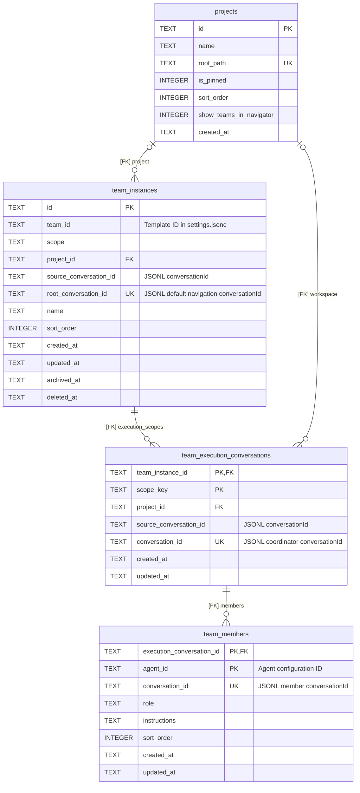
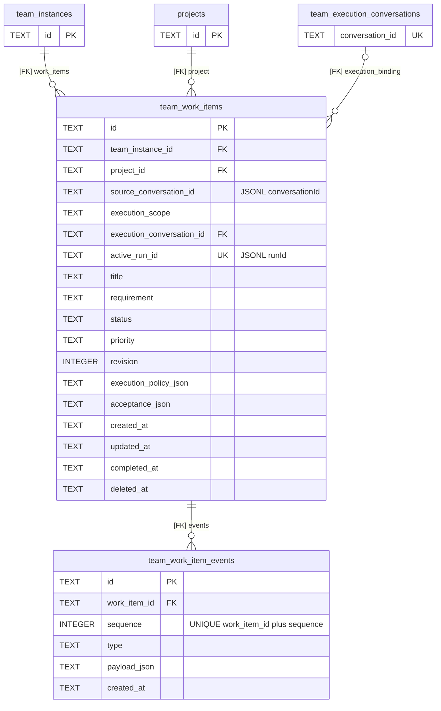
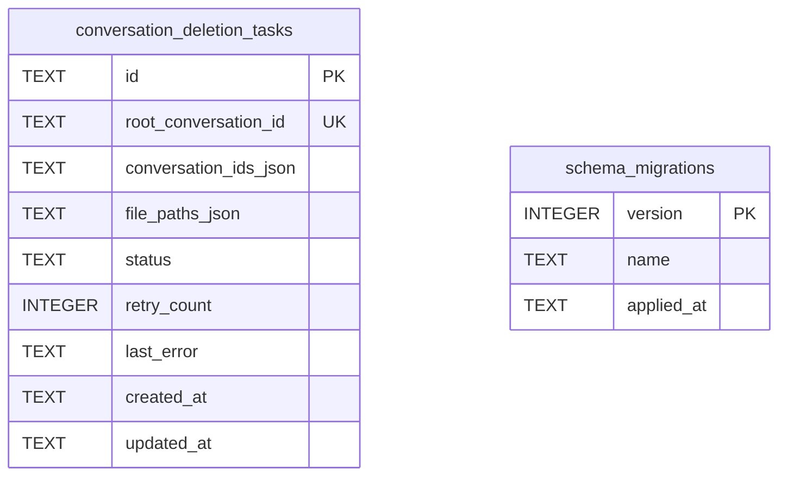
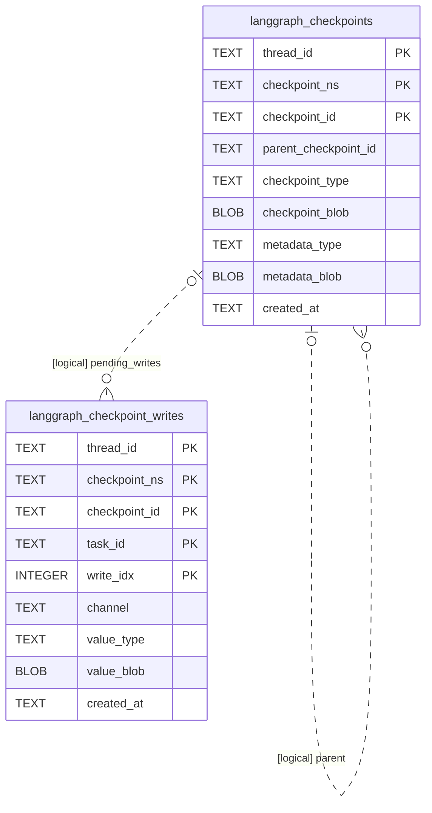
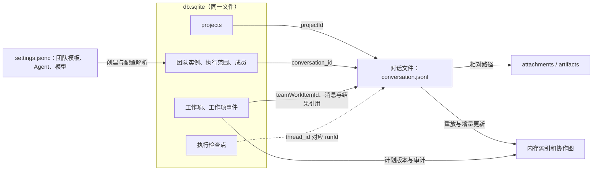

# Aster 目标存储结构与数据库 ER 图

> 2026-09-07 · 单一 `db.sqlite`、统一 JSONC 与旧库导入已实现；本图描述移除可重建对话投影后的最终表结构。对话格式见[第 22 篇](./22-JSONL对话存储与归属设计.md)。

## 1. 目标存储清单

`<ASTER_HOME>` 默认是用户主目录的 `.aster`；下表文件路径相对此目录。所有应用 SQL 数据统一在 `db.sqlite`，业务与检查点只按表区分。

| 数据 | 保存位置 | 规则 |
| --- | --- | --- |
| 对话身份、父级、类型、创建来源、Fork | `conversations/<id>/conversation.jsonl` 文件头 | 不可变属性 |
| 标题、项目 ID、Agent、模型/思考、权限偏好、归档/置顶 | 同一 JSONL 的初始配置和变更事件 | 当前值由事件还原 |
| 用户输入、其他对话消息、模型输出、工具调用/结果、审批、错误、用量、重试 | 同一 JSONL | 完整过程追加保存 |
| Run、任务清单、Subagent 交办/回执、压缩、阅读状态 | 同一 JSONL | Run 保存实际配置与工作区快照；压缩保留原历史 |
| 手动工作区绑定、草稿、排队消息 | 同一 JSONL 的绑定、保存、消费等事件 | 解绑清空手动绑定；无项目时仍有默认工作区 |
| 无项目且未手动绑定目录时的工作文件 | `workspaces/<conversationId>/` | 按需创建，不新增项目记录，不是临时缓存 |
| 附件原件 | `conversations/<id>/attachments/` | JSONL 保存 ID、名称、相对路径及元数据 |
| 大型输出、Diff、截图、保留的派生结果 | `conversations/<id>/artifacts/` | JSONL 保存引用；完整结果不因展示截断而丢失 |
| 列表、搜索和状态索引 | 内存 | 从 JSONL 重建；持久化缓存可选 |
| 项目名称、根目录、排序 | `db.sqlite → projects` | 对话通过 `projectId` 查询 |
| Agent、团队模板、全局外观、默认权限和策略 | `settings.jsonc` 的对应分区 | 团队模板及模板成员只保存一份配置 |
| 团队实例、执行隔离、成员、工作项、审计 | `db.sqlite` 的 5 张团队表 | 结构见 §2；对话过程仍在 JSONL |
| 协作计划版本、分配、结果引用、评论与验收 | `team_work_item_events.payload_json` | 按事件类型保存；消息和结果正文从 JSONL 读取 |
| 供应商、接入地址、模型列表、默认/最近选择、密钥 | `settings.jsonc → providers/defaultModelSelection/recentSelection` | `apiKey` 可明文填写，不进入日志、模型目录输出或 JSONL |
| 模型默认能力、窗口和思考选项 | `settings.jsonc → modelCatalog` | 能力目录 |
| 压缩、终端、浏览器设置 | `settings.jsonc → contextCompression/terminal/browser` | 同一文件分区保存 |
| MCP、技能注册与启用配置 | `settings.jsonc → integrations` | 服务定义只保留一份；`mcp/` 保存辅助资源 |
| 技能、插件本体 | `skills/<id>/`、`plugins/<id>/` 或外部技能目录 | `SKILL.md` / `plugin.json` 及资源 |
| 插件启用设置、目录信息 | `settings.jsonc → plugins`；扫描结果在内存 | 配置只存 ID 与开关；名称、版本、路径和哈希从插件文件取得，不建目录表 |
| 图执行恢复 | `db.sqlite → langgraph_checkpoints/langgraph_checkpoint_writes` | 检查点及待提交写入 |
| 删除与清理进度 | `db.sqlite → conversation_deletion_tasks` | 独立恢复任务 |
| UI 偏好、网站数据 | 页面 `localStorage`、Electron `userData` | 本机数据；网站 partition 为 `persist:aster-managed-browser` |
| 活跃授权、待审批回调、终端/SSH/浏览器连接 | 内存和 OS 进程 | 历史回放不恢复授权或活连接 |
| 可重建提取结果、缩略图、中间文件 | `temp/` 或执行器临时目录 | 无引用后可清理 |
| 项目代码、Git、下载及用户另存文件 | 项目目录、`.git/`、用户保存目录 | 可位于 Aster 根目录外 |

对话属性、内容和 Run 全部由 JSONL 保存；升级验证回放成功后会删除 `db.sqlite` 中的对话表、消息表和搜索表。运行期同名 SQLite `TEMP` 表只是当前进程的可丢弃内存投影，不属于 ER 图，也不能反向覆盖 JSONL。JSONC 按字段编辑、保留注释并原子替换；SQL 的 JSON 内容使用 `TEXT`，执行器序列化状态使用 `BLOB`。

## 2. 团队结构：保留 5 张表

团队保留任务看板、评论、验收返工、协作图和多项目隔离。配置模板、完整协作计划、实际消息不需要各拆一套关系表。

| 表 | 保存什么 | 保留原因 |
| --- | --- | --- |
| `team_instances` | 实际团队名称、模板来源、作用域与归档信息 | 一个模板可创建多个独立团队 |
| `team_execution_conversations` | 实例在某项目/来源范围内的协调对话 | 同范围持续复用，不同范围隔离上下文 |
| `team_members` | 每个执行范围内的实际成员及对话 | 成员长期复用，职责与模板后续变化分开 |
| `team_work_items` | 需求、项目、状态、优先级、执行策略和验收要求 | 支持独立排队、看板、验收和返工 |
| `team_work_item_events` | 变更、评论、计划、分配、结果引用和验收历史 | 保留审计，集中承载按工作项读取的记录 |

### 合并去向

| 原结构 | 调整后 |
| --- | --- |
| `teams`、模板用途的 `team_members` | 模板及成员配置只保存在 `settings.jsonc → teams`，Agent 定义在 `agents` |
| `team_member_conversations` | 合并实际职责配置，使用新的 `team_members` 结构 |
| `team_collaboration_plans/nodes/routes` | 一个计划版本作为完整 JSON 对象追加到工作项事件 |
| `team_work_item_member_assignments` | 分配事件保存成员、消息与来源引用 |
| `team_work_item_collaboration_outputs` | 结果事件保存对话、Run、结果事件引用 |

### 项目、团队与成员 ER 图

`[FK]` 为 SQL 外键；标注 `JSONL` 的列为文件引用。ER 图展开主要字段。

- 实例保留 `global/project/conversation` 作用域及对应项目/来源约束；`team_id` 仅指模板配置，不建模板 SQL 外键。
- `scope_key` 由项目或来源生成，同一 `team_instance_id + scope_key` 唯一。全局实例可为不同项目保留不同执行范围；实例默认导航根另保存在 `root_conversation_id`。
- `team_members.execution_conversation_id` 引用执行绑定的唯一 `conversation_id`。负责人也作为成员保存，其成员对话 ID 等于执行对话 ID；同范围每个 Agent 一条成员绑定。
- 模板创建成员时复制实际职责；后续明确修改实例成员，不隐式覆盖既有历史。名称、头像、运行状态和最新输出从成员 JSONL/配置读取，不再增加状态副本。
- `enabled`、`maxWorkers` 等团队设置来自 `settings.jsonc`；移除模板后保留实例与历史，执行前重新绑定配置。

## 3. 工作项与事件 ER 图

- 工作项通过 `team_instance_id` 取得模板来源，不再重复存 `team_id`。项目实例锁定项目，全局实例可接收不同项目任务。
- `execution_scope` 保留项目复用/来源对话隔离；运行前校验工作项、执行绑定的实例、项目和来源一致。`execution_conversation_id` 为空表示尚未绑定，绑定后不改变既有 Run。
- `execution_policy_json` 保存 `{ modelSelection: { providerId, modelId, reasoning }, permissionMode }`；`acceptance_json` 保存验收要求。实际 Run 的配置快照仍在 JSONL。
- 保留已有工作项状态与返工规则；需求/状态变化和对应事件在同一 SQL 事务提交。普通评论不唤醒模型，返工追加事件、增加修订并保留旧结果。
- `status` 是团队工作项状态，成员运行状态从 JSONL 取得；任务清单也从执行对话取得。阻塞说明、验收结论和结果摘要按相关事件读取。

## 4. 工作项事件与协作图

`payload_json` 按 `type` 校验结构；一条事件对应一次动作，不把全部历史塞进一个 JSON 字段。

| 事件内容 | 载荷保存 | 读取用途 |
| --- | --- | --- |
| 接收、编辑、排队、运行、失败、取消、删除 | 操作者、修订、实际变更/原因、相关 Run 引用 | 看板与操作审计 |
| 评论、验收、返工 | 评论或反馈、验收结论、工作项修订 | 普通评论不派发，显式返工才继续执行 |
| `plan_updated` | 工作项修订、`planId`、`planRevision`、创建者、原因、完整 `nodes/routes` | 最新一版为活动计划，旧版本保留 |
| `assignment_created` | `assignmentId`、工作项修订、发送/接收对话、`messageId`、任务标题 | 成员分配及实际参与者 |
| `member_result` | `assignmentId`、工作项修订、`conversationId`、`runId`、`resultEventId` | 定位对应轮次结果，不复制成员输出正文 |

- 工作项修订与计划版本分开。计划完整快照在一条事件中原子保存，校验节点 ID、路线端点、重复路线及成员归属；无计划也可合法通信。
- 当前计划读最近的 `plan_updated`；属于工作项的 JSONL 通信带 `teamWorkItemId`、`workItemRevision`，分配及回执再带 `assignmentId`，普通协作可为空。实际路线与输出按工作项/分配/Run 读取；旧修订的晚到结果保留历史，不更新新修订完成状态。
- 协作图的 `planned/observed/ad_hoc/skipped` 状态由计划和实际通信计算，坐标等展示数据不注入模型上下文。
- 按 `(work_item_id, sequence)` 唯一排序，另建 `(work_item_id, type, sequence)` 查询索引；看板分页查询工作项，详情按需读事件，避免每次扫描全部历史。

## 5. 清理与迁移 ER 图

两个表独立。`conversation_deletion_tasks` 保存待清理对话 ID、路径及进度，保证删除对话目录后仍能恢复清理；`root_conversation_id` 不设文件外键。

移除目标中的 `plugin_catalog`：启用设置转到 JSONC，目录扫描结果可重建，不再落表。扫描及旧开关迁移规则见[第 24 篇](./24-Aster目录结构与JSONC配置.md#插件目录与开关)。

## 6. 执行检查点 ER 图

以下两张表也在 `db.sqlite`，与业务表共用 §5 的 `schema_migrations`，不再单独分库。

`thread_id` 对应 JSONL 中的 Run ID；检查点用于执行恢复，不保存可编辑的对话主数据。待提交写入允许先于检查点到达，关系与清理由 Checkpoint Saver 维护。

## 7. JSONL 与数据库的关联

| 引用 | 解析方式 |
| --- | --- |
| `projectId` / `project_id` | 查项目登记，取得当前根目录 |
| 团队实例的 `team_id`、成员的 `agent_id` | 查询 `settings.jsonc` 的 `teams`、`agents` |
| SQL 中指向对话的 ID | 内存索引定位该对话 JSONL |
| 消息、Run、结果事件 ID | 结合所属对话、工作项和修订定位实际记录 |
| 检查点 `thread_id` | Run 内存索引定位所属对话 |
| 附件/产物 | 相对对话目录解析 |

SQL 只约束 SQL 实体之间的关系。文件引用缺失时保留工作项信息并提示；移除成员或团队关系不级联删除 JSONL，对话删除走独立清理流程。

## 8. `db.sqlite` 目标表清单：10 张

| 分类 | 表 | 职责 |
| --- | --- | --- |
| 业务 | `projects` | 项目登记与根目录 |
| 业务 | `team_instances` | 实际团队及模板来源 |
| 业务 | `team_execution_conversations` | 跨项目/来源的执行范围 |
| 业务 | `team_members` | 实际成员、职责及对话绑定 |
| 业务 | `team_work_items` | 团队工作项与调度状态 |
| 业务 | `team_work_item_events` | 审计、计划版本、分配及结果引用 |
| 清理 | `conversation_deletion_tasks` | 可恢复删除与清理 |
| 执行恢复 | `langgraph_checkpoints` | 图执行检查点 |
| 执行恢复 | `langgraph_checkpoint_writes` | 待提交写入 |
| 迁移 | `schema_migrations` | 整个数据库唯一的迁移版本序列 |

团队保留 5 张表，不建插件目录表；两份迁移表合为一份，因此从上一阶段的 11 张减为 10 张。

## 9. 读写与一致性

- 对话单写入者，可靠追加 JSONL 后再更新索引和界面；属性、状态和已读从事件还原。
- 工作项协作消息在双方 JSONL 记录同一消息 ID 和工作项/分配关联；SQL 事件保存分配与回执引用。跨存储用稳定操作 ID 去重、补写关联，不重复投递消息。
- 先保存对话结果，再追加 SQL 结果引用事件；缺失关联可按 JSONL 中的工作项/分配 ID 补齐，保留可恢复进度。
- 同一执行绑定的活动工作项互斥，抢占执行位使用 SQL 事务和唯一约束；不同范围按团队容量并发。模型调用和文件操作在事务外进行。
- 转项目更新对话 `projectId`；项目搬迁更新 `projects.root_path`，旧 Run 路径快照不变。
- 迁移将原计划/节点/路线合成有序计划事件，分配和产出转换成引用事件；保留原 ID、时间及顺序映射。同名 `team_members` 按实际执行绑定重建，不把模板行当已创建对话。旧结果缺少 JSONL 事件时先补写结果，再建立引用；校验后才停用旧表。

### 9.1 单库生命周期与迁移

- Main 统一持有数据库连接、启动迁移和关闭职责；业务存储与 Checkpoint Saver 只访问各自表，不各自创建数据库或运行独立迁移序列。短写事务串行提交，事务内不等待模型、命令或文件操作。
- `schema_migrations.version` 使用全库唯一、递增的版本号。两个旧库各有自己的版本序列，不能直接合并旧迁移行或仅把两处路径改成相同。
- 迁移前停止新 Run，等待存储写入结束并取得旧 `agent.sqlite`、`langgraph-checkpoints.sqlite` 的一致性备份；分别校验旧版本，再按目标结构转换业务数据、导入检查点和待提交写入。保留 ID、BLOB 内容及 Run 关联；新库建立统一迁移基线，旧版本记录保留在备份中。
- 先构建临时目标库，核对数据数量、引用、数据库完整性及配置/JSONL 迁移结果，全部通过后再发布为 `db.sqlite` 并切换读取。失败保留旧文件；已有目标库先核对迁移状态，不覆盖。成功后旧库仅作备份，不继续双写，用户确认后才清理。
- 清理过期检查点只删除对应 Run 的检查点及待提交写入，不删除整个数据库。合库不改变恢复策略，不自动重放可能已执行的命令或恢复审批授权。

## 10. 备份与清理

| 范围 | 保存内容 |
| --- | --- |
| 单条对话 | `conversation.jsonl`、`attachments/`、`artifacts/` 及对应的已有 `workspaces/<conversationId>/`；父/子对话分别备份 |
| 项目与团队 | `db.sqlite`、相关对话；项目代码、Git 和用户绑定目录另行备份 |
| 应用配置 | `settings.jsonc`（包含插件启用设置）与技能/插件/MCP 资源 |
| 执行恢复 | 一致时点的 JSONL 与 `db.sqlite`（已含检查点） |
| 浏览器与 UI | 按需备份实际 Electron `userData` 及外部保存目录 |
| 清理 | 确认无引用的临时文件与可重建缓存 |

SQLite 使用一致性备份或停机复制；完整配置备份包含明文凭据，分享/导出默认去除敏感字段。历史回放不执行命令、不重发消息、不恢复审批授权。

## 11. 设计依据

- [JSONL 对话存储与归属设计](./22-JSONL对话存储与归属设计.md)：目标对话属性、事件、目录和附件。
- [AgentDatabase](../apps/desktop/src/main/storage/agent-database.ts)：保留的业务关系、调度和历史数据基础。
- [团队运行时](../apps/desktop/src/main/teams/team-work-item-runtime.ts)、[工作项协议](../packages/protocol/src/team-work-item.ts)、[协作图协议](../packages/protocol/src/team-collaboration.ts)：执行隔离、看板、评论、验收返工及协作图需求。
- [Checkpoint Saver](../apps/desktop/src/main/storage/node-sqlite-checkpoint-saver.ts)：检查点格式。
- [目录与 JSONC 配置](./24-Aster目录结构与JSONC配置.md)：统一配置、读写与旧文件合并规则。
- [Agent Home](../apps/desktop/src/main/storage/agent-home.ts)、[应用配置](../packages/protocol/src/application-settings.ts)、[供应商配置](../apps/desktop/src/main/model/model-credential-store.ts)：当前路径及合并前字段依据。
