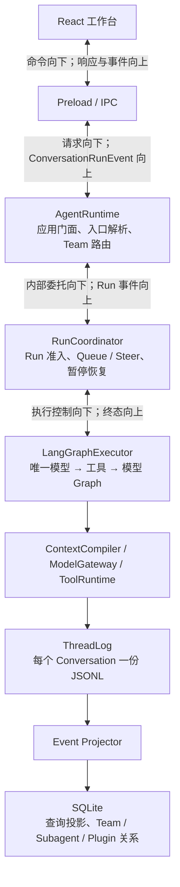
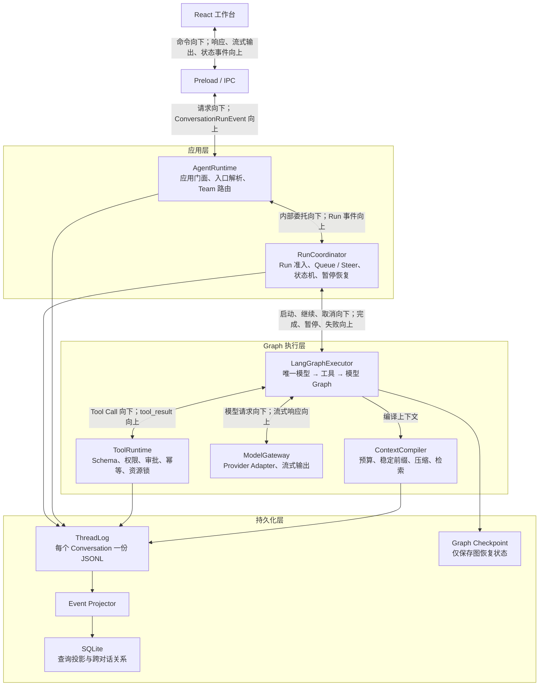
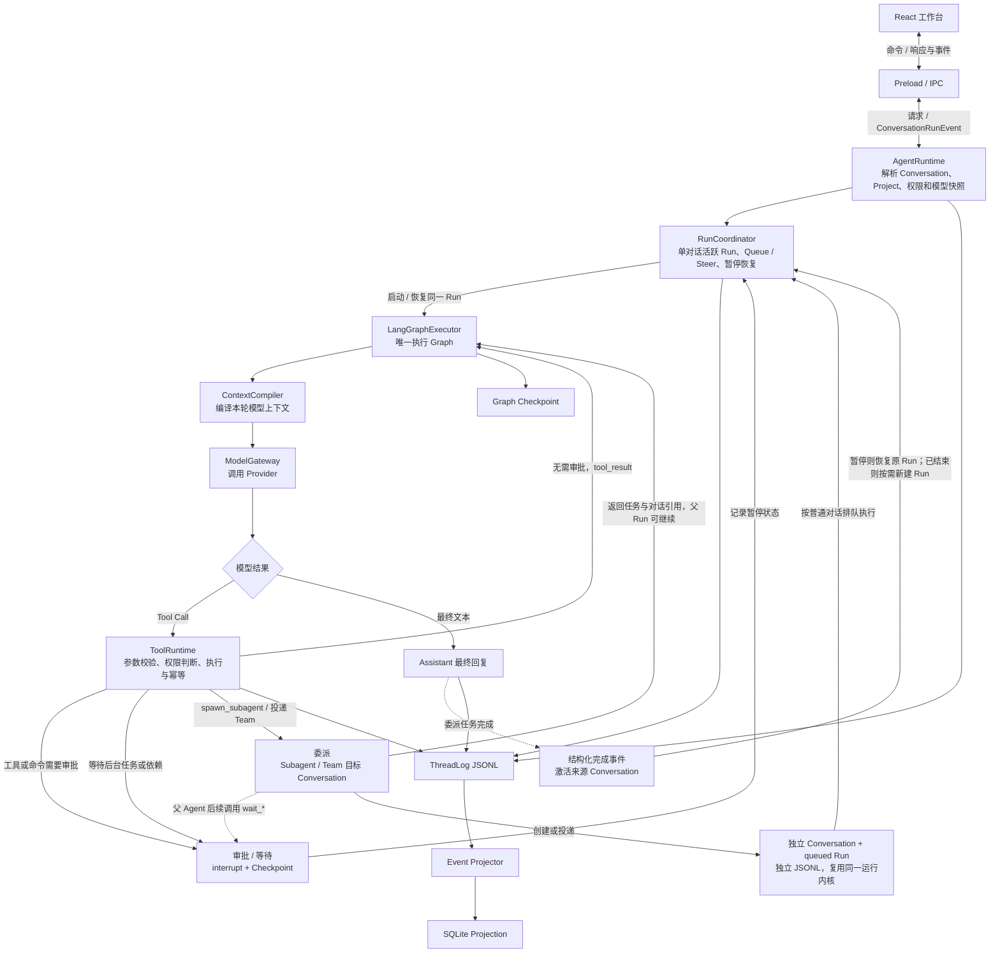
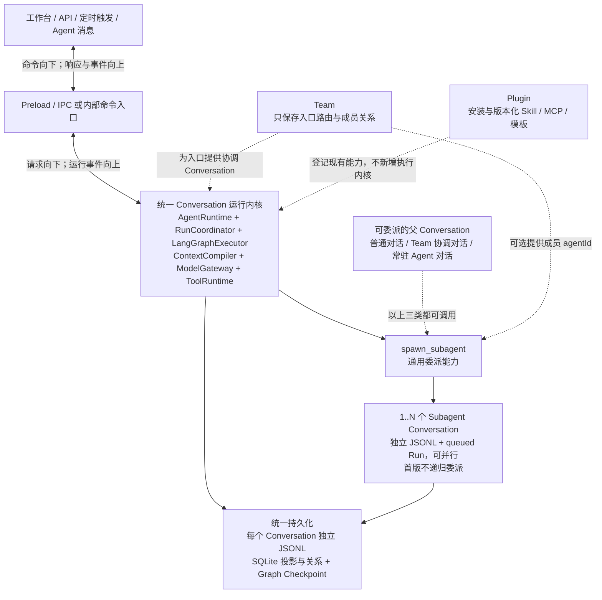

# Agent 目标架构结构图候选方案

> 文档角色：为《Agent 目标架构重构概要设计》的总体结构图提供多个候选画法，供讨论和选择。
> 状态：已选定第 4 节“版本 C：完整运行闭环版”，2026 年 8 月 26 日。
> 说明：四个版本表达的是同一套目标职责，不代表四套不同架构；版本 C 已同步到《Agent 目标架构重构概要设计》第 2 章，其余版本保留为讨论记录。

## 1. 不随画法变化的结构

以下关系在四个版本中保持不变：〔INFER｜目标架构提案〕

1. React 工作台与 Main 的命令、响应和事件统一经过 Preload / IPC。
2. `AgentRuntime` 是应用门面；`RunCoordinator` 负责 Run 准入、Queue / Steer、暂停和恢复。
3. `LangGraphExecutor` 是唯一的模型 → 工具 → 模型执行 Graph。
4. `ContextCompiler`、`ModelGateway`、`ToolRuntime` 是 Graph 调用的能力模块。
5. 每个 Conversation 使用独立 `ThreadLog` JSONL；SQLite 承担查询投影和少量跨对话关系；Graph Checkpoint 只保存图恢复状态。

## 2. 版本 A：极简纵向主链

适合放在概要设计开头。读者先看清主链，不在第一张图里展开全部依赖。〔INFER｜候选表达〕

优点：最直观、最稳定、适合首次阅读。

省略：能力模块内部关系、Graph Checkpoint、各类事件分别由谁落盘。

## 3. 版本 B：分层纵向版

适合正式 HLD。保留从上到下的主轴，同时明确应用层、Graph 执行层和持久化层。〔INFER｜候选表达〕

优点：分层清楚，职责基本完整。

代价：连线比极简版多，但仍能保持主轴从上到下。

## 4. 版本 C：完整运行闭环版（已选定）

适合解释一次对话如何经过模型、工具、审批、回传和持久化。它强调运行闭环，不使用大分层框。〔INFER｜候选表达〕

审批不是模型结果的通用分支，而是 `ToolRuntime` 在工具或命令产生副作用之前，根据权限策略触发。等待同样由具体工具进入暂停点。审批结果、后台任务完成或依赖到达后，先由 `RunCoordinator` 校验并恢复原 Run，再让 `LangGraphExecutor` 从同一 Checkpoint 继续，不重新开始整轮执行。〔INFER｜目标架构约束〕

Subagent 和 Team 委派同样不是第二套执行流程。模型通过工具发起委派，目标最终落为独立 Conversation 和 `queued` Run，并复用同一个 `AgentRuntime → RunCoordinator → LangGraphExecutor` 内核。委派工具先向父 Graph 返回任务与对话引用，父 Agent 随后可以继续当前工作，也可以调用等待工具进入暂停。目标完成后写入结构化完成事件并激活来源 Conversation：父 Run 仍在暂停时恢复同一 Run；父 Run 已经结束时不能恢复旧 Checkpoint，而是按需为同一父 Conversation 创建新 Run。〔INFER｜目标架构约束〕

优点：业务闭环最容易讲解，工具循环和暂停恢复位置清楚。

代价：它更像运行流程图，不是最纯粹的模块分层图。

## 5. 版本 D：扩展全景版

适合需要同时说明普通对话、Team、Subagent、Skill、MCP 和 Plugin 的场景。主运行内核仍只有一套。〔INFER｜候选表达〕

Team、Subagent 和 Plugin 是围绕统一运行内核的三类扩展，不是依次经过的执行阶段。Team 只提供入口路由、成员关系和可选的 `agentId`；普通对话、Team 协调对话和常驻 Agent 对话都可以调用同一个 `spawn_subagent`。父 Conversation 可以继续执行或显式等待，多个子任务按并发额度运行；首版只禁止 Subagent 再递归委派。〔INFER｜候选表达〕

优点：扩展能力齐全，能一次看见团队和 Plugin 如何复用核心。

代价：节点和连线最多，不适合作为第一次阅读时看到的唯一总图。

## 6. 选择建议

| 版本 | 信息密度 | 最适合的位置 | 选择时的取舍 |
| --- | --- | --- | --- |
| A 极简纵向主链 | 低 | HLD 开头、汇报材料 | 最容易读，但细节需要看正文 |
| B 分层纵向版 | 中 | HLD 总体架构章节 | 层次与完整度最均衡 |
| C 完整运行闭环版 | 中高 | 模型、工具、暂停章节 | 最适合解释运行过程 |
| D 扩展全景版 | 高 | Team / Plugin 扩展章节 | 覆盖面最大，但不宜承担“第一张图”角色 |

当前建议：概要设计第 2 章采用 **A 或 B**；C 放到模型—工具循环章节；D 放到团队与扩展章节。最终以选定版本为准。〔INFER｜候选表达〕

相关目标设计见[Agent 目标架构重构概要设计](./Agent目标架构重构概要设计.md)。
