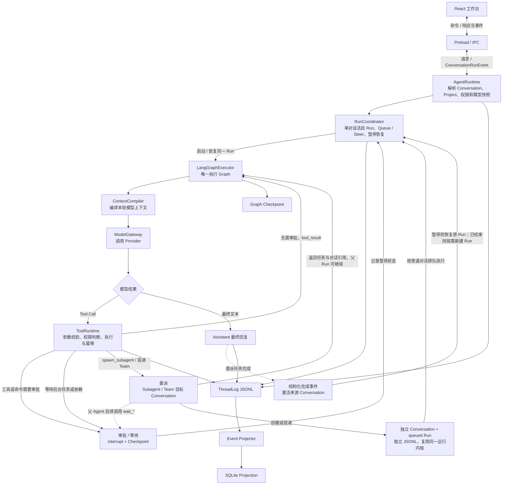
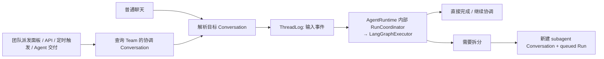
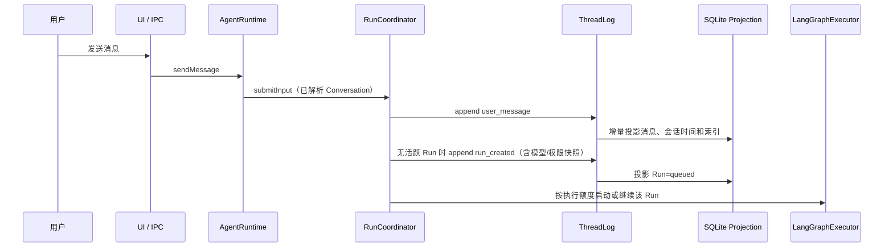
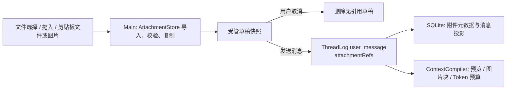
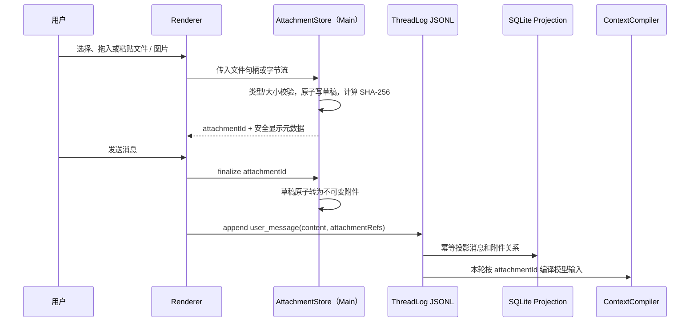
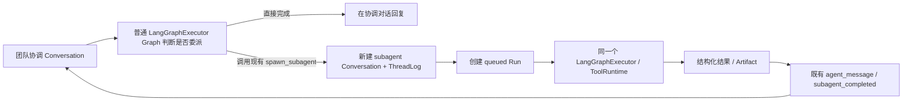

# Agent 目标架构重构概要设计

> 文档角色：面向讨论的目标架构概要设计（HLD），用于决定后续重构边界与实施顺序；它不是当前生产实现说明。
> 状态：第一版草案，2026 年 8 月 26 日。
> 结论先行：采用「**所有入口先归一为对话 + 每个对话一份 JSONL 规范事件日志 + SQLite 可重建查询投影 + 独立可恢复 Run**」的本地优先架构。
> 标注规则：明确标出 `〔FACT〕` 的内容来自当前代码或现有设计文档；其余目标设计均为 `〔INFER｜目标架构提案〕`，需要在讨论中确认后才进入实现。

## 1. 要解决什么问题

当前主链已经可运行：UI 经 IPC 进入 `AgentRuntime`，由 LangGraph 执行模型—工具循环；SQLite 保存业务事实，独立 SQLite 保存图恢复状态。〔FACT｜[Agent 运行时架构总览](../17-Agent运行时架构总览.md) §2-3〕

下一阶段不追求“换一个框架”，而是让每个关键问题都有唯一回答：

| 问题 | 目标责任者 |
| --- | --- |
| 这个对话到底发生过什么？ | `ThreadLog` JSONL |
| UI 如何快速列出、检索和关联这些事实？ | SQLite Projection |
| 本次模型实际应看到什么？ | `ContextCompiler` |
| 这次 Run 下一步是模型、工具、暂停还是结束？ | `RunCoordinator` + `LangGraphExecutor` |
| 工具是否允许执行、执行到哪一步？ | `ToolRuntime` |
| 对话中上传或粘贴的文件放在哪里？ | `AttachmentStore` 保存受管不可变快照；ThreadLog 只记录附件引用 |
| 多个 Agent 如何分工和共享结论？ | 复用 Conversation、Run、Subagent 与 Agent Message；Team 只保存成员关系 |
| 一组可安装能力从哪里来、当前能否启用？ | `PluginCatalog`；只安装、校验和登记，不参与模型循环 |

这会把当前 `AgentRuntime` 中汇聚的多种变化原因拆开，但不要求立刻删除它：它先收缩为应用 façade，逐步委托给上述明确模块。〔INFER｜目标架构提案〕

## 2. 一句话的目标架构

**无论请求来自普通聊天、团队派发面板、API、定时触发还是其他 Agent，它都先归一为某个 Conversation 的输入；模型输出、工具意图、审批决定、工具结果和压缩结果随后成为该对话 JSONL 中可回放的事件。SQLite 投影这些事件用于 UI、搜索和恢复，并保存少量 Team 成员关联配置。**〔INFER｜目标架构提案〕

主执行链只有两个架构边界：**应用层（`AgentRuntime` + 内部 `RunCoordinator`）→ Graph 执行层（`LangGraphExecutor`）**。`RunCoordinator` 是明确保留的内部模块，但不是第三个 Runtime、独立进程或新的执行器。Renderer 发出的命令和 Main 返回的响应、流式输出及状态事件都经过同一个 Preload / IPC 边界。〔INFER｜目标架构提案〕



审批由 `ToolRuntime` 在副作用发生前触发。Subagent 或 Team 委派也通过工具进入独立 Conversation 和 Run：父 Agent 可以取得任务引用后继续，也可以调用等待工具暂停；目标完成后由结构化事件激活来源 Conversation。父 Run 仍暂停时恢复同一 Checkpoint，父 Run 已结束时则按需创建新 Run。所有目标 Conversation 仍复用同一个运行内核。〔INFER｜目标架构提案〕

## 3. 五条不可违反的原则

1. **一个事实只能有一个规范来源。** 对话和 Run 的长期事件以 JSONL 为准；跨对话的小型关系（`teams`、`team_members`、`subagent_tasks`）以 SQLite 为准。`subagent_spawned` / `subagent_completed` 只保留关联审计引用，不能再充当第二份关系主数据。〔INFER｜目标架构提案〕
2. **模型上下文不是聊天历史的别名。** 它是每次按 Token 预算编译出的临时请求。〔FACT｜[对话存储、上下文与压缩设计](../16-对话存储、上下文与压缩设计.md) §4〕
3. **始终只保留一张模型—工具执行图。** 当前就是 `LangGraphExecutor`：它负责模型 → 工具 → 模型、中断、恢复和图调度；业务代码不得再维护第二个手写工具循环。〔FACT｜[LangChain 与 LangGraph 改造方案](../15-LangChain与LangGraph改造方案.md) §1〕
4. **副作用先记录意图，再执行，再记录结果。** 崩溃后绝不根据“可能执行过”自动重放写文件、命令或外部调用。〔INFER｜目标架构提案〕
5. **所有 Agent 都复用同一条对话运行内核。** 每个 Agent 有独立对话和独立日志；团队只增加成员关系和入口路由，不另起模型、上下文、工具、恢复框架或团队专属日志。协作靠结构化消息、摘要和受控引用，不靠多个 Agent 共写一份 history。〔INFER｜目标架构提案〕

## 4. 从任意输入到对话处理的完整链路

### 4.1 入口归一、接收与持久化

团队不是第二个“任务执行入口”。外部输入只需携带来源和目标：普通对话直接指定 `conversationId`；投递给 Team 时只指定 `teamId`，应用门面从 `teams` 查询其 `coordinatorConversationId`。两者最终都变为同一份 `ThreadLog` 里的输入消息，并使用同一个 `AgentRuntime（内部 RunCoordinator）→ LangGraphExecutor（按回合调用 ContextCompiler / ToolRuntime）` 链路。〔INFER｜目标架构提案〕



这里的“输入消息”使用统一消息 envelope；`sourceKind` 记录它来自用户、团队面板、API、定时触发还是其他 Agent，但不会改变后续对话处理机制。团队负责人可以直接在自己的协调对话中完成简单请求；只有判断需要委派时，才创建成员工作对话。下方时序图展示的是归一完成后的普通用户消息路径。〔INFER｜目标架构提案〕

**同一 Conversation 同时最多有一个非终态 Run。** `RunCoordinator` 在该对话的单写入队列内完成准入判断：没有活跃 Run 时，追加 `user_message` 与 `run_created`，创建一个 `queued` Run；已有活跃 Run 时，只追加带 `deliveryMode=queue | steer` 的 `user_message`，绝不再创建第二个 Run。`queue` 在下一次安全的模型回合被消费；`steer` 请求 Graph 在下一个安全节点中断并带入新输入。已进入副作用边界的 Tool Call 不因 `steer` 被强行取消；等待审批时，新的普通消息只排队，必须先审批或取消当前调用。〔INFER｜目标架构提案〕



每份 JSONL 的第一行是版本化 header，后续每行是一条按序追加的事件。最小事件集合为：

```text
user_message / assistant_message / tool_call_requested / tool_execution_prepared
approval_requested / approval_resolved / tool_result
context_checkpoint / agent_message / subagent_spawned / subagent_completed
run_created / run_started / run_resumed / run_paused / run_interrupted
run_completed / run_failed / run_cancelled
```

JSONL 写入由该对话的单写入队列串行化；每个事件都有稳定 `eventId`、递增 `sequence` 和 schema version。启动时只修复可能截断的最后一行，再从 SQLite 记录的 byte offset / sequence 增量投影。〔INFER｜目标架构提案〕

### 4.2 为什么 JSONL 和 SQLite 要同时存在

| 存储 | 是什么 | 负责什么 | 不负责什么 |
| --- | --- | --- | --- |
| `ThreadLog` JSONL | 每个 Conversation 的规范追加日志 | 回放、上下文原始来源、导出、分叉、审计 | 跨会话搜索、复杂列表查询 |
| `AttachmentStore` | 应用数据目录中的受管不可变文件快照 | 原始文件 / 图片字节、提取文本、哈希校验与无引用清理 | 把二进制、Base64 或任意外部绝对路径写进 JSONL / SQLite |
| SQLite Projection | ThreadLog 的可重建物化视图 | 会话列表、Run 状态、FTS、UI 时间线、日志偏移 | 成为另一份独立主历史 |
| SQLite 跨对话关系表 | `teams`、`team_members`、`subagent_tasks` 等少量关系 | 团队入口路由、成员归属、父子对话关联与排队关系 | 保存成员完整模型对话或另建运行日志 |
| SQLite Plugin Catalog | Plugin 的来源、版本、内容哈希和启停状态 | 安装管理、能力来源追溯、为新 Run 生成快照 | 存放 Conversation / Run 事件或直接执行能力 |
| Graph Checkpoint | 单次 Run 的执行恢复细节 | LangGraph 节点恢复 | UI 对话历史或业务事实 |

这不是“同步两份数据库”。正确顺序是：**先安全追加 JSONL，再以幂等事务更新 SQLite 投影；若中间崩溃，启动时从日志补齐投影。**〔INFER｜目标架构提案〕

这里需要把“消息放进 JSONL”与“不要 SQLite”区分开：**用户消息、Assistant 回复、Tool Call / Result、审批和 Run 状态都先写入该 Conversation 的 JSONL；SQLite 中即使保留 `messages`、`runs`、`timeline` 等表，它们也只是为了界面和查询生成的副本，不再是另一份规范历史。**这些投影表可以从 JSONL 删除后重建；`teams`、`team_members`、`subagent_tasks`、Plugin Catalog 等跨对话关系没有自然归属到某一份 ThreadLog，才继续以 SQLite 关系表作为规范来源。LangGraph 的 Checkpoint 仍只保存当前 Run 恢复所需的图状态。〔INFER｜目标架构提案〕

一次正常写入和读取使用以下固定顺序：

```text
写入：Conversation 单写入队列 → 追加并同步 JSONL → SQLite 幂等投影 → 提交后通知 UI
列表：直接查询 SQLite Projection
全文搜索：查询 SQLite FTS，得到 conversationId / sequence / byteOffset
读取原文：按 SQLite 给出的 offset 定位 JSONL，不扫描全部文件
模型上下文：优先内存尾部；缺失部分由 SQLite 定位，再从 JSONL 取规范原文
投影损坏：停止写入该投影 → 从最后确认的 sequence / offset 补投影或全量重建
```

因此三者不是互相替代关系：JSONL 解决“事实和回放”，SQLite 解决“快速查询和关系”，Graph Checkpoint 解决“执行到哪个节点”。〔INFER｜目标架构提案〕

现有实现中，业务历史和图 Checkpoint 已经分属两份 SQLite 文件；目标设计只是把业务历史的规范来源迁为 JSONL，保留 SQLite 的关系、事务和 FTS 优势。〔FACT｜[我们的 Agent 项目总体架构与上下文管理](./我们的Agent项目总体架构与上下文管理.md) §4〕

### 4.3 配置与核心数据根目录：统一使用 AGENT_HOME

目标架构不把 Agent 配置和核心数据放在安装目录，也不再把 Electron 的 `userData` 当作规范 Agent 数据根目录。统一引入 `AGENT_HOME`：若启动参数或环境变量显式指定则使用指定目录，否则使用当前用户 Home 下的 `.agent`。Windows 默认即 `C:\Users\<用户名>\.agent`。这表示“当前用户的 Agent Home”，不是写死 C 盘。〔INFER｜目标架构提案〕

```text
agentHome = AGENT_HOME（显式设置时）
         ?? <os.homedir()>/.agent
```

目标目录保持一层清晰结构：

```text
<AGENT_HOME>/
  settings.json                         # 通用设置：界面、默认模型、权限、终端、压缩、集成
  models.json                           # 自定义 Provider / Model 目录，不含明文密钥
  credentials.json                      # 仅保存操作系统加密后的凭据载荷
  conversations/<conversationId>.jsonl  # 每个 Conversation 一份规范事件日志
  attachment-drafts/                    # 尚未发送的上传 / 粘贴草稿
  attachments/                          # 已被消息引用的不可变附件
  workspaces/                            # 未关联项目的 Conversation 隔离工作区
  skills/
  plugins/
  mcp/
  tmp/                                  # 单次操作临时文件，启动时可清理
  agent.sqlite                          # 查询投影与跨对话关系
  langgraph-checkpoints.sqlite          # 当前 Run 图恢复状态
  logs/
```

首版只保留一个通用 `settings.json`，不继续为界面、终端、压缩和集成各建一份零散配置；模型目录和加密凭据因结构、安全和生命周期不同而独立。所有 JSON 都由 Main 的配置 Store 通过版本化 Schema 读取，并使用“临时文件 → 同目录原子替换”写入。API Key 明文既不进入 `settings.json`，也不进入 JSONL 或 SQLite。〔INFER｜目标架构提案〕

项目若将来需要可跟随仓库共享的设置，可以显式创建 `<project>/.agent/settings.json`，只保存项目级模型偏好、工具规则或 Skill 引用；应用不得自动在每个项目下创建 `.agent` 目录。项目配置只有在项目已被用户信任后才加载，且不能包含会话 JSONL、附件、数据库、缓存或密钥。〔INFER｜目标架构提案〕

配置生效顺序保持简单：Run 显式选择 > 已信任项目的 `.agent/settings.json` > `<AGENT_HOME>/settings.json` > 产品默认值。创建 Run 时只把最终生效的模型、权限、Skill / Plugin 版本等快照写入 `run_created`，不把整份配置文件复制进 Conversation JSONL。〔INFER｜目标架构提案〕

Electron / Chromium 自己的 `Cache`、`GPUCache`、Cookie、Local Storage 等技术状态仍由 `app.getPath("userData")` 管理；它们不是 Agent 规范数据，也不参与 CLI 与 Desktop 共享。2026-08-27 的首个迁移批次已在启动时解析 `AGENT_HOME`，并将既有 `userData` 内的 Agent 管理数据**复制**到新根目录（不删除旧数据）；Electron 技术状态仍留在 `userData`。为了不把“改数据根目录”和“重写配置格式”混在同一批次，当前沿用 `application-settings.json`、`model-catalog.json` 等兼容文件名；合并为目标目录中的 `settings.json`、`models.json` 是后续独立迁移。〔FACT｜`apps/desktop/src/main/storage/agent-home.ts`；`apps/desktop/src/main/bootstrap/index.ts`〕

### 4.4 上传、拖入和粘贴的文件：保存快照，日志只引用

用户从文件选择器、拖入区或项目目录添加的文件，不能只在消息里保存原始路径：原文件可能被修改、移动或删除。`AttachmentStore` 必须先复制为应用受管的不可变快照，再生成 `attachmentId`、名称、MIME、大小、内容哈希和可选的提取文本。原路径最多作为来源说明，不能成为后续模型读取依据。〔INFER｜目标架构提案〕



粘贴内容分成两类：

- **纯文本**：直接进入 `user_message.content`，不创建附件文件；若文本本身过大，按消息输入上限拒绝或让用户显式作为文件添加。
- **剪贴板图片、文件或浏览器提供的 Blob**：没有原始路径也没有关系；Renderer / Main 把字节交给同一个 `AttachmentStore`，以生成的 `attachmentId` 命名并写入受管目录，随后与普通上传走完全相同的草稿、发送、上下文和清理流程。

草稿只是“文件已安全接收、尚未成为一条对话消息”的短暂操作状态，可存为本地附件记录并在取消、超时或无引用时清理；**一旦发送成功，它不再是临时文件**。`user_message` 事件保存有序 `attachmentRefs`（至少包含 `attachmentId`、名称、MIME、大小、内容哈希、类型和截断状态），由此成为“该消息在该时点附带了什么”的规范事实；SQLite 仅投影附件元数据和查询关系。图片 Base64、二进制正文和任意受管绝对路径都不进入 JSONL 或 SQLite。〔INFER｜目标架构提案〕

`ContextCompiler` 不把所有附件全文长期塞进 Prompt：文本文件只注入有界预览，图片只在支持多模态的 Provider 请求构造阶段从快照读取；需要全文或中间段时，模型只能通过受权且限长的 `read_attachment(attachmentId, offset, limit)` 读取。Checkpoint 与跨对话摘要保留附件引用和读取状态，不复制二进制。删除 Conversation 时，清理流程先根据仍存活的 ThreadLog / SQLite 投影引用确认无其他消息或分叉引用该快照，再删除受管文件。〔INFER｜目标架构提案〕

本文中的 `Artifact` 不另建一套存储：它就是带有生成者、来源 Run 和用途元数据的 `AttachmentStore` 快照引用。这样工具输出中的文件、成员交付物和用户上传文件都走同一套引用、权限和清理规则。〔INFER｜目标架构提案〕

#### 4.4.1 文件到底放在哪里

目标目录只保留一个简单约定，不为图片、Word、PDF 和工具产物分别建存储系统：

```text
<AGENT_HOME>/
  conversations/
    <conversationId>.jsonl
  attachment-drafts/
    <attachmentId>/source.<ext>       # 尚未发送，可按超时清理
  attachments/
    <attachmentId>/source.<ext>       # 用户上传或粘贴的不可变原始快照
    <attachmentId>/extracted.txt      # 能提取文本时才生成
    <attachmentId>/preview.<ext>      # 确有预览需要时才生成
  workspaces/
    <conversationId>/                 # 仅未关联项目的 Conversation 使用
  agent.sqlite                        # 查询投影与跨对话关系
  langgraph-checkpoints.sqlite        # 当前 Run 的图恢复状态
```

`source.<ext>` 的扩展名依据实际检测的 MIME 决定，用户看到的原始名称只作为显示元数据，不能参与目录拼接。首版不做内容去重；`attachmentId` 是稳定身份，物理位置由 `AttachmentStore` 根据它确定。这样不需要把绝对路径保存进 JSONL 或数据库，也不依赖 Windows Temp。分叉或其他 Conversation 引用同一附件时只复制引用，不复制字节。〔INFER｜目标架构提案〕

项目工作区文件与对话附件是两种语义：工作区文件是可变文件，模型通过工作区相对路径和文件工具访问；用户把它“作为附件发送”时，系统仍创建当时版本的不可变快照。后续项目文件变化不会悄悄改变历史消息中的附件。**即使 Conversation 关联了项目，上传或粘贴的附件也不保存在 `<project>/.agent`、`.git` 或其他项目子目录中。**这样不会污染 Git 工作区、触发文件监听、意外提交隐私附件或因为项目移动而破坏历史消息。〔INFER｜目标架构提案〕

项目对话与未关联项目的临时对话使用同一套附件逻辑，区别只在工具工作目录：

| 内容 | 关联项目的 Conversation | 未关联项目的临时 Conversation |
| --- | --- | --- |
| Conversation JSONL | `<AGENT_HOME>/conversations/<conversationId>.jsonl` | 相同 |
| 发送前粘贴 / 上传草稿 | `<AGENT_HOME>/attachment-drafts/<attachmentId>/` | 相同 |
| 发送后的附件快照 | `<AGENT_HOME>/attachments/<attachmentId>/` | 相同 |
| Agent 文件工具的工作目录 | 用户已授权的项目根目录 | `<AGENT_HOME>/workspaces/<conversationId>/` |
| 是否自动把附件放进工作区 | 否；模型或用户明确需要时经 `copy_attachment` 复制 | 否；附件仍与工作文件分离，需要时再复制 |
| Conversation 删除 | 引用清理后删除无引用附件；不删除项目 | 删除隔离工作区，并在引用清理后删除无引用附件 |

未关联项目的 Conversation 不能直接使用系统共享 Temp 作为长期工作区：审批暂停、应用重启或后续继续对话时仍可能需要之前生成的文件。`<AGENT_HOME>/workspaces/<conversationId>` 是可恢复但受管的隔离工作区；只有真正的单次原子写临时文件才进入 `<AGENT_HOME>/tmp` 或操作系统 Temp，并在操作完成或启动恢复时清理。Conversation 归档时保留工作区，永久删除时通过持久清理任务幂等删除。〔INFER｜目标架构提案〕

#### 4.4.2 从粘贴或上传到写入消息



文件最终化成功、JSONL 追加失败时会留下没有消息引用的孤儿快照；后台只需在宽限期后清理无引用快照，不需要在文件系统与 SQLite 之间伪造事务。JSONL 追加成功后，这个附件引用就是规范事实；SQLite 只负责快速回答“哪些消息引用了它”。〔INFER｜目标架构提案〕

`user_message` 写入 JSONL 的是引用，而不是文件正文：

```json
{
  "type": "user_message",
  "sequence": 42,
  "content": "帮我分析这张架构图",
  "attachmentRefs": [
    {
      "attachmentId": "att_01K...",
      "name": "架构图.png",
      "kind": "image",
      "mimeType": "image/png",
      "size": 284113,
      "sha256": "..."
    }
  ]
}
```

#### 4.4.3 每次模型调用到底发送什么

模型 API 从逻辑上是按次请求构造上下文的；不能因为文件已经落盘，就假设模型下一次调用会自动记住它。`ContextCompiler` 每次先决定附件是否仍属于本轮上下文，Provider Adapter 再决定使用内联图片、Provider 文件引用或可复用的 Provider State。对上层而言始终是同一个 `attachmentId`，不能把厂商文件 ID 写回通用消息历史。〔INFER｜目标架构提案〕

| 场景 | 本次模型请求 | 后续 Tool 循环中的模型请求 | 进入旧 Checkpoint 后 |
| --- | --- | --- | --- |
| 小型文本 / Markdown / 已提取文档 | 在预算内发送完整文本，否则发送有界预览和附件说明 | 只要该用户回合仍被选中，就保持相同内容和顺序 | 默认只发摘要、名称和 `attachmentId`；需要原文时调用读取工具 |
| 大型 Word / PDF / 文本文件 | 发送名称、类型、页数或长度、结构摘要和有界首段；不把全文硬塞进 Prompt | 发送模型已读取的有界片段及读取位置，不重复全文件 | 保留摘要、关键结论、引用和已读取范围；按页、段或 offset 再读 |
| 当前用户消息中的图片 | 从受管快照生成真正的 image content block，同时发送用户文字和稳定附件引用 | 只要该图片回合仍在上下文中，逻辑上继续包含图片；Adapter 可利用 Provider 缓存 / State，不能由上层假设“已传一次就永远记住” | 默认发送图片摘要和 `attachmentId`，不再发送像素；当前问题再次指向图片或模型调用查看工具时重新载入像素 |
| 不支持图片的模型 | 不伪装成已看图；使用已存在的受控图片解析结果，或要求切换多模态模型 | 只发送已有文字结果 | 同左 |
| 工具生成的文件 / 图片 | Tool Result 写 Artifact/Attachment 引用；确有必要时把有界文本或图片块加入动态尾部 | 保持 Tool Call 与 Tool Result 成组，避免重复写入二进制 | Checkpoint 只保留结果摘要和引用 |

为了提高缓存命中，图片或文件内容如果需要在同一 Run 的多次模型调用中保留，应放在对应用户消息的固定位置，不能每轮改变序列化、名称或顺序；新的 Tool Result 和用户输入只追加到尾部。图片是否真的免传字节由 Provider 协议决定，但逻辑请求不能依赖未声明的服务端记忆。〔INFER｜目标架构提案〕

#### 4.4.4 模型知道的是附件 ID，不是机器绝对路径

模型上下文只出现安全描述和逻辑引用，例如：

```text
[附件 att_01K...｜架构图.png｜image/png｜284113 bytes]
```

需要再次查看时统一调用受控能力：

```text
read_attachment(attachmentId, page/offset/limit)  # 读取文本、Word/PDF 提取内容
view_attachment(attachmentId, detail)             # 返回图片内容块
copy_attachment(attachmentId, workspacePath)      # 经权限校验后复制到当前工作区
```

这里不提供“移动受管附件”：受管快照是历史消息的一部分，移动会让旧引用失效。用户需要文件时执行复制或导出；`ToolRuntime` 将 `attachmentId` 解析为内部路径，并把目标限制为当前授权工作区。Renderer 显示图片时使用 `agent-attachment://<attachmentId>` 或等价的 Main 受控读取通道，由 Main 解析并返回字节，不向 Renderer 或模型泄露 `<AGENT_HOME>` 绝对路径。〔INFER｜目标架构提案〕

这与 Codex Desktop 把剪贴板图片先物化为 `codex-clipboard-<uuid>.png` 的便利性目标相同，但我们不把 OS 临时路径当长期身份：**Codex 式路径只是一次物理位置；我们的 `attachmentId` 才是稳定引用。**〔INFER｜目标架构提案〕

#### 4.4.5 压缩、分叉、跨 Agent 与删除

- Context Checkpoint 保存附件摘要、`attachmentId`、关键结论和已读取范围，不保存 Base64、全文副本或绝对路径。
- 分叉 Conversation 和父子 Agent 只传附件引用；目标 Agent 必须经过自己的权限与 Token 预算读取，不能自动复制完整文件进上下文。
- 其他普通对话不能仅凭猜测的 ID 读取附件；跨对话引用必须来自明确的 Agent 消息、分叉继承或用户操作。
- 删除消息、Conversation 或分叉时不立即删除文件。清理任务根据所有存活 ThreadLog 引用和 SQLite 投影校验引用数，无引用且超过宽限期后再幂等删除。
- 附件读取、复制和图片查看都经过 `ToolRuntime` 的大小限制、权限、审计和取消边界，不为附件建立第二套工具执行机制。

〔INFER｜目标架构提案〕

## 5. 模型、工具与循环

### 5.1 模型怎么处理

`ModelGateway` 对上只接受中立的模型请求和流式事件，对下按 `apiFormat` 选择 Provider Adapter。它只做协议、流和 Provider 错误转换；不决定上下文、工具权限或重试策略。〔INFER｜目标架构提案〕

每个 Run 在创建时冻结以下快照：模型档案、推理选项、上下文预算、权限模式、可用工具集版本、已激活 Skill 版本，以及 Plugin 的 `id / version / contentHash`。这样设置变化只影响新 Run，恢复旧 Run 时不会换模型语义。〔INFER｜目标架构提案〕

流式 token / reasoning 增量只是 UI 观察事件，不逐 token 写入 ThreadLog。一次模型响应完成并通过结构校验后，才追加一条完整 `assistant_message` 或 Tool Call 事件；流中断则写入受控的暂停 / 失败事件。这样 JSONL 保持可回放的业务事实，而不是高频传输日志。〔INFER｜目标架构提案〕

### 5.2 工具怎么调用

模型只会看到稳定排序后的 Tool Manifest：工具名称、说明、Schema 和可见范围。真正执行统一进入 `ToolRuntime`：

```text
模型 Tool Call
  -> Schema 解析与工具路由
  -> 工作区/权限/并发/资源锁判断
  -> append tool_execution_prepared
  -> 若需审批：append approval_requested 并暂停
  -> 执行副作用或只读操作
  -> append tool_result
  -> 投影 UI 卡片、审计和状态
  -> 结果回到下一次模型调用
```

只读工具可限宽并行；文件写入、Subagent 委派、Agent 发信等默认按资源键有序；命令是否并行由明确策略决定。`toolCallId` 是幂等键：同一调用重放时只返回已记录的结果，不能再次产生副作用。〔INFER｜目标架构提案〕

当前项目已有工具注册、策略、审批中断和已完成 Tool Call 缓存，这些机制应迁入 `ToolRuntime`，不重新发明。〔FACT｜[AI 工具体系与生命周期设计](../11-AI工具体系与生命周期设计.md) §3-5〕

#### 权限与命令只有一个执行闸门

`ToolRuntime` 是所有工具的唯一执行入口，`run_command` 只是其中一个 Tool Handler，不能从 Graph、IPC 或其他 Agent 绕过它直接启动进程。每次调用固定按下列顺序处理：〔INFER｜目标架构提案〕

```text
LangGraphExecutor 的 Tool Call
  -> ToolRuntime：Schema 校验、从 Conversation 解析工作区、工具策略判断
  -> allow：记录 intent，执行对应 Handler，记录 tool_result
  -> ask：记录 approval_requested，暂停 Graph，等待用户决定
  -> deny：记录 permission_denied 的 tool_result，不执行副作用
```

策略判断只使用已冻结的 Run 权限快照、Conversation / Project 工作区、工具名和已校验参数；模型不能提交任意工作区根目录，也不能用“命令工具”绕过文件、网络或审批规则。审批同样由 `ToolRuntime` 按 `toolCallId` 恢复，已完成的调用只返回已保存结果。〔INFER｜目标架构提案〕

#### 模型怎样知道有哪些 Tool、MCP 与 Skill

它们都采用“**先发现，后按类型展开**”的方式，但不能混为同一种能力：Tool 是可调用动作，MCP Resource 是可读取数据，MCP Prompt / Skill 是可加载的说明与模板。模型**不能只凭名字直接调用一个 Tool**；某个 Tool 真正可调用时，Provider 请求中必须有它的完整名称、用途和 JSON Schema。〔INFER｜目标架构提案〕

| 能力类型 | 首次给模型什么 | 真正使用时如何展开 | 执行 / 注入边界 |
| --- | --- | --- |
| 核心本机 Tool | 原生 Tool Manifest：名称、短说明、严格 JSON Schema | 已可直接调用 | 必经 `ToolRuntime` |
| MCP Tool | 小规模时同样完整载入；MCP 能力过多时只保留可发现目录 | 在安全边界通过 `discover_capabilities` 激活后，**下一次模型调用**才加入完整 Schema | MCP 调用仍映射为内部 Tool，必经 `ToolRuntime` |
| MCP Resource | URI / 名称 / 摘要，不放正文 | `read_mcp_resource` 按 URI、权限和 Token 上限读取 | 作为有界参考块放在上下文尾部 |
| MCP Prompt | 名称、参数摘要，不放模板正文 | `load_mcp_prompt` 渲染后作为有界参考块进入下一次模型调用 | 不能改变系统规则、权限或工具范围 |
| Skill | `id`、版本、一句话用途与适用范围目录 | 现有 `load_skill` 成功后，把 `SKILL.md` 正文注入下一次模型调用；reference 再按需读取 | Skill 本身不授予工具权限 |

首版保持简单：初始可调用 Tool 集尽量小且稳定，核心 Tool 和少量已启用 MCP Tool 可完整载入。只有工具数量或 Schema Token 明显超过预算时，才启用一个固定的 `discover_capabilities` 元工具；它按任务描述从已发现、已授权的目录中选择少量候选，并把它们的完整 Schema 固定加入后续回合。它不是第二套执行器，也不直接执行外部操作。〔INFER｜目标架构提案〕

Prompt 的格式也分两层：系统文本只说明“何时查找能力、何时加载 Skill、不得伪造工具结果、不得绕过权限”；可调用 Tool 通过 Provider 原生 Function/Tool Schema 传入，不用 Markdown 再写一遍参数手册。完整 Manifest 按稳定名称排序，并在一次 Run 内只增不减，减少缓存失效和模型混淆；每次激活都记录 `catalogVersion`、`activeToolIds` 和来源 Plugin 快照，恢复时使用同一能力快照。MCP 返回的 Resource、Prompt 和 Tool 输出都按外部不可信内容处理，必须有大小限制、脱敏和结构校验。〔INFER｜目标架构提案〕

#### Plugin 是受控的安装与分发层，不是第五种运行时能力

Skill 是给模型渐进披露的方法说明；MCP 是连接外部 Tool / Resource / Prompt 的协议；**Plugin 是安装、版本化和分发这些现有能力的包**。首版 Plugin 只携带声明式内容：Skill 目录、MCP Server 配置和模板。安装后仍拆入既有的 Skill / MCP / 模板目录或记录，并保留 `sourcePluginId`；Plugin 名称本身不进入模型 Prompt，也不获得额外执行权限。〔INFER｜目标架构提案〕

Plugin 的最小生命周期是：**安装包 → 校验 manifest、目录结构和内容哈希 → 写入 `plugins` 记录 → 将贡献登记到既有 Skill / MCP / 模板目录 → 启用或禁用 → 创建 Run 时冻结版本快照**。现阶段只需要一个 `plugins` 表（`pluginId`、`version`、本地路径、`contentHash`、`enabled`、安装时间、来源）；贡献本身继续使用既有记录并写入 `sourcePluginId`，不再新增 `plugin_contributions`、Plugin 对话或 Plugin 事件日志。〔INFER｜目标架构提案〕

Plugin 不直接进入 `LangGraphExecutor`，也不直接执行代码、工具或 UI。启用状态只影响**新建 Run**的能力目录；已开始的 Run 继续使用其冻结的 Plugin 快照。首版仅支持受控的本地安装包；插件市场、第三方 UI 注入、无人审查的任意代码，以及由 Plugin 绕过 `ToolRuntime` 的执行路径都不进入首版。若以后需要 Provider Adapter 或自定义原生代码，必须另设受审查的内置扩展合同，不能把它伪装成普通内容 Plugin。〔INFER｜目标架构提案〕

### 5.3 LangGraphExecutor 怎么循环

没有独立的 `AgentLoop` 组件。**`LangGraphExecutor` 就是当前唯一的模型—工具执行 Graph**；“模型 → 工具 → 模型”只是对这张 Graph 的行为描述。它与 `RunCoordinator` 的分工是：

```text
RunCoordinator：本 Run 能否开始、是否暂停、是否结束、是否可恢复
LangGraphExecutor：在允许执行时，每次模型调用前请求 ContextCompiler，再执行 model -> tools -> model，并负责 interrupt / resume / graph checkpoint
```

这不是新增一层手写循环。`RunCoordinator` 只在 Graph 之外记录状态并决定是否允许继续；它不自行调用“模型后再调用工具”。〔INFER｜目标架构提案〕

一次图推进的结果只有三种：

| 本轮结果 | 后续处理 |
| --- | --- |
| 最终文本，且没有待消费输入 | 追加 `assistant_message` 和 `run_completed`，`RunCoordinator` 结束 Run |
| 一个或多个 Tool Call | `LangGraphExecutor` 交给 `ToolRuntime`；结果回来后进入下一次模型调用前的上下文编译 |
| 模型限额、网络退避、等待审批/依赖 | 追加对应暂停事件，`RunCoordinator` 停止本 Run 推进 |

模型调用轮数和单轮工具数量都有上限；达到上限必须成为可解释的 Run 终态或暂停状态，而不是无限循环。〔INFER｜目标架构提案〕

## 6. 暂停、取消与恢复

暂停不是内存里的 Promise，而是可见、可恢复的业务状态。`runs.status` 只保留粗粒度的 `queued / running / paused / terminal`；下表中的 `awaiting_approval` 等是独立的 `pauseReason`，不是另一套彼此混用的 Run 状态。〔INFER｜目标架构提案〕

| 原因 | JSONL 事件 | SQLite 投影（`status / pauseReason`） | 恢复方式 |
| --- | --- | --- | --- |
| 用户审批 | `approval_requested` | `paused / awaiting_approval` | 用户决策写入 `approval_resolved`，以原图线程恢复 |
| 用户手动暂停 | `run_paused` | `paused / paused_by_user` | 用户显式继续或取消 |
| 限流 / 可重试网络故障 | `run_paused` | `paused / waiting_retry` | 到时重试，或用户取消 |
| 等待 Subagent / Agent 消息 | `run_paused` | `paused / waiting_dependency` | 目标消息或子任务终态唤醒 |
| 进程退出时的 running Run | `run_interrupted` | `paused / requires_reconciliation` | 只恢复尚未进入副作用边界的工作 |

审批继续沿用 LangGraph 的 `interrupt/Command` 机制，但审批事实属于 ThreadLog 和 SQLite Projection，不只存在图内部。〔FACT｜[LangChain 与 LangGraph 改造方案](../15-LangChain与LangGraph改造方案.md) §1〕

### 6.1 异常处理：统一契约，分边界收口

不设置一个吞掉所有异常的“全局异常管理器”。所有可见错误使用统一的 `errorCode`、安全消息、`retryable` 和关联 ID（`conversationId` / `runId` / `toolCallId`），但在最靠近语义的边界转换：〔INFER｜目标架构提案〕

| 边界 | 处理者 | 结果 |
| --- | --- | --- |
| IPC 输入、权限解析、找不到 Conversation | `AgentRuntime` 的 IPC 边界 | 拒绝本次请求，返回稳定错误；不创建 Run |
| 参数无效、权限拒绝、命令非零退出、可预期工具失败 | `ToolRuntime` | 追加结构化 `tool_result`，显示在所属工具卡，并把结果交回 Graph |
| Provider 限流、网络可重试错误、审批和依赖等待 | `ModelGateway` / `RunCoordinator` | 转为 `run_paused` 或受控重试；恢复时继续同一 Run |
| 不可恢复的图、持久化或未知程序错误 | Run 执行边界（`AgentRuntime`） | 追加 `run_failed`，记录脱敏诊断，并向 UI 发出终态事件 |
| 进程级 `uncaughtException` / `unhandledRejection` | Bootstrap 仅记录和安全退出 | 不是业务错误恢复入口，不能假装某个 Run 已被正确处理 |

因此工具 Handler 不各自拼 UI 错误，也不吞异常；预期失败由 `ToolRuntime` 结构化，未知错误交给 Run 边界终止。Renderer 只消费统一错误契约，不读取堆栈、Provider 原始错误或命令原始环境信息。〔INFER｜目标架构提案〕

## 7. 上下文：怎样既放得下，又尽量命中缓存

### 7.1 上下文预算

每个模型档案提供 `contextWindow`、最大输出预留和可选的输入上限。每次请求先算出：

```text
promptBudget = min(模型上下文总量 - 输出预留, 产品配置的最大输入)
workingBudget = promptBudget - 稳定前缀 - 工具定义 - 已激活 Skill - 当前附件预留
```

`ContextCompiler` 在 `workingBudget` 内选择完整的上下文块，不按“最近 N 条消息”硬切。Assistant 的 Tool Call 和对应 Tool Result 是不可拆分的一组。〔INFER｜目标架构提案〕

### 7.2 每次真正发给模型的内容

按固定顺序构造请求，越稳定的内容越靠前：

```text
1. 稳定系统规则：Agent 基本行为与安全边界
2. 稳定能力层：确定性 Tool Manifest、Skill 目录摘要、固定工作区规则
3. 当前工作记忆：最近有效 Context Checkpoint、关键约束；可变任务清单不放入 Checkpoint
4. 最近完整原始回合：用户、Assistant、Tool Call、Tool Result
5. 动态参考块：FTS 命中的旧事实、其他对话的受权摘要、附件摘录
6. 本次新增输入：当前用户消息、Steer、Agent 消息、刚得到的工具结果
```

第 1—3 层形成尽可能长的稳定前缀；第 4—6 层只在尾部增长。Provider 缓存是否可用取决于模型，但固定顺序、稳定序列化和不在前缀中混入时间戳 / Run ID / 动态检索结果，能最大化可用缓存命中。缓存命中只能降低成本或延迟，不能突破模型上下文总量。〔INFER｜目标架构提案〕

**任务清单的例外规则**：它是 Conversation 的当前工作状态，不是聊天回合、团队任务表或压缩摘要。每个模型调用开始前，运行时按该 `conversationId` 读取 active list，按任务顺序注入只含 `status + title` 的有界动态系统块；工具更新后下一轮立即刷新，关闭后省略。该块不进入 Graph 持久消息，不携带 UUID、时间戳或 Run ID。ContextCompiler 在编译历史时为其最大模型可见容量预留预算，因此清单在 Run 中途创建不会挤破下一轮上下文。〔FACT｜`apps/desktop/src/main/agent/task-list-context.ts`；`apps/desktop/src/main/agent/agent-runtime.ts`；`apps/desktop/src/main/agent/context-manager.ts`〕

附件不是一段全局常驻文本，而是挂在原始消息或 Tool Result 上的内容块：该完整回合被选中时按 [§4.4.3](#443-每次模型调用到底发送什么) 发送图片、预览或已读取片段；被 Checkpoint 覆盖后默认只发送摘要和 `attachmentId`，需要精确内容时再通过附件工具放入动态尾部。〔INFER｜目标架构提案〕

当前上下文设计已明确要求稳定系统规则和工具定义置前、动态检索置尾；目标设计保留这个约束。〔FACT｜[对话存储、上下文与压缩设计](../16-对话存储、上下文与压缩设计.md) §7〕

### 7.3 JSONL 怎样服务上下文，而不是拖慢上下文

不能每次模型调用都扫描完整 JSONL。每个日志事件在投影时同时维护：byte offset、sequence、事件类型、关联 Tool Call、估算 Token、是否已被 Checkpoint 覆盖和 FTS 索引。

`ContextCompiler` 的读取路径是：内存中的最近尾部 → SQLite offset / Token 索引 → 按需从 JSONL 精确读取原始事件。SQLite 找位置，JSONL 提供原文；两者各做自己擅长的事。〔INFER｜目标架构提案〕

### 7.4 怎样加快压缩

压缩采用增量、异步、可校验的 Checkpoint：

1. 只压缩上次 Checkpoint 之后的旧完整回合；不重压整个会话。
2. 当用户未等待回复时预计算候选；真正写入前校验日志 sequence 仍连续，避免旧摘要覆盖新消息。
3. 新 Checkpoint 追加为 `context_checkpoint` 事件，记录覆盖到的 sequence、结构化摘要和版本；原始消息永不删除。
4. 触发压缩前先裁剪特别长的历史 Tool Result，并把完整输出保留为 Artifact / 日志引用。
5. 若压缩失败，继续使用旧 Checkpoint + 最近完整回合；不破坏原始日志。

这延续当前“增量摘要、覆盖边界只前进、原始历史不删除”的正确原则。〔FACT｜[对话存储、上下文与压缩设计](../16-对话存储、上下文与压缩设计.md) §3、§6〕

## 8. Agent 团队、工作对话与跨对话读取

### 8.1 团队首版只增加关系，不增加运行时

**Team 不是模型、不是 Conversation，也不是新的执行 Graph。**首版只是在 SQLite 中记录一个团队的协调对话和成员关系；团队收到的任何请求都进入协调 Conversation，随后完全按普通对话处理。〔INFER｜目标架构提案〕

| 对象 | 首版如何复用 |
| --- | --- |
| `Team` | 一条 `teams` 记录，保存 `coordinatorConversationId`；用于把团队入口路由到协调对话 |
| `TeamMember` | 一条 `team_members` 关联，指向已有 `AgentProfile`；只表达角色和归属 |
| 协调 Conversation | 普通长期 Conversation；接收团队任务、直接完成或调用现有委派能力 |
| 成员工作 Conversation | 现有 `subagent` Conversation；一项被拆出的工作就是一条子对话、一份 ThreadLog |
| Run | 现有 Run；创建成员工作对话时同时创建 `queued` Run，调度器按既有规则启动 |

因此，团队派发的任务在运行层面就是一条对话：未执行时是“带 `queued` Run 的成员工作对话”，执行后仍进入同一个 `AgentRuntime（内部 RunCoordinator）→ LangGraphExecutor（按回合调用 ContextCompiler / ToolRuntime）`。不引入 `TeamTask`、`workState` 或团队专属 Run 状态机。〔INFER｜目标架构提案〕

### 8.2 日志与数据库怎样最少化

```text
logs/
  conversations/<conversationId>.jsonl   # 普通、协调、成员工作对话均使用同一种 ThreadLog
```

首版**不建立 `TeamLog`**。成员工作对话的消息、Tool Call、审批和结果只写各自的 `ThreadLog`；父协调对话通过既有 `agent_message` / `subagent_completed` 接收有界结果。团队成员关系、团队入口和父子对话关联是跨对话的小型关系，直接保存在 SQLite；不再复制出一份团队事件日志。〔INFER｜目标架构提案〕

| 表 / 既有投影 | 最小职责 |
| --- | --- |
| `teams` | `teamId`、名称、`coordinatorConversationId`；把团队入口映射到协调对话 |
| `team_members` | `teamId`、`agentProfileId`、角色；记录成员归属，不保存完整聊天历史 |
| `conversations` | 复用现有 Conversation；成员工作对话使用现有 `threadKind=subagent`，可选保存 `teamId` / `memberId` 便于筛选 |
| `subagent_tasks` | 跨对话父子关联的规范来源；复用既有排队、结果摘要和恢复事实；不新建 `team_tasks` 或分派表 |
| `runs` | 复用既有 `queued / running / paused / terminal` 状态；排队状态属于 Run，不再写一份 Conversation 状态 |

这与“对话排队”的体验一致：用户看到的是一条待执行的成员对话；实现上由该对话的 `queued` Run 表示尚未获得执行额度。它不同于用户向正在运行的同一对话追加的 `queue` 输入消息，但两者都复用现有持久化和恢复链路。`subagent_spawned` / `subagent_completed` 只引用 `subagentTaskId` 作为审计事件，不与 `subagent_tasks` 争夺关系主数据。〔INFER｜目标架构提案〕

### 8.3 一次团队委派如何流动



成员工作对话创建时只接收有界任务包，而不是协调对话全文：

```text
任务目标 + 验收条件 + 工作区 / Artifact 引用
+ 必要的父对话摘要 + 权限 / 模型快照
```

并行时只创建多个独立的 `subagent` Conversation；顺序依赖由协调对话在前一个结果返回后再委派下一条，不在首版引入任务 DAG、依赖表或全局团队调度器。〔INFER｜目标架构提案〕

### 8.4 对话之间如何沟通和读取

| 行为 | 允许的输入 | 模型得到什么 | 不允许的行为 |
| --- | --- | --- | --- |
| `send_agent_message` | 目标 Conversation + 结构化消息 | 目标在安全边界收到一条新消息 | 直接改写对方 history |
| `read_conversation_summary` | 受权对话 + Token 预算 | 最新 Checkpoint、最近结论、可引用事件范围 | 默认复制全文 |
| `read_conversation_events` | 对话引用 + 明确 sequence 范围 + 权限 | 有界原始事件 | 无限制扫描任意对话 |
| `spawn_subagent` | 任务包、角色、资源边界 | 独立成员工作对话和交付引用 | 父子共写同一 JSONL |

首版不建立 Team Brief 或全局共享记忆；成员只接收委派时的有界任务包，并通过上述消息和受权读取获得更多信息。〔INFER｜目标架构提案〕

### 8.5 首批团队范围

首版只支持协调对话委派少量独立 Subagent、接收结构化结果并继续用户对话。并发额度、工具资源锁和文件冲突继续复用现有 Runtime 规则；复杂任务依赖由协调对话按结果顺序委派。任务 DAG、成员容量模型、全局团队调度器、独立 mailbox、自动招聘、长期自治团队、跨机器调度和通用共享记忆都不进入首版。〔INFER｜目标架构提案〕

## 9. 目标模块边界

| 模块 | 唯一职责 | 不应知道什么 |
| --- | --- | --- |
| `ThreadLog` | JSONL 格式、顺序写入、尾行恢复、按 offset 读取 | UI、模型 Provider、工具实现 |
| `EventProjector` | 将 ThreadLog 幂等投影为 SQLite 查询状态 | 如何向模型组 Prompt |
| `ContextCompiler` | Token 预算、缓存前缀、回合选择、检索、压缩候选 | 如何执行文件或命令 |
| `RunCoordinator`（`AgentRuntime` 内部协作对象） | 输入准入、每对话单活跃 Run、状态机、启动、暂停、恢复、结束 | Provider JSON/SSE 细节与模型—工具循环实现；不是独立 Runtime 或执行层 |
| `LangGraphExecutor` | 唯一模型—工具 Graph、中断和图 Checkpoint | SQLite 业务表和 UI 事件细节 |
| `ModelGateway` | 模型请求、流和协议适配 | 权限、任务调度和日志投影 |
| `ToolRuntime` | Schema、授权、审批、资源锁、执行、幂等结果 | 对话全文的上下文选择 |
| `PluginCatalog` | 校验、安装、启停和版本快照；把 Plugin 贡献登记给既有 Skill / MCP / 模板能力 | 模型—工具循环、直接执行代码或 UI 注入 |
| `AgentRuntime` | IPC 调用方的薄 façade、依赖装配，以及 `teamId → coordinatorConversationId` 的入口解析 | 重新集中所有业务判断或另建团队执行循环 |

## 10. 迁移方式：不双写成两个真相源

| 阶段 | 最小改动 | 验证目标 |
| --- | --- | --- |
| 0. 定义合同 | 定义 `ThreadLog v1` 事件 Schema、header、eventId、投影游标和恢复规则 | 任意事件可校验、重复投影不产生重复 UI / 状态 |
| 1. 影子日志与回放 | 当前 SQLite 业务写入主链不变，同时为新 Run 生成可回放 JSONL；用其编译模型上下文并在业务投影缺失时恢复核心事实 | JSONL 回放出的消息、工具和 Run 顺序与现有事实一致；不会覆盖已有 SQLite 业务行 |
| 2. JSONL 成为新对话规范源 | 新 Conversation 先写日志，再投影 SQLite；旧对话通过一次性导入获得日志 | 崩溃后 SQLite 可从日志补齐，UI / 搜索不退化 |
| 3. 上下文切换 | ContextCompiler 从 ThreadLog + 索引读取，而不是直接拼数据库消息 | 长会话不全量扫描；请求快照保持稳定前缀 |
| 4. 门面收口 | 逐批将上下文、工具职责从 `AgentRuntime` 委托给独立模块；团队只复用现有委派入口 | 新增一个工具或 Agent 消息类型不再改动多个中央分支 |

阶段 1 可以用 ThreadLog 重放模型可见历史和验证恢复，但**正常业务写入仍以 SQLite 为主**；阶段 2 完成后，JSONL 才是新对话的唯一规范来源。〔INFER｜目标架构提案〕

**实施状态（2026-08-27）**：阶段 0 已落下 `ThreadLog v1` 的 header、单调 sequence、eventId 和尾行恢复；阶段 1 已开始，并已落下阶段 2 的写前投影接缝：在有 `ThreadLog + EventProjector` 的普通首轮、被消费的 `queue` 输入，以及已完成日志基线的 Subagent 首轮输入中，`run_queued` 以一个事件原子保存用户消息、queued Run、模型/权限快照和标题；运行中收到的新 Pending 输入用 `pending_messages_updated` 写入完整待处理快照并预约已存附件，删除用 `pending_message_cancelled` 保留取消审计并释放草稿附件，Steer 真正进入活跃 Run 的模型安全边界时用写前 `user_message` 原子消费 Pending 并写入模型可见输入；执行模型或工具前，`run_started` 固化为不可自动重放的执行边界；模型产生工具调用或安全边界后的中途 Assistant 回合使用写前 `assistant_message`，并在真正调用处理器前用 `tool_call_requested` 固化 Tool Timeline，处理结束后用 `tool_result` 同时投影 Tool 状态与模型可见结果；压缩完成的 Checkpoint 通过 `context_checkpoint` 先保存覆盖边界与结构化摘要；编辑最新用户消息时，`run_replaced` 原子保存被替代 Run、替代消息和新的 queued Run；不涉及 Subagent 跨对话结果交付的普通 Run 完成、失败或取消时，`run_terminal` 原子保存终态和最终 Assistant 内容。这些事件先追加 JSONL，再幂等物化 SQLite 的 Run、Timeline、模型消息、Checkpoint 及既有草稿或排队附件绑定；消息和 Pending 快照同时保存公开 `attachmentRefs`，启动时由 `AttachmentStore` 根据确定性受管目录恢复附件元数据及路径，不把路径或二进制写进 JSONL。Subagent 终态因为需要同时更新子任务、父对话结果消息和投递唤醒，仍使用现有 SQLite 原子完成路径并写影子日志，不能误称为双 Conversation JSONL 原子提交。协作、任务清单等仍会在 `<AGENT_HOME>/conversations/<conversationId>.jsonl` 影子追加 `agent_message / agent_message_read`、工具执行意图/审批决定、任务清单、`subagent_task_created / subagent_task_completed` 和 `run_finished`；因此排队消息、子对话任务包、完成状态、有界交付关系及其已读状态都能由 ThreadLog 重放。排队消息在真正进入 Run 时才转成模型可见消息，不会提前污染当前模型轮。跨对话消息按 SQLite 消息 ID 去重写入目标对话日志，即使投递钩子重试也不会让模型历史重复一条协作消息。新建 Run 的执行快照已冻结稳定排序后的原生 Tool Manifest（`name + schema/说明内容哈希`）；带该快照的 queued Run 恢复时会拒绝静默替换可调用工具。`EventProjector` 已用 per-Conversation 游标将 JSONL 事件幂等索引到 SQLite 的独立事件索引表，并在启动时补投影、逐条回放校验 eventId / sequence / type / 时间 / payload；游标之后的写前事件即使与旧 SQLite 事实共存也会重试物化。当 Conversation 仅剩元数据、尚无业务投影时，它还会用这些富事件重建核心 Run、Timeline、模型消息、工具结果、Checkpoint、任务清单和 Subagent 关系，且不覆盖已有业务行。启动补投影后，已到达模型/工具边界却没有终态的 `run_started` Run 会按原有策略标为失败，绝不作为 queued Run 自动重放。旧 SQLite-first Conversation 首次启动会一次性导入 `conversation_created + legacy_snapshot_imported`；附件二进制自身若已丢失、删除任务等尚未纳入逐事件重建。当前 `ContextCompiler` 已在存在 ThreadLog 时从日志重放的模型消息和 Checkpoint 编译上下文，并仅把 SQLite 用于 FTS 相关历史检索；UI、Timeline、Run 和业务写入仍走 SQLite 现有链路。因此阶段 2“完整 JSONL 规范源 + 全量业务投影”尚未完成，不能将当前实现表述成 JSONL-first。〔FACT｜`apps/desktop/src/main/agent/agent-runtime.ts`；`apps/desktop/src/main/agent/context-compiler.ts`；`apps/desktop/src/main/storage/agent-database.ts`；`apps/desktop/src/main/storage/event-projector.ts`；`apps/desktop/src/main/storage/conversation-attachment-store.ts`〕

## 11. 首批验收标准

1. 单个对话的 JSONL 发生尾行截断后，重启可恢复到最后一个完整事件。
2. SQLite 的日志投影删除或落后时，可从 JSONL 增量重建会话、Timeline、Run 和 FTS；Team 成员关系仍由其独立 SQLite 配置表保留。
3. 同一 `toolCallId` 的审批恢复或图重放不会重复写文件、启动命令或发送 Agent 消息。
4. 长对话的模型请求可展示预算分解：稳定前缀、Checkpoint、最近回合、检索块、本轮输入和输出预留。
5. 连续两次相近请求的稳定前缀字节序列一致；动态检索和本轮输入只出现在末尾。
6. Subagent 有独立日志；父对话默认只收到有界交付摘要，不复制子对话全文。
7. 团队委派只创建现有 `subagent` Conversation 与 `queued` Run；父协调对话只收到有界结果，不产生 TeamLog、TeamTask、团队专属状态机或第二套工具循环。
8. 所有工具和命令均经过 `ToolRuntime`；权限拒绝不产生副作用，审批恢复不重复执行已完成 `toolCallId`，异常以 IPC / 工具 / Run 的统一错误契约呈现。
9. 未进入完整 Manifest 的延迟 Tool 不能被模型直接调用；`discover_capabilities` 激活后才在下一次模型调用附带稳定排序的完整 Schema，Skill / MCP Resource / MCP Prompt 正文均不自动注入。
10. Plugin 的启用或禁用只影响新 Run；运行中的 Run 可追溯其冻结的 `pluginId / version / contentHash`，其 Skill、MCP 与模板贡献仍分别经过既有加载和 `ToolRuntime` 链路。

## 12. 本草案明确不做什么

- 不取消或平行重写当前 `LangGraphExecutor`；不另写第二套模型—工具循环。
- 不让 JSONL 和 SQLite 同时成为同一份对话 / Run 事实的可编辑主存储。
- 不把完整其他对话或 Subagent 历史自动塞入 Prompt。
- 不以“方便”为由把所有工具拆成很多 Shell 薄包装。
- 不把所有 MCP Tool Schema、MCP Resource 正文、MCP Prompt 或 Skill 正文一次性塞进系统 Prompt。
- 不在首版团队中引入 TeamLog、任务 DAG、全局调度器、独立 mailbox、自动自治团队或远程调度。
- 不在首版 Plugin 中引入插件市场、第三方 UI 注入、无人审查的任意代码，或绕过 `ToolRuntime` 的执行路径。
- 不用一个全局 `catch` 吞掉权限、工具或 Run 错误；必须在相应边界持久化和转换。

## 13. 接下来讨论时优先确认的五个决定

本文先采用以下默认答案，后续讨论直接修改本文件：

1. **JSONL 是否成为对话规范来源？**本草案答案是“是”，但先影子验证，再切换新对话。
2. **上下文 Checkpoint 是否也作为日志事件保存？**本草案答案是“是”，因为它影响模型可见历史，必须可回放和可审计。
3. **Agent 团队是否共享全局记忆？**本草案答案是“否”；只共享受权消息、摘要、Artifact 和显式事件引用。
4. **Plugin 首版允许贡献什么？**本草案答案是“仅声明式 Skill、MCP 配置和模板”；自定义原生代码与第三方 UI 另行设计。
5. **运行中对话收到新输入怎么办？**本草案答案是“每个 Conversation 只有一个活跃 Run；默认 `queue`，用户显式 `steer` 才在安全节点中断当前图推进”，不为新输入再建 Run。

相关的当前实现说明见[我们的 Agent 项目总体架构与上下文管理](./我们的Agent项目总体架构与上下文管理.md)，上下文现状见[对话存储、上下文与压缩设计](../16-对话存储、上下文与压缩设计.md)。
