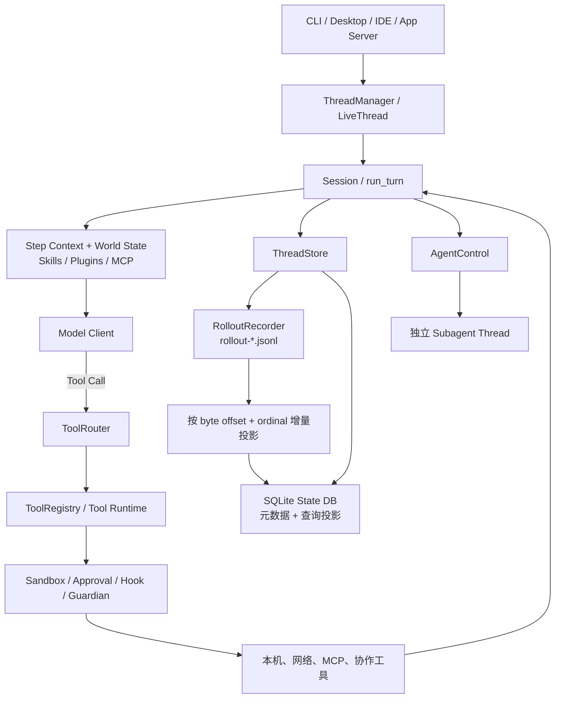
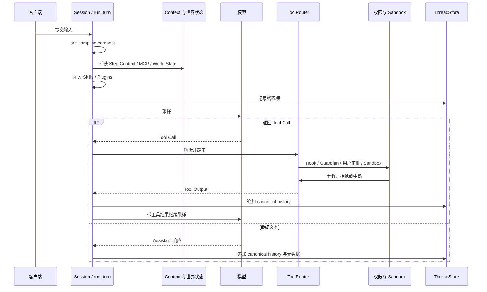

# Codex 总体架构与上下文管理

> 文档角色：Codex 开源源码快照的架构调研，用于对照本项目的会话存储、上下文压缩、工具控制面和多 Agent。
> 分析日期：2026 年 8 月 25 日。
> 源码快照：`.tmp-openai-codex-0822b`，提交 `343074d4207d572809bd8cea15f4be1d09d98e0b`（2026 年 8 月 22 日）。
> 覆盖范围：以 `codex-rs` 中的 Thread Store、rollout、session turn、compaction、tools 和 multi-agent spawn 路径为主。
> 边界：本文描述这一开源源码快照；不把它等同于任何时间点全部 Codex 客户端、服务端或产品配置的实现。

## 1. 先给结论：Codex 不是「只使用 JSONL」

Codex 的本地线程存储是典型的**双层存储**：

- JSONL rollout 保存 canonical raw history，也就是可重放、可审计的原始线程项；
- SQLite state database 保存可查询的线程元数据和历史投影；
- `ThreadStore` 明确把「追加原始历史」和「更新线程元数据」分为两条 API。〔FACT｜`.tmp-openai-codex-0822b/codex-rs/thread-store/README.md:7-30`〕

所以「Claude Code / Codex 都用 JSONL」最多只说对了一半：JSONL 常适合成为一份单线程的追加日志；但成熟的桌面/IDE Agent 仍需要 SQLite 或等价索引层来解决线程列表、搜索、归档、父子 Agent 关系和分页查询。

Codex 与本项目的总体路线比 PI 更接近：两者都把模型回合、工具治理、上下文、持久化和多 Agent 生命周期分层；差别在于 Codex 以 **canonical rollout JSONL + SQLite materialization** 为主要形态，本项目以 **SQLite-first 业务事实 + LangGraph SQLite checkpoint** 为主要形态。

## 2. 架构全景



关键是「同一条线程」里存在多个不同层次的状态：

- 模型可见的 history / context；
- 原始 rollout 项；
- 可供 UI、线程列表和跨线程查询的 SQLite 投影；
- 运行中的 Session、工具调用和审批；
- 多 Agent 的父子边和容量控制。

把它们都当成「聊天记录」会混淆职责。

## 3. 一次 Turn 的主链

`run_turn` 在模型请求前先执行预压缩，然后解析所需 MCP，捕获本轮 Step Context，并记录世界状态与 reference context；随后构建 Skill / Plugin 注入，记录输入，再进入后续采样和工具循环。〔FACT｜`.tmp-openai-codex-0822b/codex-rs/core/src/session/turn.rs:153-281`〕



可见的设计主张是：**模型请求不是只由聊天消息决定，而是由当前线程的可见历史、世界状态、工具目录、Skill/Plugin/MCP 注入和回合配置共同决定。**〔FACT｜`.tmp-openai-codex-0822b/codex-rs/core/src/session/turn.rs:206-281`〕

## 4. 持久化：JSONL 做事实回放，SQLite 做查询与状态投影

### 4.1 ThreadStore 的职责分离

Thread Store 文档明确约定：

- `append_items` 只追加 raw canonical history，不从内容猜元数据；
- `update_thread_metadata` 是唯一元数据写入口；
- 活跃线程使用 `LiveThread`，将 history append 和 metadata patch 按策略写入；
- 本地存储通过 `codex-rollout` JSONL 保存历史，通过 SQLite state database 保存可查询元数据。〔FACT｜`.tmp-openai-codex-0822b/codex-rs/thread-store/README.md:7-30`〕

这比「JSONL 或 SQLite 二选一」更准确：二者的职责并不相同。

### 4.2 JSONL rollout 是什么

`RolloutRecorder` 的注释明确说明它把 canonical session rollout items 写成 JSONL，并给出 `rollout-<timestamp>-<conversation_id>.jsonl` 的文件命名。创建参数同时包含 thread ID、父线程 ID、fork 来源、动态工具、能力根、history mode 等元数据。〔FACT｜`.tmp-openai-codex-0822b/codex-rs/rollout/src/recorder.rs:77-118`〕

因此，**一个 rollout JSONL 对应一条线程的某次 durable history 轨迹**；它不是所有 Agent 共同追加的一份总日志。子 Agent 会创建独立线程、独立 rollout，并通过父子线程关系相连。〔FACT｜`.tmp-openai-codex-0822b/codex-rs/core/src/agent/control/spawn.rs:487-511`〕

### 4.3 为什么 JSONL 不会让查询天然变快

Codex 新的分页历史路径把 JSONL 逐行解析成 SQLite 投影。它为每条线程维护已投影的下一个 byte offset 与 ordinal，只读取上次位置之后的新增字节；只投影换行结束的完整记录，尾部半行会等待下次完整后再处理。〔FACT｜`.tmp-openai-codex-0822b/codex-rs/thread-store/src/local/thread_history_materialization.rs:18-68,71-117`〕

```text
rollout.jsonl（canonical append log）
    └─ 从 lastByteOffset 开始读取增量
        └─ 校验 ordinal 与完整行
            └─ 投影为 SQLite 的线程历史 / 查询状态
```

这恰恰说明 JSONL 的限制：若每次线程列表、搜索或分页都扫描完整文件，长会话会越来越慢。Codex 通过「**日志作为可回放事实，SQLite 作为可查询物化视图**」保留两者优点。〔INFER〕

### 4.4 对本项目的意义

如果本项目未来确有「可移植的审计回放文件」需求，可以借鉴这种单向结构；但不能让 JSONL 与 SQLite 都接受独立编辑，否则会产生双真相源和一致性问题。〔INFER〕

## 5. 上下文管理：压缩替换模型历史，但不等于抹去持久化轨迹

### 5.1 压缩发生的位置

Codex 有自动内联压缩和用户触发的手动压缩路径。`run_turn` 在采样前会尝试预压缩；压缩逻辑还考虑中途上下文溢出的恢复。〔FACT｜`.tmp-openai-codex-0822b/codex-rs/core/src/session/turn.rs:163-190`；`.tmp-openai-codex-0822b/codex-rs/core/src/compact.rs:111-167,240-345`〕

### 5.2 压缩后的模型可见历史

压缩代码把当前 history 汇总为摘要，并用 `build_compacted_history` 建立新的模型 history。对于中途压缩，为保持模型训练时期待的上下文结构，会在最后一个真实用户消息之前重新插入初始上下文；对于预回合/手动压缩，则让下一轮重新注入初始上下文。〔FACT｜`.tmp-openai-codex-0822b/codex-rs/core/src/compact.rs:59-108,347-385`〕

这可简化为：

```text
模型可见历史 = 必要的初始上下文 / 世界状态
            + 压缩摘要
            + 保留的近期有效输入
            + 本轮新增输入、工具结果与动态能力
```

Codex 特别在意 reference context 与 world state：压缩后不是无条件把所有系统环境重复附加，而是根据压缩相位决定保留或重新注入，从而同时平衡正确性和前缀缓存。〔FACT｜`.tmp-openai-codex-0822b/codex-rs/core/src/compact.rs:59-108,362-385`〕

### 5.3 一条重要区分

- **模型 live history**：会因 compaction 被摘要替换。
- **rollout canonical history**：作为持久化线程项继续记录；Thread Store 的历史 append 不依赖从内容猜元数据。〔FACT｜`.tmp-openai-codex-0822b/codex-rs/thread-store/README.md:7-18`；`.tmp-openai-codex-0822b/codex-rs/core/src/compact.rs:374-385`〕
- **SQLite history projection**：服务于可查询、分页和客户端状态，不应被误认为模型每轮的完整 prompt。〔FACT｜`.tmp-openai-codex-0822b/codex-rs/thread-store/src/local/thread_history_materialization.rs:18-68`〕

这种三层拆分与本项目的「UI 原始历史 / Context Checkpoint / LangGraph 执行 Checkpoint」非常相近，只是落盘顺序与实现手段不同。

## 6. 工具调用：模型可见定义、执行 Runtime、权限决定三层分开

### 6.1 路由与注册

`ToolRouter` 同时持有 `ToolRegistry` 和模型可见的 `ToolSpec`；它能区分模型看到的工具定义、对应的 Runtime、以及工具是否支持并行。〔FACT｜`.tmp-openai-codex-0822b/codex-rs/core/src/tools/router.rs:68-145`〕

`ToolRegistry` 的 Runtime 合同除了执行工具，还覆盖 ready 等待、MCP 所属服务器、hooks、遥测和结果接受后的回调。〔FACT｜`.tmp-openai-codex-0822b/codex-rs/core/src/tools/registry.rs:51-145`〕

```text
模型 Tool Call
  -> ToolRouter：解析工具名与 payload
  -> ToolRegistry：找到能力、并发能力与 runtime
  -> Tool Runtime：执行前后 hook、生命周期、结果
  -> Approval / Sandbox：决定是否允许产生副作用
  -> 模型可见 Tool Output
```

### 6.2 审批顺序

Codex 的审批逻辑明确给出优先级：

1. Hook；
2. 若启用 Strict Auto Review 或 Guardian，则 Guardian；否则用户；
3. 允许、拒绝、超时或取消的结果被转换为工具执行结果。〔FACT｜`.tmp-openai-codex-0822b/codex-rs/core/src/tools/approvals.rs:438-529`〕

它强调了一件本项目也必须保持的事：**模型提出工具调用，不等于工具已获准执行。**工具定义、实际执行、审批和 sandbox 不应混在同一个函数里。

## 7. 多 Agent：独立 Thread、显式父子关系、历史继承策略

Codex 的子 Agent 由 `AgentControl` 创建为独立 thread，持久化 `parent_thread_id`，标记 thread source 为 `Subagent`，并受最大线程数 / 容量预留控制。〔FACT｜`.tmp-openai-codex-0822b/codex-rs/core/src/agent/control/spawn.rs:403-560`〕

子 Agent fork 时会先 flush 父 rollout，再加载父模型上下文；可选择 Full History 或 Last N Turns，并会过滤不应继承的 tool / reasoning / 协作消息等条目。〔FACT｜`.tmp-openai-codex-0822b/codex-rs/core/src/agent/control/spawn.rs:671-878`〕

因此，多个 Agent 的正确模型是：

```text
父 Thread 的 rollout / SQLite 记录      子 Thread 的 rollout / SQLite 记录
                │                                  │
                └──── parent_thread_id / spawn edge ────┘
```

而不是「多个 Agent 共同写一份 JSONL」。

## 8. 与本项目的对照和可借鉴点

| 主题 | Codex | 本项目当前方向 | 可借鉴程度 |
| --- | --- | --- | --- |
| 原始历史 | canonical rollout JSONL | SQLite 原始模型消息、Timeline 与 Run | 业务目标不同；无需硬改。 |
| 查询层 | SQLite 元数据与历史增量投影 | SQLite 直接承担主查询与 FTS | 本项目当前更简单。 |
| JSONL 性能 | byte offset + ordinal 增量物化 | 尚未有 JSONL 主写入路径 | 只有引入审计日志时才需要借鉴。 |
| 上下文 | world state、reference context、压缩替换历史 | System + Checkpoint + 新消息 + 相关检索 + Skill | 原则高度相通。 |
| 工具 | Router / Registry / Approval / Sandbox | Runtime / Registry / 权限 / 审批 / 审计 | 本项目已经走在正确分层上。 |
| 多 Agent | 独立 Thread + parent ID + 容量与 fork 策略 | 独立 Conversation / Run / SubagentTask | 可对照完善恢复、容量与可观测性。 |

### 最值得带回本项目的三点

1. **若未来加 canonical JSONL，必须同时设计可重建的 SQLite projection。**byte offset、ordinal、一致性校验和部分尾行处理是不可省略的配套，而非「写个 JSONL 文件」就结束。〔INFER〕
2. **继续把模型上下文、UI 历史和执行恢复状态分开。**Codex 的 context/world-state/reference-context 设计说明：这三者即便内容有关，也不应共用一个粗糙的数据结构。〔INFER〕
3. **多 Agent 继续坚持独立线程与明确关联。**只传摘要或有限继承历史，不让并行 Agent 共用可变聊天记录，才能避免上下文污染和审计不清。〔INFER〕

## 9. 阅读本项目时建议对照的章节

- 本项目主链：[我们的 Agent 项目总体架构与上下文管理](./我们的Agent项目总体架构与上下文管理.md)
- 项目上下文细节：[对话存储、上下文与压缩设计](../16-对话存储、上下文与压缩设计.md)
- 项目多 Agent 语义：[多 Agent 团队与任务调度设计](../05-多Agent团队与任务调度设计.md)
