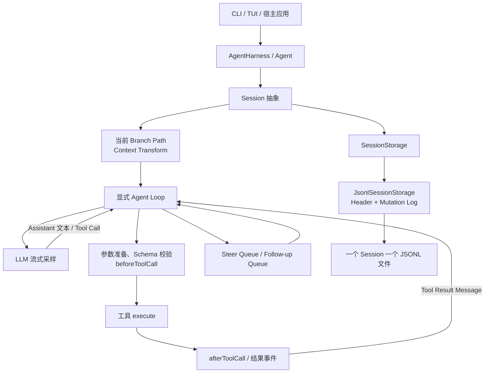
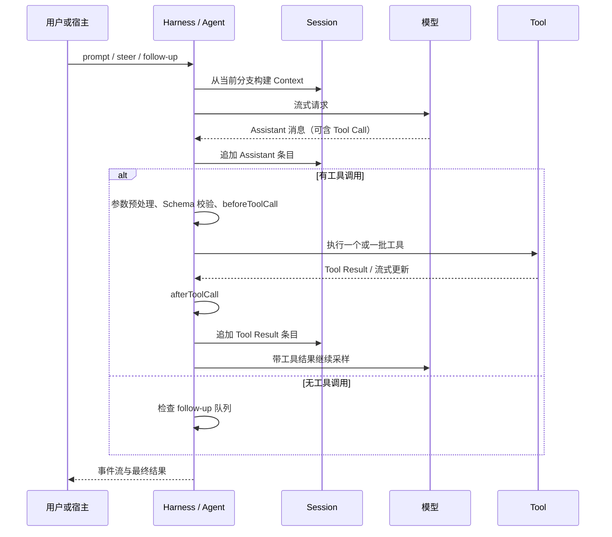

# PI Agent 总体架构与上下文管理

> 文档角色：PI Agent 源码快照的架构调研，用于与本项目的持久化、上下文和工具执行设计对照。
> 分析日期：2026 年 8 月 25 日。
> 源码快照：`.tmp-pi-mono-0822`，提交 `c49906ec77788625aacbdc53ebca6fbe65bd20f5`（2026 年 8 月 22 日）。
> 覆盖包：`@earendil-works/pi-agent-core`、`@earendil-works/pi-coding-agent`，版本均为 `0.84.2`。
> 边界：本文描述上述源码快照，不把它表述为 PI 后续所有版本或所有第三方扩展的永久实现。

## 1. 先给结论

PI Agent 的核心理念不是先做一个庞大的「AI IDE 后端」，而是把 Agent 的最小闭环做成可嵌入的 Harness：**显式的模型—工具循环、可投影的会话状态、可替换的会话存储、可插拔的上下文转换和工具钩子**。〔FACT｜`.tmp-pi-mono-0822/packages/agent/src/agent-loop.ts:155-275`；`.tmp-pi-mono-0822/packages/agent/src/harness/session/context.ts:45-99`〕

它与本项目相通的地方很多：都有多轮 `模型 → 工具 → 模型` 循环、Steer/后续输入、工具参数校验、上下文压缩和会话分叉。最大的分野在于持久化与产品控制面：PI 核心偏向以 JSONL 会话 mutation log 驱动；本项目偏向以 SQLite 维护可查询的业务事实、运行事实和 UI 时间线，并把 LangGraph 恢复状态放入独立 SQLite 文件。

**因此，不应把「PI 使用 JSONL」理解为「主流 Agent 都应改成 JSONL」。**PI 的选择与它的可嵌入 Harness 定位匹配；本项目的桌面工作台、多 Agent、检索、审批和任务状态，更自然地匹配 SQLite-first。

## 2. 架构全景



图中的职责分层是明确的：

1. `agent-loop.ts` 负责通用 Agent Loop，不直接绑定具体 UI 或磁盘格式。〔FACT｜`.tmp-pi-mono-0822/packages/agent/src/agent-loop.ts:155-275`〕
2. `Session` / `SessionState` 负责把条目、分支、lane、记录等会话事实组织为可读取状态；JSONL 只是其中一个 `SessionStorage` 实现。〔FACT｜`.tmp-pi-mono-0822/packages/agent/src/harness/session/jsonl/storage.ts:48-57`〕
3. 上下文构建从当前分支路径的条目投影出模型消息，且允许调用方追加 transform/projector。〔FACT｜`.tmp-pi-mono-0822/packages/agent/src/harness/session/context.ts:45-99`〕
4. 工具由声明、Schema、执行函数和前后钩子组成；宿主应用可决定如何接 UI、权限与审计。〔FACT｜`.tmp-pi-mono-0822/packages/coding-agent/src/core/extensions/types.ts:449-498`；`.tmp-pi-mono-0822/packages/agent/src/agent-loop.ts:600-750`〕

## 3. 一次对话 / 工具回合如何运转



`runLoop` 有两层循环：内层持续处理工具调用和中途插入的 steering 消息；当模型准备结束时，外层再检查 follow-up 队列，必要时开始下一轮。中途消息会在下一次 Assistant 响应前写入当前上下文。〔FACT｜`.tmp-pi-mono-0822/packages/agent/src/agent-loop.ts:166-275`〕

这是一种很「裸」也很清楚的 Agent Loop：没有把回合控制藏在某个大框架的默认行为中。它的代价是，复杂产品需要由宿主自行补上运行状态机、审批中断恢复、文件冲突、跨 Agent 通信和 UI 业务事实。〔INFER〕

## 4. 会话写到哪里：JSONL 是会话 mutation log，不是共享总线

### 4.1 一个文件对应什么

PI 的 JSONL Repository 按工作目录建立会话目录，并用 `时间戳_会话ID.jsonl` 作为文件名；列出会话时只读取每个文件第一行的 header。〔FACT｜`.tmp-pi-mono-0822/packages/agent/src/harness/session/jsonl/repo.ts:27-29,65-106`〕

因此更准确的说法是：

- **一个 JSONL 文件对应一个 Session**；不是多个 Agent 共同向同一个聊天 JSONL 随意追加。
- 一个 Session 内可以有 lane / branch 相关状态；当前模型上下文只取所选分支路径。〔FACT｜`.tmp-pi-mono-0822/packages/agent/src/harness/session/jsonl/storage.ts:130-168`；`.tmp-pi-mono-0822/packages/agent/src/harness/session/context.ts:59-99`〕
- 会话 fork 会创建新的目标 JSONL，并记录默认父会话 ID；不是让父子 Agent 长期共写一份文件。〔FACT｜`.tmp-pi-mono-0822/packages/agent/src/harness/session/jsonl/repo.ts:142-155`〕

### 4.2 文件内容和恢复方式

JSONL 文件以 header 开头，后续每行是可解析的 mutation。加载时，`JsonlSessionStorage` 从头读取有效行并逐条 `applyMutation`，在内存重建 `SessionState`。〔FACT｜`.tmp-pi-mono-0822/packages/agent/src/harness/session/jsonl/storage.ts:69-107`〕

```text
header
mutation #1：创建 lane / entry / record / fact
mutation #2：追加用户消息
mutation #3：追加 Assistant 消息
mutation #4：追加 Tool Result
...
```

其可靠性处理也值得注意：

- 最后一行若是进程崩溃留下的截断 JSON，会将有效前缀写入临时文件后原子替换，修复 torn tail。〔FACT｜`.tmp-pi-mono-0822/packages/agent/src/harness/session/jsonl/storage.ts:80-106`〕
- fork 会先完整生成同级 `.tmp` 文件，再原子 rename 到目标文件，避免半成品覆盖目标会话。〔FACT｜`.tmp-pi-mono-0822/packages/agent/src/harness/session/jsonl/storage.ts:23-46,110-120`〕
- 单个 storage 实例把 mutation 追加排队串行化，避免同一实例的异步追加乱序。〔FACT｜`.tmp-pi-mono-0822/packages/agent/src/harness/session/jsonl/storage.ts:258-270`〕

### 4.3 JSONL 的收益和边界

| 维度 | PI 方案的收益 | 代价 / 本项目要留意的点 |
| --- | --- | --- |
| 追加 | 单个 mutation 直接 append，审计轨迹直观 | 要恢复或查询完整状态，通常需读文件并重放状态。 |
| 可携带性 | 一个文件即可复制、归档、`jq` 查看 | 跨会话按条件查询、排序、分页、全文检索不如数据库自然。 |
| 崩溃恢复 | 行边界 + 临时文件原子发布，修复尾行很直接 | 需要仔细设计写入序列、重复写入和多进程并发。 |
| 分叉 | 可物化出新的独立文件 | 历史很长时 fork / 重放的 I/O 成本要被控制。 |
| Schema 演进 | 每行带类型，历史兼容可逐步处理 | SQL 迁移、索引一致性、跨表事务等能力需要自己重建。 |

PI 的 JSONL 并不是「查询很快」的方案。该实现提供的是打开单个会话后重建内存状态、按会话操作和读取 header 列表；在本次范围内，没有看到其把 JSONL 当作跨会话复杂查询引擎。〔FACT｜`.tmp-pi-mono-0822/packages/agent/src/harness/session/jsonl/repo.ts:65-101`；`.tmp-pi-mono-0822/packages/agent/src/harness/session/jsonl/storage.ts:194-255`〕

## 5. 上下文管理：分支路径 + 最近一次压缩点之后的消息

### 5.1 默认投影规则

PI 的上下文不是简单把整份 JSONL 原样塞给模型。它先取得当前 branch path 的条目，然后执行默认 transform：从后向前找最近一次 `compaction`，若找到，就只保留这个压缩条目以及它之后的条目。〔FACT｜`.tmp-pi-mono-0822/packages/agent/src/harness/session/context.ts:45-63`〕

压缩条目本身会投影为：

```text
[压缩摘要消息]
+ [retainedTail 中明确保留的最近消息]
+ [压缩点之后的新原始消息]
```

〔FACT｜`.tmp-pi-mono-0822/packages/agent/src/harness/session/context.ts:65-99`〕

自定义条目可以通过 `entryProjectors` 转成模型消息，且可以继续叠加 `entryTransforms`。这意味着 PI 把「会话事实」和「模型可见上下文」明确分开。〔FACT｜`.tmp-pi-mono-0822/packages/agent/src/harness/session/context.ts:59-99`〕

### 5.2 何时压缩，压缩后保留多少

默认压缩配置为：启用自动压缩、预留 `16,384` Token 用于摘要请求/输出、压缩后大约保留最近 `20,000` Token。〔FACT｜`.tmp-pi-mono-0822/packages/agent/src/harness/compaction/compaction.ts:147-162`〕

触发条件是：

```text
estimatedContextTokens > contextWindow - reserveTokens
```

〔FACT｜`.tmp-pi-mono-0822/packages/agent/src/harness/compaction/compaction.ts:215-250`〕

Token 估算优先利用最近 Assistant 回合带回的 provider usage；没有可用 usage 时才逐消息估算。〔FACT｜`.tmp-pi-mono-0822/packages/agent/src/harness/compaction/compaction.ts:164-243`〕

### 5.3 对本项目的启发

PI 的亮点不是摘要算法本身，而是以下边界：

1. 会话记录可以完整存在，**模型上下文只是对会话条目的一个可替换投影**。
2. 压缩点是会话中的显式条目，调试时能看见它何时生效。
3. transform/projector 是真实扩展点，而不是在 Agent Loop 中散落特殊判断。

本项目已经拥有「原始消息不删、Checkpoint 覆盖边界单调前进、模型只看摘要加新消息」的同类原则；若未来第三方 Skill / 插件确实需要提供新的上下文来源，可借鉴 PI 的窄投影接口，而不应为了模仿它把 SQLite 主存储改成 JSONL。〔INFER〕

## 6. 工具调用：Schema、钩子与并发模式

PI Coding Agent 的工具定义包含：名称、给模型的描述、TypeBox 参数 Schema、可选参数预处理、执行函数，以及可选的逐工具执行模式。〔FACT｜`.tmp-pi-mono-0822/packages/coding-agent/src/core/extensions/types.ts:449-498`〕

调用流程如下：

```text
Tool Call
  -> 找到工具
  -> prepareArguments（可选）
  -> Schema 校验
  -> beforeToolCall（可阻断/终止）
  -> execute
  -> afterToolCall（可改写模型可见结果）
  -> Tool Result Message
```

〔FACT｜`.tmp-pi-mono-0822/packages/agent/src/agent-loop.ts:586-750`〕

并发规则也很直接：全局可选 sequential / parallel；只要当前批中有任何工具声明 `executionMode: "sequential"`，整批按顺序执行；否则先逐个预处理，再并发执行已允许的调用，最后按原调用顺序生成 Tool Result 消息。〔FACT｜`.tmp-pi-mono-0822/packages/agent/src/agent-loop.ts:411-553`〕

这套核心 API 为「工具策略由宿主决定」留出了位置。仅从该核心 loop 可确认可通过 `beforeToolCall` 阻断调用；完整的文件权限、Sandbox、审批 UI、外部副作用审计并不是这段通用 loop 自己强制实现的控制面。〔INFER〕

## 7. 多 Agent：能确认 Session Fork，不等同于完整调度平台

PI 核心会话层明确支持 fork、分支和自定义记录。〔FACT｜`.tmp-pi-mono-0822/packages/agent/src/harness/session/jsonl/repo.ts:142-155`；`.tmp-pi-mono-0822/packages/agent/src/harness/session/jsonl/storage.ts:110-120`〕

但在本次审阅的 `pi-agent-core` 会话、loop 和 Coding Agent extension API 中，没有看到与 Codex 或本项目同等完整的持久化多 Agent 控制面：例如父子任务表、运行容量、父任务唤醒、结构化完成摘要、跨会话可查询的消息收件箱。更合理的理解是：PI 提供做这些能力的 Harness 原语，具体多 Agent 产品形态由上层应用或扩展组合。〔INFER〕

## 8. 与本项目的对照：该借什么，不该照搬什么

| 主题 | PI Agent | 本项目当前方向 | 判断 |
| --- | --- | --- | --- |
| Agent Loop | 显式、轻量、宿主可控 | LangGraph 承担图循环，Runtime 保留业务副作用 | 两者都合理；本项目不应另写第二套 Loop。 |
| 会话记录 | JSONL mutation log | SQLite 业务事实 + 独立图 Checkpoint | 产品目标不同，不需要统一。 |
| 模型上下文 | branch path 的 transform / compaction projection | Checkpoint + 新消息 + 相关历史 + Skill 等预算选择 | 原则相通；可借鉴更清晰的投影扩展点。 |
| 工具 | Schema + before/after hook + 批处理模式 | Registry + Runtime 权限/审批/审计/并发策略 | 本项目的控制面更适合本机编码工具。 |
| 多 Agent | 原语与扩展组合 | 独立 Conversation / Run / SubagentTask | 本项目更接近工作台级实现。 |

### 建议带走的三件事

1. **把事件与会话投影边界继续保持清晰。**未来扩展上下文来源时，优先引入窄接口，而不是污染 Run 主链。〔INFER〕
2. **若要 JSONL，优先做可选导出或单向审计副本。**不要同时让 SQLite 和 JSONL 都成为可编辑的主事实源。〔INFER〕
3. **保留工具前后钩子的思想，但钩子不能绕过权限。**在本项目中它们必须仍经过 Runtime 的参数校验、审批、审计和幂等保护。〔INFER〕

## 9. 阅读本项目时建议对照的章节

- 本项目主链：[我们的 Agent 项目总体架构与上下文管理](./我们的Agent项目总体架构与上下文管理.md)
- 当前项目存储与压缩设计：[对话存储、上下文与压缩设计](../16-对话存储、上下文与压缩设计.md)
- 当前项目工具生命周期：[AI 工具体系与生命周期设计](../11-AI工具体系与生命周期设计.md)
