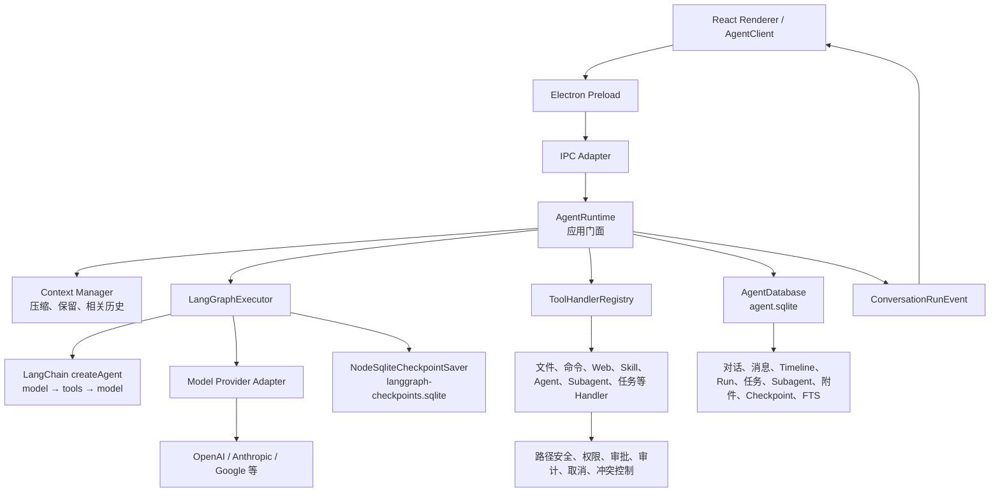
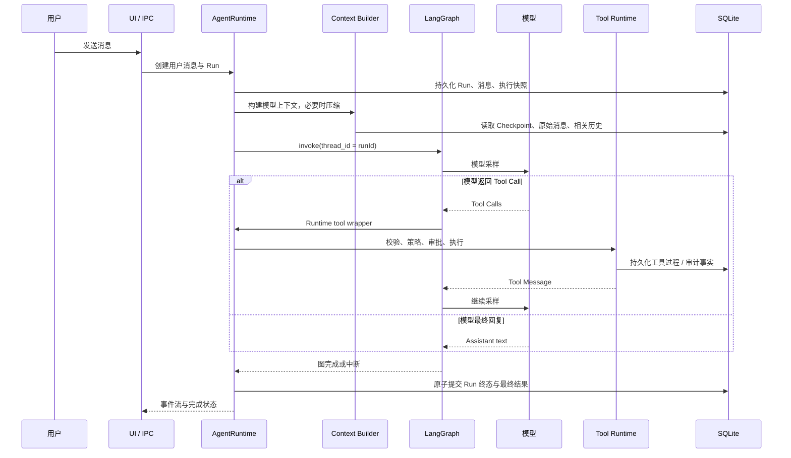
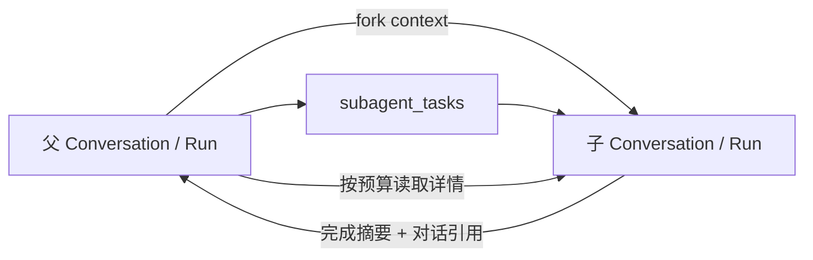

# 我们的 Agent 项目总体架构与上下文管理

> 文档角色：本项目当前实现的架构、持久化、上下文、工具调用与多 Agent 设计总览，并给出与 PI Agent、Codex 对照后的优化建议。
> 分析日期：2026 年 8 月 25 日。
> 对照基准：当前仓库工作区 `D:\Code\Project\202608\Agent` 的源码状态。
> 边界：本文以当前代码和现有设计文档为准；它描述的是当前实现，不把路线图能力写成已完成能力。

## 1. 先给结论

本项目已经不是「聊天 UI 外面包一层工具调用」：它形成了一个 **JSONL 写前事件 + SQLite 查询投影的桌面 Agent 工作台**。普通 Run、Queue / Steer、工具、Checkpoint 和普通终态先追加每 Conversation 的 `ThreadLog`，再由 `EventProjector` 幂等物化；SQLite 保留 UI、FTS、Run 查询和跨对话关系，LangGraph 图状态单独保存为可恢复执行细节；`AgentRuntime` 守住模型、工具、副作用和 IPC 边界。〔FACT｜`apps/desktop/src/main/bootstrap/index.ts`；`apps/desktop/src/main/storage/event-projector.ts`；`apps/desktop/src/main/agent/langgraph-executor.ts`〕

与 PI 相比，本项目补齐了桌面产品的 SQLite 查询、附件、审批和关系模型；与 Codex 相比，当前投影仍更贴近本地业务表。JSONL 不替代 SQLite，而是负责可回放的单对话事件；完整跨对话原子交付和删除工作流仍由 SQLite 事务负责。

更值得投入的是：验证长会话压缩质量、图恢复与副作用幂等、全文检索与 Checkpoint 一致性、以及 Subagent 的可观测性和唤醒闭环。

## 2. 总体架构



依赖方向保持为：

```text
Electron Bootstrap
  -> IPC Adapter
      -> AgentRuntime
          -> LangGraphExecutor
              -> LangChain ChatModel / ToolNode
              -> NodeSqliteCheckpointSaver
          -> AgentDatabase
          -> Model / Tool / Storage adapters
```

〔FACT｜`doc/13-后端编码规范.md:53-69`；`apps/desktop/src/main/bootstrap/index.ts:111-186`〕

### 2.1 各层职责

| 层 | 当前职责 | 不应承担的职责 |
| --- | --- | --- |
| IPC Adapter | 输入解析、sender 校验、调用 Runtime、输出/错误映射 | 直接操作 SQL、处理模型协议。 |
| AgentRuntime | Run 生命周期、上下文装配、工具治理、审批、消息队列、Subagent | 把 SQL 行直接泄漏给 UI 或让框架绕过副作用治理。 |
| LangGraphExecutor | `model → tools → model` 图循环、中断/恢复、图 Checkpoint、模型轮数限制 | 成为第二个业务数据库或绕过 Runtime 执行工具。 |
| ToolHandlerRegistry | 工具定义聚合、可用性、唯一性和执行策略路由 | 代替 Runtime 做跨工具审批协调。 |
| AgentDatabase | 用户可见业务事实与查询索引 | 保存 Graph 内部临时状态。 |
| Graph Checkpointer | 节点边界的执行恢复 | 充当 UI 聊天历史。 |

`LangGraphExecutor` 的注释明确表明：框架拥有模型/工具循环、中断和 checkpoint 边界；Runtime callback 仍是业务副作用唯一所有者。〔FACT｜`apps/desktop/src/main/agent/langgraph-executor.ts:508-513`〕

## 3. 一次用户任务如何流动



Run 进入图之前会先通过 `prepareContext` 构建上下文并在必要时循环压缩；图使用同一个 `thread_id` 执行与审批恢复。〔FACT｜`apps/desktop/src/main/agent/agent-runtime.ts:1528-1690`；`apps/desktop/src/main/agent/agent-runtime.ts:3177-3236`；`apps/desktop/src/main/agent/langgraph-executor.ts:667-700`〕

## 4. 对话到底写到哪里

### 4.1 业务主库：`agent.sqlite`

Electron 启动时创建：

```text
<userData>/agent.sqlite
```

〔FACT｜`apps/desktop/src/main/bootstrap/index.ts:111-114`〕

它保存的是用户和产品真正需要查询、展示、恢复的业务事实，至少包括：

- `conversations`：项目、父对话、工作目录、Agent 身份、归档、删除状态；
- `runs`：一轮运行及其执行快照；
- `conversation_timeline`：用户可见时间线；
- `model_messages`：模型上下文用的用户、Assistant、Tool 消息；
- 待发送消息、附件、任务清单、Agent 消息、`subagent_tasks`；
- `conversation_context_checkpoints`：对旧历史的结构化摘要边界。〔FACT｜`apps/desktop/src/main/storage/agent-database.ts:3353-3499`〕

这回答了「我们的对话写到哪了」：**对话不是只存一段 JSON，而是按可查询、可恢复的业务对象拆分落在 `agent.sqlite`。**

### 4.2 图恢复库：`langgraph-checkpoints.sqlite`

启动时还创建：

```text
<userData>/langgraph-checkpoints.sqlite
```

〔FACT｜`apps/desktop/src/main/bootstrap/index.ts:114-116`〕

它保存 LangGraph 的图状态、节点写入与 thread 恢复信息，不是 UI 聊天历史的替代品。项目规范明确要求不要把 Graph Checkpoint 当作聊天记录，也不要把完整业务数据库行复制进 Graph State。〔FACT｜`doc/17-Agent运行时架构总览.md:253-275`〕

### 4.3 当前 JSONL 与 SQLite 的分工

`<AGENT_HOME>/conversations/<conversationId>.jsonl` 已由生产组合根装配。它有 header、单调 sequence、eventId、尾行恢复和每 Conversation 投影游标；正常写入采用「JSONL 追加 → SQLite 幂等投影 → UI 事件」顺序。`ContextCompiler` 在日志存在时从其重放模型消息与 Checkpoint，避免每轮扫描 SQLite 的完整历史。〔FACT｜`apps/desktop/src/main/storage/thread-log.ts`；`apps/desktop/src/main/storage/event-projector.ts`；`apps/desktop/src/main/agent/context-compiler.ts`〕

SQLite 仍是列表、关系、FTS、业务事务和 Graph Checkpoint 的高效查询层：它不扫描 JSONL 来驱动 UI；JSONL 也不承担跨会话关系、二进制文件或复杂筛选。附件日志只保存公开引用，`AttachmentStore` 根据受管目录恢复本地路径和元数据。

## 5. 上下文管理：完整历史不等于每轮模型输入

### 5.1 上下文的输入来源

`AgentRuntime.buildContext` 组合的输入包括：

1. 系统规则：当前 Agent 身份、项目工作区、权限模式、工具并发规则、Subagent 协作和 Skill 目录；
2. `model_messages` 中的原始会话消息与附件；
3. 最新 Context Checkpoint；
4. 当前用户消息驱动的相关历史检索；
5. 后续模型边界进入的 Agent 消息、Steer 消息和激活的 Skill 正文。〔FACT｜`apps/desktop/src/main/agent/agent-runtime.ts:3070-3174`；`apps/desktop/src/main/agent/agent-runtime.ts:1541-1571`〕

```text
模型输入
  = System Message
  + 最新 Checkpoint 摘要（若存在）
  + Checkpoint 之后的原始消息
  + 预算允许时的相关历史引用
  + 本轮 Queue / Steer / Agent 消息
  + 临时 Skill 上下文
```

### 5.2 Token 预算与压缩

`buildManagedContext` 先计算固定成本：系统消息、工具定义、输出预留、Skill 预留和已有摘要；再取 Checkpoint 覆盖范围之后的原始消息。〔FACT｜`apps/desktop/src/main/agent/context-manager.ts:348-364`〕

若超出压缩阈值，系统按顺序：

1. 对较旧消息裁剪过长工具输出；
2. 选择完整的旧回合为压缩候选；
3. 保护近期回合，按完整回合从旧到新裁剪；
4. 在剩余预算内追加一份相关历史引用。〔FACT｜`apps/desktop/src/main/agent/context-manager.ts:365-436`〕

`prepareContext` 会调用摘要模型，写入一个覆盖序列单调前进的 Checkpoint，再重新建上下文；压缩失败时不会删除原始消息。〔FACT｜`apps/desktop/src/main/agent/agent-runtime.ts:3177-3236`；`apps/desktop/src/main/storage/agent-database.ts:3190-3233`〕

### 5.3 相关历史不是全量回放

主库使用 FTS5 trigram 虚拟表索引 `model_messages` 的正文和工具调用 JSON；插入、删除、更新由触发器保持索引同步。〔FACT｜`apps/desktop/src/main/storage/agent-database.ts:3288-3338`〕

当前轮以最新用户消息为查询词，取最多 24 条相关候选，再由 Context Manager 在剩余 Token 预算中合成为一条有界「相关历史」消息。〔FACT｜`apps/desktop/src/main/agent/agent-runtime.ts:3133-3168`；`apps/desktop/src/main/agent/context-manager.ts:405-436`〕

这比「把 JSONL 全部扫一遍后拼 Prompt」更适合长会话：完整历史留在数据库，模型只带它当前需要的那一小段。

### 5.4 关键不变量

| 不变量 | 当前实现依据 | 价值 |
| --- | --- | --- |
| 原始消息不因压缩而删除 | Checkpoint 只保存覆盖序列和摘要 | UI 审计、分叉、重新生成与后续检索仍有来源。 |
| Checkpoint 覆盖范围不后退 | 保存时拒绝较小 `coveredThroughSequence` | 防止摘要回滚导致上下文不一致。 |
| Tool 输出先裁剪 | 超阈值时先处理旧工具长输出 | 保留对话语义，减少日志吞掉预算。 |
| 相关历史受预算约束 | 只有剩余 Token 足够才加入 | 避免检索反而挤掉当前任务。 |
| Skill 正文不写成聊天消息 | 只作为本轮模型 context message | UI 历史干净，能力注入可替换。 |

〔FACT｜`apps/desktop/src/main/agent/context-manager.ts:348-436`；`apps/desktop/src/main/storage/agent-database.ts:3190-3233`；`apps/desktop/src/main/agent/agent-runtime.ts:1541-1571`〕

## 6. 工具调用：Runtime 是副作用唯一入口

### 6.1 工具定义与执行策略

`ToolHandlerRegistry` 负责汇总当前会话可用工具、检查名称唯一、按上下文查找 Handler，并返回每个调用的执行策略。〔FACT｜`apps/desktop/src/main/tools/tool-handler-registry.ts:32-74`〕

当前策略模型为：

```text
parallel(read | command) 或 serial(可要求 batch 前预准备)
```

读取工具最多 8 个并发，明确并行的命令最多 4 个；其余敏感操作维持有序。〔FACT｜`apps/desktop/src/main/tools/tool-execution-policy.ts:1-15`〕

### 6.2 图循环不会绕过 Runtime

`LangGraphExecutor` 将模型返回的 Tool Call 交给 Runtime Coordinator；`AgentRuntime.executeGraphTools` 决定策略、准备文件变更、按组限宽执行、缓存已完成调用并保持结果与调用 ID 对应。〔FACT｜`apps/desktop/src/main/agent/langgraph-executor.ts:640-663`；`apps/desktop/src/main/agent/agent-runtime.ts:2224-2353`〕

```text
模型 Tool Call
  -> 参数解析与 Handler 路由
  -> 权限 / 工作区 / 取消 / 审计 / 冲突约束
  -> 需要审批时中断图
  -> 用户决定后以同一图线程恢复
  -> 结果写入 Tool Message，模型继续
```

模型每轮最多 32 个 Tool Call；同一文件的多个变更先准备快照，后续基于旧版本的变更会作废，避免静默覆盖。〔FACT｜`apps/desktop/src/main/agent/agent-runtime.ts:3100-3102`；`apps/desktop/src/main/agent/agent-runtime.ts:2260-2278`〕

### 6.3 审批与重放保护

图因审批暂停后，Runtime 通过 `Command({ resume })` 恢复同一个图 thread，而非重新启动一个新 Run。〔FACT｜`apps/desktop/src/main/agent/langgraph-executor.ts:656-663,681-700`〕

同时，已完成 Tool Call 按 `runId:toolCallId` 缓存，避免 LangGraph 重放节点时重复执行已发生的副作用。〔FACT｜`apps/desktop/src/main/agent/agent-runtime.ts:2230-2257,2288-2344`〕

这比只有 `beforeToolCall` 的轻量 Harness 多了一层产品级保障，尤其适合文件写入、命令、Agent 消息和任务状态操作。

## 7. 多 Agent：独立 Conversation，不共用可变历史

### 7.1 Subagent 创建与持久化

创建 Subagent 时，Runtime 会 fork 父对话为独立 child conversation、继承工作区、创建 child Run，并写入 `subagent_tasks` 关联父对话、子对话、来源 Run 和目标 Run。〔FACT｜`apps/desktop/src/main/agent/agent-runtime.ts:1888-1964`；`apps/desktop/src/main/storage/agent-database.ts:3473-3491`〕



子任务完成后，结果以有长度上限的摘要消息交付回父对话；父 Agent 需要细节时再按 Token 预算读取子对话。〔FACT｜`apps/desktop/src/main/storage/agent-database.ts:1922-1968`；`apps/desktop/src/main/agent/agent-communication-tool.ts:63-99`〕

### 7.2 为什么不要多个 Agent 共写一份 JSONL / 同一 history

本项目的设计已经回答了这个问题：每个 Agent 都有独立 Conversation、Run、模型上下文和执行状态；父子关系、消息和任务结果在数据库中显式关联。〔FACT｜`doc/14-业务上下文.md:155-177`〕

共享一份可变聊天记录会让以下问题变得模糊：谁产生了副作用、谁消费了用户消息、哪个摘要覆盖了哪些历史、父子任务如何恢复。独立会话加有界摘要更利于并发、审计和恢复。〔INFER〕

## 8. PI、Codex 与本项目的核心对照

| 维度 | PI Agent | Codex | 本项目 |
| --- | --- | --- | --- |
| 产品定位 | 可嵌入的轻量 Harness | 通用编码 Agent 平台 | 本地优先桌面 Agent 工作台 |
| 主循环 | 显式 TS Agent Loop | Session turn + 工具控制面 | LangGraph `createAgent`，Runtime 守住业务副作用 |
| 原始会话存储 | Session JSONL mutation log | canonical rollout JSONL | 每 Conversation `ThreadLog` 写前事件；跨对话关系留 SQLite |
| 查询 / 索引 | 会话打开后内存状态；上层可扩展 | SQLite 元数据和 JSONL 增量投影 | SQLite 查询、关系与 FTS5 投影 |
| 模型上下文 | branch path + compaction + transform | history + world state + dynamic injection + compaction | System + Checkpoint + 新消息 + FTS 相关历史 + Skill |
| 图 / 运行恢复 | Harness 按宿主组合 | Session/Thread 机制 | 独立 `langgraph-checkpoints.sqlite` |
| 工具治理 | Schema、hook、执行模式 | Router、Registry、Hook、Guardian、审批、Sandbox | Registry、Runtime、路径安全、权限、审批、审计、冲突控制 |
| 多 Agent | Fork / 扩展原语为主 | 独立 Thread + parent/spawn edge | 独立 Conversation + Run + SubagentTask |

## 9. JSONL 相对 SQLite 的真实优劣

### 9.1 JSONL 更适合什么

| 优势 | 适用场景 |
| --- | --- |
| append-only，容易形成回放/审计日志 | 想保留每个原始事件、便于导出与排障。 |
| 人可读、工具友好 | 单会话文件、`jq` 分析、迁移和离线归档。 |
| 单文件便携 | 分享、备份、导入导出。 |
| 尾行崩溃恢复直观 | 有严格换行、原子发布和重放约束时。 |

### 9.2 SQLite 更适合什么

| 优势 | 本项目中的直接需求 |
| --- | --- |
| 条件查询、排序、分页、索引 | 对话列表、Run、审批、任务、未读状态。 |
| 全文检索 | 为当前任务找相关历史，而不是扫描全部旧记录。 |
| 事务 | 原子提交 Run 终态、最终回复、任务结果等关联事实。 |
| 关系约束 | 父子 Conversation、SubagentTask、附件、项目和删除流程。 |
| 演进与迁移 | 版本化 Schema、索引、触发器、一致性修复。 |

### 9.3 最重要的判断

JSONL 并不替代 SQLite 的查询能力；SQLite 也不天然替代可移植的原始回放日志。Codex 同时使用二者，正是因为二者解决不同问题。

对本项目而言，JSONL 负责单对话可回放与崩溃补投影，SQLite 负责 UI、检索、审批、任务和多 Agent 查询；两者都不能被另一方替代。当前仍未把附件二进制、删除任务和双 Conversation 的原子交付迁成单一 JSONL 规范源。〔FACT｜`doc/16-对话存储、上下文与压缩设计.md` §3〕

## 10. 建议的优化路线

以下是基于当前代码和上述对照得到的建议；不是本次已经实现的功能。

| 优先级 | 建议 | 为什么现在值得做 | 最小可行做法 | 不要做什么 |
| --- | --- | --- | --- | --- |
| P0 | 长会话上下文回归矩阵 | 压缩、工具输出裁剪、FTS 相关历史、附件和 Skill 已相互作用 | 为 token 预算、Checkpoint 单调性、最近回合保护、检索命中、压缩失败保留原消息补充端到端测试与指标 | 不要先引入向量数据库。 |
| P0 | 中断恢复与副作用幂等演练 | 运行中审批、图 Checkpoint、文件/命令副作用是最容易产生数据损失或重复执行的交界 | 覆盖「审批前崩溃、批准后恢复、已完成 ToolCall 重放、命令取消」的测试与恢复日志 | 不要依赖“重试通常没事”。 |
| P0 | FTS / Checkpoint 一致性验证 | 相关历史检索依赖消息索引，压缩又依赖 sequence 覆盖边界 | 对插入、编辑、删除、fork、归档/清理后搜索和 Checkpoint 做一致性测试 | 不要把检索失败默默降级成无限制全量历史。 |
| P1 | 上下文诊断可观测性 | 用户和维护者需要知道为何模型“忘了”旧事 | 在调试信息中展示预算、Checkpoint 覆盖序列、保留消息数、相关历史数量、裁剪量；不展示敏感正文 | 不要把整个隐藏 Prompt 暴露给普通 UI。 |
| P1 | Subagent 生命周期可视化和容量策略 | 独立对话已具备，协作成本主要来自可见性和协调 | 展示父子关系、状态、摘要、等待原因；为真实并行数提供明确限制与排队说明 | 不要让父 Agent 直接复制全部子对话进 Prompt。 |
| P2 | 扩大 JSONL 写前覆盖 | 仍有 Subagent 双会话终态、删除任务等 SQLite 原子事实 | 为每个跨资源操作先定义可补偿、可协调的事件合同 | 不伪造两个 JSONL 的原子提交。 |
| P2 | Context source 扩展点 | 若未来插件/Skill 真的需要注入新类型上下文 | 以窄的 Context contribution 合同接入，并继续经过预算器 | 不要为单次需求造通用“万能上下文管理器”。 |

### 10.1 已采用 JSONL 后的后续边界

建议顺序应是：

```text
保持单 Conversation JSONL 追加和 SQLite 增量投影
  -> 新增事实先定义写前事件、幂等物化与崩溃恢复
  -> 跨 Conversation / 二进制资源继续采用独立 SQLite 关系与可恢复清理合同
  -> 若要迁移，先补齐补偿和一致性测试
  -> 保持 JSONL schema/version、脱敏和重复投影验证
```

不能把 JSONL 和 SQLite 都当作可随意编辑的主历史：每类事实必须有唯一责任者。〔INFER〕

## 11. 推荐阅读顺序

1. [PI Agent 总体架构与上下文管理](./PI Agent总体架构与上下文管理.md)：理解轻量 Harness 与 JSONL session log。
2. [Codex 总体架构与上下文管理](./Codex总体架构与上下文管理.md)：理解 JSONL + SQLite 双层存储与多 Agent thread。
3. [对话存储、上下文与压缩设计](../16-对话存储、上下文与压缩设计.md)：回到本项目的详细设计。
4. [Agent 运行时架构总览](../17-Agent运行时架构总览.md)：回到本项目的完整运行主链。
